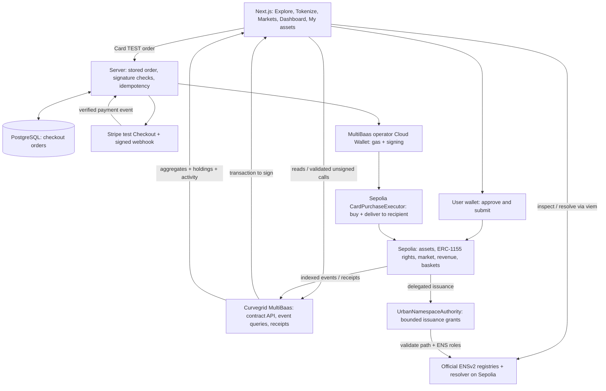

# TOKENIZE TOKYO


**東京トークン化計画 · ETHGlobal Tokyo 2026 · Classic / From Scratch**

## Project summary

**Turn idle city spaces into programmable urban rights.**

**One-sentence summary:** TOKENIZE TOKYO turns underused urban spaces into programmable usage and revenue rights, connecting map-based discovery, funding, trading, income distribution and custody-backed portfolios.

**For ENS judges:** [live ENSv2 permissions demo](https://tokenize-tokyo.vercel.app/ens) · [90-second runbook and code map](docs/ENS_PRIZE_DEMO.md)

## Curvegrid submission guide

| Required README item | Where to find it |
| --- | --- |
| Project summary | [Summary above](#project-summary), [problem and solution](#problem) |
| How we use MultiBaas | [Integration table, code and transaction evidence](#curvegrid--multibaas-integration) |
| Team and social handles | [Urban Rights Lab / natsuki](#team-and-ai-assistance) |
| Setup and testing instructions | [How to run](#how-to-run), [validation commands and latest results](#validation) |
| MultiBaas experience, challenges and wins | [Developer feedback](#multibaas-developer-feedback) |

### Best RWA Tokenization Project

**Beyond issuing a token:** each right has a spatial scope, purpose, duration, supply and transfer policy. Separate asset/right approvals gate trading; conflicting exclusive uses are rejected. Atomic purchases settle payment and rights together. Deposited revenue follows holder balances while preserving previously accrued claims. Compatible revenue rights can be held in a redeemable basket. ENSv2 adds bounded operator issuance rather than unrestricted control of the building.

**Judge path:** Explore → Tokenize → Markets / Funding → My assets → Compose. The [contract table](#smart-contracts) and [lifecycle walkthrough](#how-it-works) connect each behavior to its implementation. The tokens represent prototype contractual rights, not land-title ownership.

### Best Digital Asset Dashboard

**Understand → identify an action → act:** Dashboard aggregates lifecycle conversion, trading/deposit activity and asset composition. Its action queue surfaces pending reviews, funded projects awaiting activation and active revenue projects with no deposits; users can inspect the relevant space and continue the workflow. My assets connects holdings to claims, resale and basket redemption. Explore and Funding expose project availability and primary-sale progress.

Activity charts use actual indexed event timestamps, with short windows suitable for a newly seeded testnet. Trading volume, deposited income and illustrative project economics are distinct; volume is not investment return. [Dashboard code](src/components/MarketOverview.tsx) · [charts](src/components/PlatformCharts.tsx) · [analytics](src/lib/analytics.ts)

### What judges can verify now

| Surface | Current state | Evidence / boundary |
| --- | --- | --- |
| Core RWA market and dashboard | Hosted on **Ethereum Sepolia, chain ID 11155111**, through MultiBaas | [Deployment](deployments/11155111.json); seeded fictional projects and valueless MockJPY |
| ENSv2 identity and permissions | One registered rooftop binding; delegated issuance and report permissions verified on Sepolia | [Live ENS demo](https://tokenize-tokyo.vercel.app/ens), [proof](deployments/ens-v2-sepolia-delegation-proof.json); other generated names are previews |
| Card purchase → Cloud Wallet → delivery | Hosted **Stripe test** checkout and actual Sepolia delivery verified | [Hosted payment proof](deployments/card-checkout-hosted-verification.json); no real fiat settlement or cash-out |
| FractionVault and RentalEscrow | Contracts and wallet UI tested against local Anvil | [Local-chain proof](deployments/finance-local-verification.json); public deployment/linking pending |
| Wallet-free walkthrough | Explicit browser simulation at `/demo` | No blockchain transactions; role switching belongs to this mode |
| Production issuer onboarding, T-REX, lending and real on/off-ramps | Planned | [Trust model](docs/TRUST_MODEL.md), [token-standard roadmap](#token-standard-extensibility-planned); not compliance certification |

**Quick links:** [live app](https://tokenize-tokyo.vercel.app/) · [wallet-free demo](https://tokenize-tokyo.vercel.app/demo) · [latest submission QA](docs/SUBMISSION_QA_2026-09-27.md) · [GitHub](https://github.com/natsukingly/tokenize-tokyo)


## Problem

A rooftop can host solar panels. A vacant building can host a workshop. An unused lot can host a pop-up market. Yet the space owner, project operator and funder often need to negotiate each arrangement separately.

The missing building block is a clear, transferable description of **which space, for which purpose, during which period, with which economic rights**. A token that represents an entire building does not express these smaller, practical agreements.

Even after a project raises money, participants need to distinguish approval, funding, physical activation and actual revenue. A dashboard that only displays token prices cannot answer who verified a project, what holders bought or whether any income was deposited.

## Solution

We model an urban right as **space × time × usage × cash flow**.

Each asset has a location, issuer and project description. Its rights specify a spatial scope, purpose, start/end dates, quantity, terms and transfer policy. Usage rights represent access to a defined space; revenue rights represent a proportional claim on funds actually deposited into the project's vault.

The product connects three layers:

- **Discover and explain:** a map, asset directory, project overview and editable operating assumptions make the proposed use understandable before purchase.
- **Issue and transact:** verified rights can be offered at a fixed price, purchased with MockJPY, resold and, where compatible, combined into baskets.
- **Operate and account:** separate activation, revenue deposits, holder claims and transaction history make project progress inspectable.

Curvegrid MultiBaas supplies the contract API, indexed activity and transaction monitoring. ENSv2 gives spaces a hierarchical identity and lets an issuer delegate bounded issuance authority to an operator.

The prototype uses fictional sites and valueless test tokens. It does not sell property ownership or verify real ownership documents. Initial production registration is intended for pre-approved companies; the current demo does not enforce that eligibility policy. [Trust model and production gaps](docs/TRUST_MODEL.md)

## How it works

1. **Describe a space.** Select a location and asset category, then edit the project overview, intended customers, operations, use of funds and risks. Optional budget, revenue and cost assumptions produce illustrative operating scenarios.
2. **Register and review the asset.** The issuer registers a geographic reference and metadata. A verifier approves or rejects the asset.
3. **Define a right.** Choose a scope such as rooftop, interior, wall or land; set the purpose, time window, supply, terms and transfer policy. The contract checks conflicting exclusive uses. Each right requires separate verification before trading.
4. **Fund through a primary offer.** The issuer lists verified units at a fixed price. A buyer approves the exact MockJPY payment and purchases units in an atomic token/payment transaction. Primary-sale progress is shown in the Launchpad.
5. **Activate the project.** A verifier separately marks an eligible right Active. Raising funds does not automatically establish physical operation.
6. **Deposit and claim revenue.** The vault distributes only settlement tokens actually deposited. Transfer checkpoints preserve income accrued to previous holders.
7. **Resell or compose.** Holders can list transferable rights or deposit compatible revenue rights into a fixed-ratio basket. Basket shares are backed by underlying ERC-1155 custody and redeem for those rights.

For example, a holder of 10 out of 100 units receives 10% of a 10,000 mJPY deposit: 1,000 mJPY. If they later sell five units, already accrued income remains theirs; subsequent deposits follow the new balances.

**Post-acquisition management:** the new FractionVault splits deposited revenue rights into smaller tradable shares, distributes deposited income and redeems shares for whole underlying units. RentalEscrow lends exclusive usage rights for a prepaid period, with expiry, early return and lender recovery. Contracts and wallet UI are implemented and verified against local Anvil; the two extensions still need public deployment and MultiBaas linking. [Implementation, code map and deployment guide](docs/FINANCE_IMPLEMENTATION.md)

**Current boundaries:** primary-sale payments go directly to the seller; there is no funding-goal escrow or automatic refund. Project scenarios are editable assumptions, not promised returns. The wallet-free `/demo` retains its separate mock-credit fractional/rental simulation. See [feature status](docs/FEATURE_STATUS.md).

### Try the demo

**Beyond Tokyo — `/cities`:** use **City preview** in the sidebar to switch between Tokyo, New York and Hong Kong, or play a three-city closing tour. Real city maps accompany illustrative use cases; overseas markets are expansion previews. [Presentation guide and scope](docs/CITY_PREVIEW.md)

**Live testnet flow — [open the app](https://tokenize-tokyo.vercel.app/):**

1. Connect an injected wallet such as MetaMask or Rabby and switch to **Ethereum Sepolia (11155111)**. Email/Google onboarding through Privy is also configured; its authenticated signing path still needs an account-owner rehearsal.
2. Obtain Sepolia test ETH from a faucet for wallet-signed transactions, then mint MockJPY in the wallet panel. The earlier Curvegrid Testnet faucet is not a Sepolia faucet.
3. Select a listed right, review the project description and terms, and choose **Acquire right**.
4. Confirm the payment approval and purchase separately in the wallet.
5. Open **View transaction** to inspect the decoded function, events and receipt; then check your holdings and the indexed activity.

**Card alternative:** direct rights/basket listings offer **Card · TEST**. Stripe test checkout triggers the operator Cloud Wallet to deliver the purchase to the receiving wallet; the buyer does not sign the purchase or pay its gas. This is a test payment integration, not a real-money on-ramp. [Setup, recorded delivery and limitations](docs/CARD_CHECKOUT.md)

**Wallet-free walkthrough — [open /demo](https://tokenize-tokyo.vercel.app/demo):** explore the map, try **Tokenize**, inspect Funding and Dashboard, and use the simulated roles to exercise the lifecycle. This route stores simulated events in the browser and sends no blockchain transactions. The [demo runbook](docs/DEMO_SCENARIO.md) describes the presentation sequence.

**Recorded execution evidence:**

- **Current Sepolia:** [hosted card purchase and replay protection](deployments/card-checkout-hosted-verification.json) · [open its confirmed transaction](https://tokenize-tokyo.vercel.app/tx/0x8e5d49e8f3e84ccd479e039dbd2501fb1592c38455e6d12d1e930a1322dfffbc) · [Etherscan](https://sepolia.etherscan.io/tx/0x8e5d49e8f3e84ccd479e039dbd2501fb1592c38455e6d12d1e930a1322dfffbc).
- **Current UI and local regression checks:** [submission QA report](docs/SUBMISSION_QA_2026-09-27.md), including public read-only ENS, loading, login-entry and explorer checks.
- **Earlier Curvegrid Testnet archive:** [scripted verification](deployments/testnet-demo-verification.json) records 448 confirmed scenario transactions, 50 assets, 44 rights, three baskets, 69 sales and 630 indexed events at that report's timestamp. [Browser report](deployments/browser-wallet-verification.json) covers mint, approval, purchase, resale, cancellation and decoded receipts on that earlier network.

Reports are dated snapshots of seeded test activity, not user adoption. The earlier browser report uses a controlled signer through an injected EIP-1193 provider; it does not establish manual wallet-extension coverage on the current Sepolia deployment. Old Curvegrid transaction hashes must not be looked up as Sepolia transactions.

## Technical implementation

### Architecture

The application uses Next.js, React, TypeScript and MapLibre. Solidity contracts are built and tested with Foundry. The main market uses the MultiBaas TypeScript SDK for contract reads, event queries, unsigned transaction composition and receipts. ENS namespace validation additionally uses viem reads on Sepolia.



The hosted market and ENSv2 integration now run on **Sepolia** through a dedicated MultiBaas environment. The earlier **Curvegrid Testnet** deployment remains separate; balances are not bridged or migrated. See [data provenance](docs/SEPOLIA_CUTOVER.md).

### Smart contracts

| Contract and source                                                      | Responsibility                                                                                           | Key entry points                                                    |
| ------------------------------------------------------------------------ | -------------------------------------------------------------------------------------------------------- | ------------------------------------------------------------------- |
| [UrbanAssetRegistry.sol](contracts/src/UrbanAssetRegistry.sol)           | Asset metadata, issuer and verification lifecycle; exact geographic-reference uniqueness at verification | `registerAsset`, `requestVerification`, `verifyAsset`               |
| [UrbanRightToken.sol](contracts/src/UrbanRightToken.sol)                 | ERC-1155 rights with spatial/time constraints, transfer policies and separate verification/activation    | `createScopedRight`, `findConflict`, `verifyRight`, `activateRight` |
| [UrbanMarketplace.sol](contracts/src/UrbanMarketplace.sol)               | Fixed-price primary/secondary listings and atomic MockJPY settlement; partial fills                      | `createListing`, `purchase`, `cancelListing`                        |
| [RevenueVault.sol](contracts/src/RevenueVault.sol)                       | Transfer-aware distribution of deposited revenue                                                         | `depositRevenue`, `checkpoint`, `claimable`, `claim`                |
| [BasketVault.sol](contracts/src/BasketVault.sol)                         | Custody-backed baskets of 2–8 compatible revenue rights; distribution and redemption                     | `createBasket`, `mintBasketShares`, `redeem`, `claimRevenue`        |
| [FractionVault.sol](contracts/src/FractionVault.sol)                     | Custody-backed fractions of one revenue right, share trading, income and whole-unit redemption; public deployment pending | `createPool`, `deposit`, `purchase`, `claimRevenue`, `redeem` |
| [RentalEscrow.sol](contracts/src/RentalEscrow.sol)                       | Prepaid temporary use of an escrowed exclusive usage right; public deployment pending | `createOffer`, `rent`, `userOf`, `returnRental`, `withdraw` |
| [CardPurchaseExecutor.sol](contracts/src/CardPurchaseExecutor.sol) | Test-checkout settlement and recipient delivery in one transaction; one fulfillment per order | `fulfill`, `fulfilled` |
| [MockJPY.sol](contracts/src/MockJPY.sol)                                 | Freely minted, 18-decimal settlement token for testing                                                   | `mint`                                                              |
| [UrbanNamespaceAuthority.sol](contracts/src/UrbanNamespaceAuthority.sol) | Sepolia ENS binding and bounded operator grants, consumed by delegated issuance                          | `bindSpace`, `grantIssuance`, `revokeIssuance`, `consume`           |

Conflict checks apply within the same asset and overlapping canonical scopes, including whole-asset scope. Time intervals are half-open, so adjacent bookings can coexist. These checks do not detect arbitrary physical geometry overlaps or off-platform agreements. Verification is role-gated, but the demo's initial administrator also receives the verifier role.

### Token-standard extensibility (planned)

**English — Current implementation vs. future extension**

The current prototype issues usage and revenue rights through the existing **ERC-1155 `UrbanRightToken`** contract. The Tokenize flow mints a new right; it does not deploy a new contract per asset or let issuers choose arbitrary token standards. MockJPY's ERC-20 payment support does not imply ERC-20 asset-issuance support.

The project can be extended to other EVM token standards through additional contract and application development. **T-REX / ERC-3643 is a future candidate for permissioned revenue or investment interests**, alongside ERC-1155 usage rights. ERC-3643 is ERC-20 compatible and provides interfaces for identity-based eligibility, transfer restrictions and issuer controls. It is **not implemented, deployed or integrated into TOKENIZE TOKYO today**. [ERC-3643 specification](https://eips.ethereum.org/EIPS/eip-3643)

The proposed approach separates the **space and its ENS identity** from the **token representing a particular right**. A future token reference would record the chain, contract address, standard and, where applicable, token ID. This would allow one space to reference rights issued under different standards. The standard-selection and adapter layer is a roadmap item, not an existing plug-in interface.

Implementation would require:

- A deployment and issuance flow for the additional standard, including the T-REX identity registries, trusted claim issuers and compliance configuration. Access to the official T-REX Factory/Gateway must be confirmed; it is not assumed to be permissionless. [Official deployment access](https://docs.erc3643.org/erc-3643/smart-contracts-library/tokens-factory/official-factories-and-gateways)
- Standard-specific token references, approvals, balances, decimals, event indexing and ENS issuance-authority integration.
- Compatible marketplace settlement, revenue accounting and Basket/custody contracts, including transfer-eligibility checks for vaults and investors. Existing contracts depend on `UrbanRightToken` and cannot accept T-REX assets merely by changing an ABI.
- Issuer/investor onboarding and end-to-end tests for issuance, permitted and rejected transfers, distributions and redemption. Choosing ERC-3643 alone does not establish legal compliance or verify real-world ownership; the [production trust requirements](docs/TRUST_MODEL.md) still apply.

**MultiBaas remains the integration layer:** it supports linking contract addresses to ABIs, calling methods and indexing events across EVM contract types. That infrastructure capability is separate from this application's current ERC-1155-specific workflows. [MultiBaas contract management](https://docs.curvegrid.com/multibaas/manage-contracts/)

**日本語 — 現在の実装と将来の拡張**

現在の利用権・収益権は、既存の **ERC-1155 `UrbanRightToken`** から発行します。Tokenizeは権利の新規発行であり、資産ごとの新しいコントラクトのデプロイや、発行規格の自由選択には対応していません。決済用MockJPYがERC-20であることと、ERC-20の資産トークンを発行できることは別です。

将来は、コントラクトとアプリの追加実装により、他のEVMトークン規格へ拡張する方針です。**利用権にERC-1155、投資家の参加条件を管理する収益持分・出資持分にT-REX／ERC-3643を使う構成**を候補としています。ERC-3643はERC-20互換で、本人確認情報に基づく保有資格の確認、譲渡制限、発行者による管理の仕組みを備えます。**TOKENIZE TOKYOでのT-REX対応は未実装・未デプロイ・未接続です。**

拡張時は、**空間とENSの識別・管理**と、**その空間に設定する権利トークンの規格**を分けます。チェーン、コントラクトアドレス、規格、必要に応じてToken IDを記録し、同じ空間に複数規格の権利を紐づける構想です。この共通参照・規格選択・接続層は、現在完成している機能ではなく今後の開発項目です。

追加で必要なのは、T-REX関連コントラクトの配置と本人確認・譲渡ルールの設定、規格別の発行画面・承認・残高・小数桁・イベント索引・ENS発行権限の対応、売買・収益分配・Basket／保管先の対応、発行から償還までの検証です。既存の市場やVaultは`UrbanRightToken`に依存しているため、ABIの差し替えだけでは対応できません。公式Factory／Gatewayを使う場合は利用許可の確認も必要です。

MultiBaasはERC-1155専用ではなく、別規格のコントラクトもABIとアドレスを登録して接続・操作・イベント索引の対象にできます。ただし、それだけで本アプリの取引機能が別規格に対応するわけではありません。T-REX採用後も、法人審査、実物資産の権限確認、実際のKYC／AMLや法的な発行条件の整備は別途必要です。規格の採用のみをもって法令準拠済みとは説明しません。

### Frontend and data model

| Area                                     | Relevant code                                                                                                                                |
| ---------------------------------------- | -------------------------------------------------------------------------------------------------------------------------------------------- |
| Main application and asset detail        | [Dashboard.tsx](src/components/Dashboard.tsx)                                                                                                |
| Map and asset directory                  | [TokyoMap.tsx](src/components/TokyoMap.tsx), [AssetDirectory.tsx](src/components/AssetDirectory.tsx)                                         |
| Space → Right → Publish flow             | [TokenizeFlow.tsx](src/components/TokenizeFlow.tsx)                                                                                          |
| Project overview and operating scenarios | [ProjectPlan.tsx](src/components/ProjectPlan.tsx), [project-plan.ts](src/lib/project-plan.ts)                                                |
| Funding and financial activity           | [Launchpad.tsx](src/components/Launchpad.tsx), [MarketOverview.tsx](src/components/MarketOverview.tsx), [PlatformCharts.tsx](src/components/PlatformCharts.tsx), [analytics.ts](src/lib/analytics.ts) |
| Event replay and metadata                | [projection.ts](src/lib/projection.ts), [model.ts](src/lib/model.ts)                                                                         |
| Browser wallet and test-gas onboarding   | [use-browser-wallet.ts](src/lib/use-browser-wallet.ts), [test-gas API](src/app/api/test-gas/route.ts)                                        |
| Card checkout and operator signing | [card-service.ts](src/server/card-service.ts), [operator.ts](src/server/operator.ts), [Stripe webhook](src/app/api/webhooks/stripe/route.ts), [payment guide](docs/CARD_CHECKOUT.md) |
| Fractional and rental wallet flows | [RightsFinance.tsx](src/components/RightsFinance.tsx), [rights-finance.ts](src/lib/rights-finance.ts) |
| Explicit simulation mode                 | [demo route](src/app/demo/page.tsx), [demo.ts](src/lib/demo.ts)                                                                              |

Project drafts are prepared examples for seven asset categories, not a runtime AI service. Descriptions and assumptions persist in inline asset metadata; UTF-8 content is encoded as base64 JSON and checked against the contract's 4 KB limit. The map uses OpenFreeMap/OpenStreetMap; PLATEAU data is not integrated.

### Deployment

Status updated on **2026-09-27**:

| Environment        | Chain ID     | Manifest / evidence                                                                                                       | Status                                                                                                                    |
| ------------------ | ------------ | ------------------------------------------------------------------------------------------------------------------------- | ------------------------------------------------------------------------------------------------------------------------- |
| Hosted market + ENSv2 | `11155111` | [Sepolia manifest](deployments/11155111.json), [official-contract preflight](deployments/ens-v2-sepolia-preflight.json) | Current public app; core market and ENS registration, binding, delegation and revocation verified |
| Hosted card executor | `11155111` | [Executor manifest](deployments/card-checkout-11155111.json), [hosted delivery](deployments/card-checkout-hosted-verification.json) | Additive contract; Stripe test payment and Cloud Wallet fulfillment verified |
| Earlier market archive | `2017072401` | [Curvegrid Testnet manifest](deployments/2017072401.json), [browser report](deployments/browser-wallet-verification.json) | Earlier independent deployment; not the current hosted network |
| Local contracts    | `31337`      | [Anvil manifest](deployments/31337.json)                                                                                  | Local contract development and scripted scenarios                                                                         |
| Fractional / rental extensions | `31337` | [Isolated browser verification](deployments/finance-local-verification.json) | Implemented and tested on local Anvil; two additional public contract links and frontend configuration pending |
| Browser simulation | None         | [demo.ts](src/lib/demo.ts)                                                                                                | LocalStorage simulation; no on-chain settlement                                                                           |

The manifests contain exact contract addresses and indexing start blocks. Identical numeric addresses across chains refer to separate deployments. The rooftop of asset #1 has a verified Sepolia ENS binding; other generated names remain clearly marked previews. See the [ENS integration](#ens--ensv2-integration).

Hosting uses Vercel. Configure production environment variables before `vercel deploy --prod`; `NEXT_PUBLIC_*` values are compiled into the frontend. See [.env.example](.env.example) and [.vercelignore](.vercelignore). A local README/source change does not update the hosted build.

### How to run

**Prerequisites:** Node.js 22.9+ and npm 11.10.1 (`npm install --global npm@11.10.1`), plus Git. Use the pinned npm version for consistent peer-dependency installation. Contract work also requires Foundry (`forge`, `anvil`); Forge MultiBaas linking requires Python 3. CI pins Foundry 1.5.0.

```bash
git clone --recurse-submodules https://github.com/natsukingly/tokenize-tokyo.git
cd tokenize-tokyo
npm ci
cp .env.example .env.local
npm run dev
```

The example environment defaults to `NEXT_PUBLIC_APP_MODE=demo`. Open [localhost:3000/demo](http://127.0.0.1:3000/demo) for a wallet-free walkthrough. For an existing checkout, initialize dependencies with `git submodule update --init --recursive` and keep your existing environment configuration.

**Local contract scenario:** start `npm run anvil` in one terminal; in another run:

```bash
npm run deploy:local
npm run demo:seed
```

This sends local transactions. The browser's demo mode continues to use its simulator; it does not automatically read Anvil.

`npm run test:accounts` runs wallet/account UI checks against an isolated MultiBaas-format fixture. It uses test-only addresses and intercepted reads, with no testnet credentials or signing. The general `npm run test:e2e` suite uses demo mode. Read-only checks against the hosted Sepolia app are documented in the [QA report](docs/SUBMISSION_QA_2026-09-27.md). They do not create accounts or sign transactions.

**MultiBaas mode:** set the following in `.env.local`, using matching addresses from your deployment manifest:

```dotenv
NEXT_PUBLIC_APP_MODE=multibaas
NEXT_PUBLIC_CHAIN_ID=11155111
NEXT_PUBLIC_MULTIBAAS_URL=<your MultiBaas deployment URL>
NEXT_PUBLIC_MULTIBAAS_DAPP_KEY=<DApp User group key>
NEXT_PUBLIC_RPC_URL=<Sepolia wallet RPC URL>
NEXT_PUBLIC_REGISTRY_ADDRESS=<registry>
NEXT_PUBLIC_RIGHTS_ADDRESS=<rights>
NEXT_PUBLIC_MARKET_ADDRESS=<market>
NEXT_PUBLIC_REVENUE_ADDRESS=<revenue>
NEXT_PUBLIC_BASKET_ADDRESS=<basket>
NEXT_PUBLIC_SETTLEMENT_ADDRESS=<settlement>
```

Register your local/hosted origin in MultiBaas CORS. For a newly deployed protocol, configure server-only `MULTIBAAS_URL`, `MULTIBAAS_API_KEY`, `NETWORK_RPC_URL` and `DEPLOYMENT_FILE`, then run `npm run multibaas:link`. Deployment and linking are separate; [Deploy.s.sol](contracts/script/Deploy.s.sol) deploys contracts and [Link.s.sol](contracts/script/Link.s.sol) registers their ABIs and addresses. Use the `curvegrid` Foundry profile for Curvegrid Testnet's Paris target; the default profile targets Cancun for the ENSv2 work.

Run `PROBE_ADDRESS=<funded-test-address> npm run multibaas:verify` to check chain identity, links, indexing, reads, unsigned composition, aggregation and frontend-key restrictions. The probe is not submitted.

Keep administrative and signing keys server/local only. The browser uses a restricted DApp key; wallet RPC uses a Web3 key. The legacy Curvegrid-only test-gas integration uses a separate server-only `MULTIBAAS_FAUCET_KEY` and `APP_ORIGIN`. The faucet verifies an expiring EOA signature; its local cooldown is not a distributed rate limiter.

**ENS setup:** use a separate, gitignored `.env.sepolia` and a Sepolia MultiBaas deployment. [Setup script](scripts/setup-ens-sepolia.ts) and [ENS design](docs/ENSV2_DESIGN.md) document the configuration.

```bash
forge build --root contracts
npm run ens:setup:sepolia -- --env .env.sepolia
```

Without `--broadcast`, setup only checks the official contracts. Adding `--broadcast` deploys a new protocol and registers the configured namespace using Sepolia test funds. After deployment, set `ENSV2_DEPLOYMENT_FILE` to that manifest and run `npm run ens:link:multibaas -- --env .env.sepolia` to link the nine required protocol/ENS contracts. Enable the frontend ENS variables only after that separate deployment is configured. The delegation proof script also requires explicit `--broadcast`; it is not a read-only health check.

### Validation

**Latest run — 2026-09-27 JST:** production build and TypeScript passed; 192 unit/database tests and 74 contract tests passed. Browser coverage includes the demo lifecycle, account fixtures, actual local-chain financial operations and read-only checks on the public Sepolia app. See [exact counts, commands, scope and untested paths](docs/SUBMISSION_QA_2026-09-27.md).

| Command / source                                                          | What it checks                                                                                                                                                                                          |
| ------------------------------------------------------------------------- | ------------------------------------------------------------------------------------------------------------------------------------------------------------------------------------------------------- |
| `npm run typecheck`                                                       | TypeScript consistency                                                                                                                                                                                  |
| `npm test` / `npm run test:coverage`                                      | Projections, analytics, wallet validation, ENS calls and other unit behavior                                                                                                                            |
| `npm run test:contracts`                                                  | [Core protocol](contracts/test/Protocol.t.sol), [spatial constraints](contracts/test/Spatial.t.sol), [edge cases](contracts/test/EdgeCases.t.sol), [ENS delegation](contracts/test/ENSDelegation.t.sol) |
| `npm run test:accounts` | Wallet/account states against an isolated MultiBaas-format fixture; no testnet signing |
| `npm run test:finance` | [Browser transactions against isolated Anvil](contract-e2e/finance.spec.ts): custody, fractional purchase/income/redemption, rental/return/recovery and activity; uses a local MultiBaas API fixture, not the hosted service |
| `npm run build`                                                           | Production Next.js build                                                                                                                                                                                |
| `npx playwright install chromium`, then `npm run test:e2e -- --workers=1` | UI scenarios; run with demo configuration                                                                                                                                                               |
| `npm run multibaas:verify`                                                | MultiBaas configuration and API readiness; requires configured credentials and funded probe                                                                                                             |
| `npm run demo:verify:testnet`                                             | Scripted transaction/event reconciliation and basket custody                                                                                                                                            |

[CI configuration](.github/workflows/ci.yml) runs typecheck, coverage, contract tests, production build and browser tests. For opt-in real testnet browser transactions, see [wallet-live.spec.ts](tests/wallet-live.spec.ts) and the [recorded result](deployments/browser-wallet-verification.json). Opt-in live signing tests spend test gas and are separate from the default suite. PostgreSQL concurrency tests require `CARD_TEST_DATABASE_URL` pointing to an isolated disposable database; see the QA report. Earlier reports retain their original network and execution date.

## Sponsor integrations

### Curvegrid / MultiBaas Integration

**MultiBaas is used for contract onboarding, contract interaction, event indexing, ABI-backed REST APIs and transaction monitoring.** It powers both the RWA lifecycle and the dashboard; it is part of the live market's read/write path.

| Use                                                | How TOKENIZE TOKYO uses it                                                                                                                                                                                                      | Relevant code — start here                                                                                                                                                                                                                                           |
| -------------------------------------------------- | ------------------------------------------------------------------------------------------------------------------------------------------------------------------------------------------------------------------------------- | -------------------------------------------------------------------------------------------------------------------------------------------------------------------------------------------------------------------------------------------------------------------- |
| **1. Deployment workflow and contract onboarding** | Foundry broadcasts deployment. Forge MultiBaas links the six core contract ABIs, addresses, labels and indexing start blocks. Sepolia setup adds the ENS links; card checkout links its executor separately.                                                                                     | [Deploy.s.sol](contracts/script/Deploy.s.sol); [Link.s.sol: `link`](contracts/script/Link.s.sol#L20); [link-multibaas.ts](scripts/link-multibaas.ts)                                                                                                                 |
| **2. Contract interaction**                        | Read balances, claimable revenue and asset state. Compose registration, approval, purchase, revenue and basket transactions with `signAndSubmit: false`; the user's wallet signs and submits.                                   | [multibaas.ts: `readContract`](src/lib/multibaas.ts#L29), [`sendViaMultiBaas`](src/lib/multibaas.ts#L168), [`sendAtMultiBaas`](src/lib/multibaas.ts#L214); [transactions.ts: `walletTransaction`](src/lib/transactions.ts#L1)                                        |
| **3. Event indexing and dashboard aggregation**    | Discover assets/rights/listings, reconstruct lifecycle and holder activity, and query trade/deposit/claim totals with the `add` aggregator. Queries filter by contract address and paginate 50 rows at a time.                  | [queries.ts: `eventQuery`](src/lib/queries.ts#L154); [multibaas.ts: `queryRows`](src/lib/multibaas.ts#L44), [`loadMarket`](src/lib/multibaas.ts#L61); [projection.ts: `project`](src/lib/projection.ts#L42); [MarketOverview.tsx](src/components/MarketOverview.tsx) |
| **4. ABI-backed REST API access**                  | Linked ABIs expose contract functions through the MultiBaas API. The TypeScript SDK's `ContractsApi`, `EventQueriesApi` and `ChainsApi` use the deployment's `/api/v0` endpoint. No custom per-contract REST wrapper is needed. | [multibaas.ts: `clients`](src/lib/multibaas.ts#L15); [config.ts: contract labels](src/lib/config.ts#L17); [Link.s.sol](contracts/script/Link.s.sol)                                                                                                                  |
| **5. Transaction monitoring and explorer**         | Poll receipts via `ChainsApi.getTransactionReceipt`. Display decoded calls, transfers, status and receipts at a shareable `/tx/[hash]` URL using `getTransaction` and `getTransactionReceipt`.                                  | [multibaas.ts: confirmation polling](src/lib/multibaas.ts#L253); [TransactionExplorer.tsx](src/components/TransactionExplorer.tsx#L18); [transaction page](src/app/tx/[hash]/page.tsx)                                                                               |
| **6. Cloud Wallet fulfillment** | A verified Stripe test payment triggers the operator Cloud Wallet to submit one idempotent executor purchase, paying gas and delivering rights to the recipient. | [operator.ts](src/server/operator.ts), [card-service.ts](src/server/card-service.ts), [hosted proof](deployments/card-checkout-hosted-verification.json) |

**Deployment attribution:** MultiBaas manages the linked contracts and their API/indexing. On-chain deployment is performed by Foundry; the project does not claim that the MultiBaas SDK broadcasts those deployments.

**New fractional/rental flows:** [rights-finance.ts](src/lib/rights-finance.ts) uses `loadFinance` for ABI-backed reads, `sendFinanceIntent` for validated unsigned calls and receipt tracking, and `loadFinanceActivity` for eleven indexed event types. [link-finance-multibaas.ts](scripts/link-finance-multibaas.ts) registers the two extension ABIs and addresses. Their [browser verification](deployments/finance-local-verification.json) uses real local Anvil contracts with a MultiBaas API fixture; public linking and live-service verification are pending. [Exact code map and rollout steps](docs/FINANCE_IMPLEMENTATION.md)

The main transaction path is implemented as follows:

```text
UI action
  → ContractsApi.callContractFunction(..., { from, args, signAndSubmit: false })
  → validate returned sender, recipient, value and calldata
  → wallet eth_sendTransaction
  → ChainsApi.getTransactionReceipt
  → EventQueriesApi.executeArbitraryEventQuery
  → refreshed holdings, lifecycle and dashboard
```

The app rechecks the connected account and chain before signing, including between approval and purchase. Failed API reads remain visible; `multibaas` mode does not silently substitute simulated data. The core market has no custom event indexer; ENS namespace inspection is an explicit separate Sepolia RPC read path.

**Proof and verification:**

- [Live decoded Sepolia card fulfillment](https://tokenize-tokyo.vercel.app/tx/0x8e5d49e8f3e84ccd479e039dbd2501fb1592c38455e6d12d1e930a1322dfffbc) → inspect the call and receipt without a MultiBaas console account.
- [verify-multibaas.ts](scripts/verify-multibaas.ts) → checks chain/link/indexing readiness, unsigned composition, aggregation and denial of admin access to the DApp key.
- [verify-testnet-demo.ts](scripts/verify-testnet-demo.ts) → reconciles earlier Curvegrid Testnet scenario hashes with indexed events; [report](deployments/testnet-demo-verification.json) and [receipts](deployments/testnet-demo-receipts.json).
- [multibaas.test.ts](src/lib/multibaas.test.ts), [transactions.test.ts](src/lib/transactions.test.ts), [projection.test.ts](src/lib/projection.test.ts) → API adapter, transaction validation and projection regression coverage.

**Hosted Cloud Wallet transactions are verified:** the [Stripe test checkout](docs/CARD_CHECKOUT.md) stores orders in PostgreSQL, verifies the signed payment webhook and submits `CardPurchaseExecutor.fulfill` through [the operator integration](src/server/operator.ts). The [public proof](deployments/card-checkout-hosted-verification.json) records recipient balance 3 → 4, a successful Sepolia receipt and no duplicate delivery after replay. The browser-wallet path remains available for direct purchases and other actions. General sponsored tokenization and production fiat settlement are not implemented.

**Separate, not yet exercised live:** the [MultiBaas event webhook handler](src/app/api/webhooks/multibaas/route.ts) has [signature validation and deduplication](src/lib/webhook.ts), but its hosted delivery/durable ingestion is not verified. The market currently refreshes indexed events through polling. This is distinct from the hosted Stripe webhook used for checkout.

[Privy + MetaMask onboarding](src/components/PrivyConnection.tsx) is activated locally and on the live demo: email/Google login, automatic EVM embedded-wallet creation and a separate MetaMask choice are configured. The login UI and cancellation were checked on the deployed site; authenticated wallet creation and signing still need an account-owner test. Azure Cloud Wallet setup and live signature verification are recorded in [the verification report](deployments/cloud-wallet-verification.json); sponsored tokenization remains pending. See [wallet setup and verification status](docs/WALLET_SETUP.md) and the [Cloud Wallet setup CLI](scripts/setup-cloud-wallet.ts).

### MultiBaas developer feedback

**Wins:** ABI linking and one SDK for reads, events, aggregates and transaction composition removed the need for a custom indexer.

**Challenges:** We had to account for positional event selectors (`inputIndex`), the 50-row query limit, bytes32/array normalization and indexing delay after a receipt.

**Feedback:** Clearer pagination errors, field-name selectors and log-index ordering would simplify integration. These workarounds are visible in [queries.ts](src/lib/queries.ts), [multibaas.ts](src/lib/multibaas.ts) and [projection.ts](src/lib/projection.ts).

### ENS / ENSv2 Integration

**ENSv2 is used for spatial identity and delegated authority.** A registered path ties a human-readable space name to an asset and scope. An operator must hold both the required ENS role and an issuer-defined application grant before creating a right on the issuer's behalf.

Registered Sepolia name:

```text
rooftop.building-1.chiyoda.tokenizetokyo-demo-2026.eth
└ space └ building └ district └ project namespace
```

| Use                                                     | How TOKENIZE TOKYO uses it                                                                                                                                                      | Relevant code — start here                                                                                                                                                                                                                                                                                                  |
| ------------------------------------------------------- | ------------------------------------------------------------------------------------------------------------------------------------------------------------------------------- | --------------------------------------------------------------------------------------------------------------------------------------------------------------------------------------------------------------------------------------------------------------------------------------------------------------------------- |
| **Namespace registration**                              | Commit/reveal through the official ENSv2 registrar; create the city/district/building registry hierarchy and leaf resolver.                                                     | [setup-ens-sepolia.ts](scripts/setup-ens-sepolia.ts); [deployment.ts](src/lib/ens/deployment.ts)                                                                                                                                                                                                                            |
| **Resolve and inspect a space**                         | Follow registry links, inspect expiry/roles and read resolver text records identifying the chain, rights contract, asset, scope and authority.                                  | [registry.ts: `inspectNamespace`](src/lib/ens/registry.ts#L99); [authority.ts: `loadEnsBinding`](src/lib/ens/authority.ts#L65); [NamespaceDashboard.tsx](src/components/NamespaceDashboard.tsx)                                                                                                                             |
| **Bind ENS identity to the protocol**                   | Validate the namespace path and bind it to a verified asset's canonical scope.                                                                                                  | [UrbanNamespaceAuthority.sol: `bindSpace`](contracts/src/UrbanNamespaceAuthority.sol#L54), [`_validatePath`](contracts/src/UrbanNamespaceAuthority.sol#L134)                                                                                                                                                                |
| **Grant, revoke and enforce issuance**                  | Enforce the operator's ENS role plus the issuer's purpose, time, quantity and validity limits. Consume quota atomically when delegated issuance creates a right for the issuer. | [UrbanNamespaceAuthority.sol: `grantIssuance`](contracts/src/UrbanNamespaceAuthority.sol#L88), [`revokeIssuance`](contracts/src/UrbanNamespaceAuthority.sol#L102), [`consume`](contracts/src/UrbanNamespaceAuthority.sol#L108); [UrbanRightToken.sol: `createScopedRightForIssuer`](contracts/src/UrbanRightToken.sol#L139) |
| **Wallet actions and audit trail**                      | Grant/revoke from the UI, verify composed calldata against the requested action, and query permission events through Sepolia MultiBaas.                                         | [EnsDelegation.tsx](src/components/EnsDelegation.tsx#L30); [multibaas.ts: `sendVerifiedCallViaMultiBaas`](src/lib/multibaas.ts#L188); [events.ts: `loadEnsAudit`](src/lib/ens/events.ts#L5); [link-ens-multibaas.ts](scripts/link-ens-multibaas.ts)                                                                         |
| **Verify official contracts and permission boundaries** | Compare official runtime bytecode with pinned artifacts; test role/grant separation, revocation, expiry, wrong scope and issuance quota.                                        | [ens-preflight.ts](scripts/ens-preflight.ts); [official artifact provenance](contracts/test/fixtures/ensv2/README.md); [ENSDelegation.t.sol](contracts/test/ENSDelegation.t.sol); [registry tests](src/lib/ens/registry.test.ts); [transaction tests](src/lib/ens/transactions.test.ts)                                     |

The application uses official ENSv2 contracts pinned to source commit `71a3b7339dbc55ab47667abdfe8303bac4f4c24e`. Resolver text records include `urban.chainId`, `urban.rightsContract`, `urban.assetId`, `urban.scope` and `urban.authority`. No payment-address record is configured.

ENS namespace permissions alone do not authorize issuance: `UrbanNamespaceAuthority` also checks the issuer's bounded grant. Delegated rights are minted to the asset issuer and remain subject to separate verifier approval. Revocation stops future issuance; it does not erase existing token balances or accrued revenue.

**Public Sepolia evidence:**

- [Deployment manifest](deployments/11155111.json) records the deployed authority, registries, resolver and `locallyForked: false`.
- [Namespace registration transaction](https://sepolia.etherscan.io/tx/0xa4e8e8fe110aa51bbe10f9f4e2c43af58af20f51bd769e5c73604f90dc4db858).
- [Asset/scope binding transaction](https://sepolia.etherscan.io/tx/0xb6e13414008b877a8e3feb6332146869a7bacd257c170431f009b299a1535078).
- [Official-contract preflight report](deployments/ens-v2-sepolia-preflight.json).
- [Public delegation proof](deployments/ens-v2-sepolia-delegation-proof.json): an operator issued 10 units of right #1 to the issuer; attempts for the interior, another asset and after ENS-role revocation were rejected. Test permissions were revoked afterward. [Delegated issuance transaction](https://sepolia.etherscan.io/tx/0x10da73ed264c75e700f147fc687b0a4298a04cd818c1e72c18eca09df4cd0696).

**Release status:** the hosted application uses Sepolia, with nine protocol/ENS contract links plus the separately linked card executor. The [ENS permissions demo](https://tokenize-tokyo.vercel.app/ens) reads the registered binding, checks recorded transaction receipts, exposes wallet actions and simulates current reporter permissions. [Demo guide, exact code paths and evidence](docs/ENS_PRIZE_DEMO.md). Earlier finalized logs are explicitly identified as a verified public archive; subsequent activity is indexed by MultiBaas. Real browser-extension signing remains a separate presentation rehearsal from automated contract and RPC checks.

**Report-only delegation:** the dedicated rooftop Permissioned Resolver grants an energy reporter access to just `urban.energyReport`. Protected record writes are denied; revocation blocks future reporting while preserving the existing report. The UI reads the report through Universal Resolver V2 and checks current permissions with read-only calls. Code: [reports.ts](src/lib/ens/reports.ts), [EnsShowcase.tsx](src/components/EnsShowcase.tsx). Evidence: [public reporting proof](deployments/ens-v2-sepolia-report-proof.json).

ENS names establish protocol identity and permissions; they do not prove real-world property ownership.

## What we built during the hackathon

For the **Classic / From Scratch** submission, the project-specific work in this repository includes:

- The urban-rights model and Solidity contracts for asset review, scoped rights, fixed-price settlement, revenue distribution, baskets and ENS-bound issuance.
- Custody-backed revenue-right fractions and temporary rental of exclusive usage rights, including wallet flows and real local-chain browser verification; public deployment is pending.
- The map-first interface, asset directory, Tokenize flow, project descriptions, operating scenarios, funding views, portfolio, analytics and transaction explorer.
- The MultiBaas integration: contract linking, API reads/writes, event queries, aggregates, receipt tracking, Cloud Wallet fulfillment and verification scripts.
- Stripe test checkout, durable payment orders, replay-safe delivery and receipts for direct rights/basket purchases.
- The ENSv2 integration: namespace setup, asset binding, bounded delegation, revocation, frontend actions and permission tests.
- The wallet-free simulator, testnet seeding, browser transaction verification, contract/unit/UI tests and demo materials.

We build on existing Next.js/React, MapLibre, viem, OpenZeppelin, Foundry, the MultiBaas SDK/Forge MultiBaas and official ENSv2 contracts. Those dependencies and the basemap are existing infrastructure; the application logic and integrations above are the project contribution.

## Team and AI assistance

**Urban Rights Lab** is the team behind TOKENIZE TOKYO, focused on making urban space rights understandable and programmable.

| Member  | Role                                             | Profiles                                                                                        |
| ------- | ------------------------------------------------ | ----------------------------------------------------------------------------------------------- |
| natsuki | Product, protocol design, full-stack development | [GitHub: @natsukingly](https://github.com/natsukingly) · [X: @0x_natto](https://x.com/0x_natto) |

**AI assistance:** Codex assisted with implementation, verification work and documentation. The editable project-plan templates are AI-authored examples, not live model output. An alternative generated wordmark and its prompt are documented in [brand asset provenance](docs/BRAND_ASSET_PROMPT.md); [design variants](docs/DESIGN_VARIANTS.md) records the visual alternatives.

**Remaining before submission:** add the recorded demo video URL to the README/showcase, rehearse account-owner login and browser-wallet signing on the hosted Sepolia flow, and reconcile the pitch with the final deployed behavior. [Submission checklist](docs/SUBMISSION_CHECKLIST.md) · [remaining tasks](docs/REMAINING_TASKS.md)

## Links

- **Demo:** [live Sepolia app](https://tokenize-tokyo.vercel.app/) · [ENSv2 permissions](https://tokenize-tokyo.vercel.app/ens) · [wallet-free simulation](https://tokenize-tokyo.vercel.app/demo)
- **GitHub:** [natsukingly/tokenize-tokyo](https://github.com/natsukingly/tokenize-tokyo)
- **Video:** **Pending — add the recorded demo URL before submission.**
- **Demo guide:** [presentation sequence](docs/DEMO_SCENARIO.md)
- **Technical details:** [implementation report](docs/IMPLEMENTATION_REPORT.md) · [ENS design](docs/ENSV2_DESIGN.md) · [trust model](docs/TRUST_MODEL.md)
- **Pitch materials:** [general deck](docs/pitch/index.html) · [Curvegrid deck](docs/pitch/curvegrid.html) · [ENS deck](docs/pitch/ens.html) — update release claims against the final deployment before presenting.
- **Integration references:** [MultiBaas documentation](https://docs.curvegrid.com/multibaas/) · [TypeScript SDK](https://github.com/curvegrid/multibaas-sdk-typescript) · [Forge MultiBaas](https://github.com/curvegrid/forge-multibaas)

## License

Project-authored code is [MIT licensed](LICENSE). Dependencies, ENS fixtures and third-party fonts retain their own licenses; the root license does not relicense those materials.
