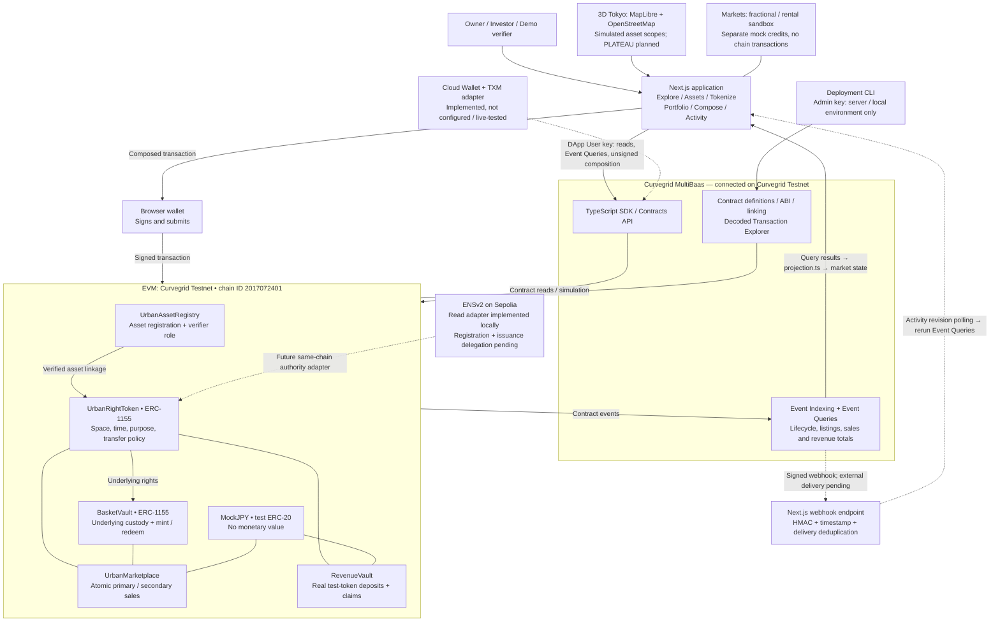
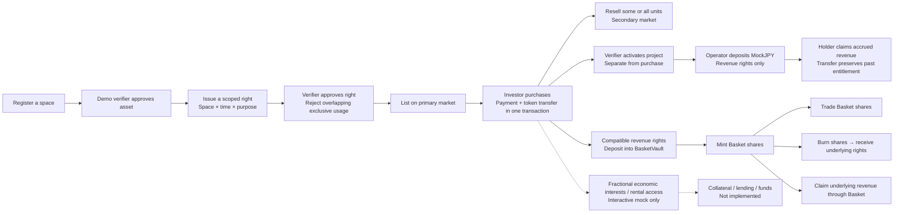
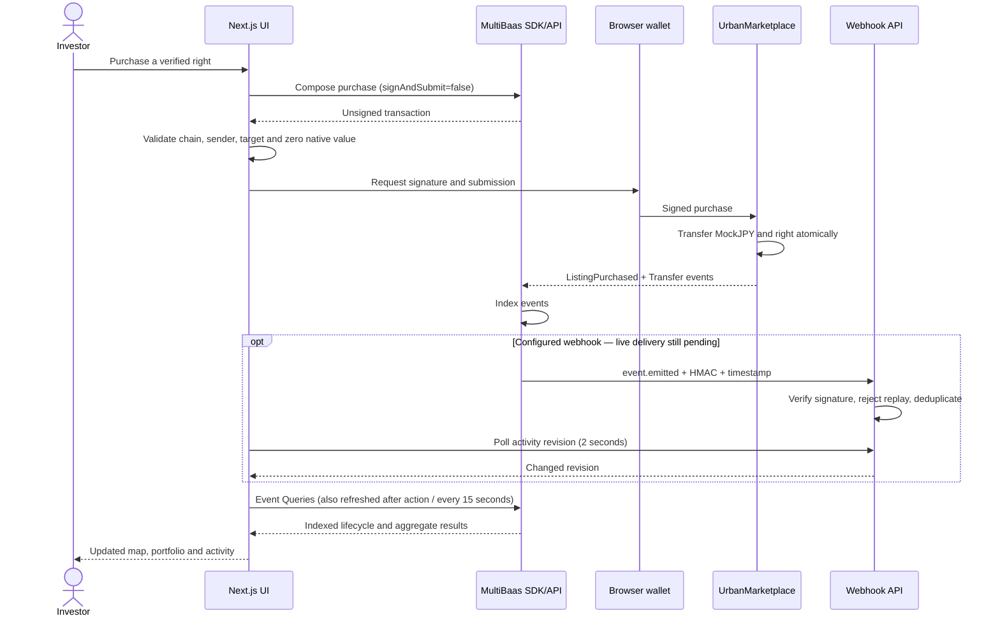
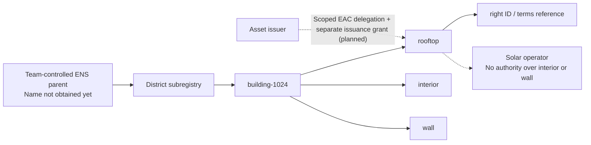

# TOKENIZE TOKYO


## (a) One-sentence summary

**TOKENIZE TOKYO turns Tokyo's dormant urban spaces into scoped, time-bounded ERC-1155 rights (usage and revenue share) that can be verified, funded, traded and bundled into baskets, with every market view built from Curvegrid MultiBaas event queries and every transaction composed by MultiBaas and signed in the user's own wallet.**

> **Integration status (read first).** The MultiBaas path was verified live on 2026-09-26 on a MultiBaas Free-plan deployment on **Curvegrid Testnet (chain ID 2017072401)**: Foundry deploy of all six contracts, Forge MultiBaas linking, event indexing, Event Queries (including `add` aggregation), SDK reads and unsigned transaction composition all passed `npm run multibaas:verify`. **Not yet exercised live:** webhook delivery, Cloud Wallet, TXM, and the browser UI in `multibaas` mode. In `multibaas` mode the app fails visibly instead of falling back to simulated data.

---

## Pitch: Dormant Capital

Tokyo does not lack assets. It has assets that do nothing.

| Figure                                                                    | Value          | Source                                                                          |
| ------------------------------------------------------------------------- | -------------- | ------------------------------------------------------------------------------- |
| Vacant homes in Tokyo                                                     | 896,500        | MIC Statistics Bureau, 2023 Housing and Land Survey (令和5年住宅・土地統計調査) |
| of which "other vacant homes" (not for rent, not for sale, not secondary) | 214,200        | same survey                                                                     |
| Unused land in the 23 wards                                               | about 1,303 ha | Tokyo Metropolitan Government, 2021 Land Use Survey (令和3年 土地利用現況調査)  |
| Detached houses with rooftop solar                                        | about 6.0%     | TMG Bureau of Environment, FY2022 survey (2022年度実績)                         |

Sources:

- Vacant homes: MIC, 2023 Housing and Land Survey, Tokyo summary by the TMG Bureau of Housing Policy <https://www.juutakuseisaku.metro.tokyo.lg.jp/akiya/learn/genjyo> (detail tables on e-Stat <https://www.e-stat.go.jp/dbview?sid=0004021631>).
- Unused land: TMG Bureau of Urban Development, "Land Use in Tokyo, 2021 survey of the 23 wards" <https://www.toshiseibi.metro.tokyo.lg.jp/about/chousa/tochi_c/tochi_kekka_r3>.
- Rooftop solar: TMG Bureau of Environment, Tokyo solar installation survey, FY2022 results (detached houses 6.01%, all housing 5.79%, all buildings 4.99%) <https://www.kankyo.metro.tokyo.lg.jp/climate/renewable_energy/solar_energy/200300a20210608150837623>.

The owner of a vacant house or an idle roof has no way to sell _part of what the space can do_ (the roof for 10 years of solar, the ground floor on weekends as a workshop) without selling or leasing the whole property through a bespoke contract. Capital providers have no shared registry of what is available, what is already committed, and what revenue has actually been paid.

## Urban Rights Protocol

A right is **space × time × usage × cash flow**.

| Dimension | On-chain field                                                                                                                                                   | Where                          |
| --------- | ---------------------------------------------------------------------------------------------------------------------------------------------------------------- | ------------------------------ |
| Space     | `assetId` + canonical `scope`: roof=0, interior=1, wall=2, land=3, whole asset=4                                                                                 | `UrbanRightToken.SpatialScope` |
| Time      | `startAt`, `endAt` as a half-open interval `[start, end)`                                                                                                        | `UrbanRightToken.Right`        |
| Usage     | `rightType` (Usage, Revenue Share, Lease, Other), `purpose` hash, `exclusive` flag, transfer policy (Open, Allowlist, Nontransferable), `termsURI` + `termsHash` | `UrbanRightToken.RightRequest` |
| Cash flow | Revenue Share rights receive a pro-rata share of MockJPY actually deposited into `RevenueVault`                                                                  | `RevenueVault`                 |

Every right is an ERC-1155 token id with a fixed supply. Assets and rights have **separate** verification lifecycles (asset: Draft, Pending, Verified, Rejected; right: Pending, Verified, Active, Closed, Rejected).

**Conflict engine** (`UrbanRightToken.findConflict`):

- Two rights on the same asset conflict when at least one is exclusive, the scopes match or either is "whole asset", and the intervals overlap: `start < other.endAt && other.startAt < end`. Adjacent periods (`end == other.start`) do not conflict.
- Only Verified or Active rights block; the check runs at creation **and again at `verifyRight`**, so two competing pending applications cannot both be approved.
- Exclusive usage must have `supply == 1` (indivisible).
- Revenue Share rights (`rightType == 1`) are skipped by the engine and cannot be exclusive, so **revenue rights coexist with usage rights** on the same space: a workshop can use the interior while investors hold the roof's solar revenue.
- Only one asset can be verified per canonical `geoReference` hash (`verifiedAssetByGeo`), and only the verified asset's issuer can create rights on it.

This is a bounded, canonical-scope engine, not an arbitrary polygon intersection or surveyed floor plan.

## Product

- **Explore**: 3D Tokyo (MapLibre GL, OpenFreeMap vector tiles from OpenStreetMap data, extruded buildings) with category and lifecycle filters and a **City X-ray** layer that shows right scopes on each building.
- **Assets**: a separate directory of registered spaces, with name/district search, category and state filters, and offer-price sorting. Desktop rows become cards on smaller screens. **View on map** opens the selected space and its existing terms/purchase panel; directory filters persist while navigating. The homepage no longer includes the asset-card list.
- **Opportunity Lens**: a filter that lights up about 150 client-side, clearly labeled demo sites representing the kind of dormant supply the statistics describe. These are a visual demo dataset, not on-chain assets and not claims about real properties.
- **Tokenize**: register an asset, request verification, verifier approves, issuer defines a scoped right, verifier approves, issuer lists it.
- **Portfolio**: holdings, claimable revenue, resale listings, basket redemption. Each holding shows its units and claimable mJPY next to the actions available on it (**Claim revenue**, enabled only when something is claimable; **List for resale**; **Redeem** for basket shares).
- **Compose**: bundle 2 to 8 compatible revenue rights into a Tokyo Solar Basket (ERC-1155 shares backed by custody of the underlying rights).
- **Activity**: urban activity ledger built from MultiBaas event queries; links to the MultiBaas Transaction Explorer.
- Lifecycle stage per asset (`src/lib/lifecycle.ts`): Dormant, Available, Funding, Funded, Active. "Funded" means the issuer sold its full supply; it is not a certification of project economics.

## Guided experience and broader asset types

**Main theme — Cyberpunk:** open `http://127.0.0.1:3000/` (or `?theme=cyberpunk`). Tokenize opens a modal over the current screen, keeping the map and draft in place. A custom brush wordmark and a map-first Explore layout put Tokyo in the foreground; **Overview** restores the dashboard layout, and **Original** restores the green design. The preference uses its own localStorage key and does not change holdings, transactions or app mode. See [design variants and logo attribution](docs/DESIGN_VARIANTS.md).

Use **使い方ガイド** in the sidebar for an optional Japanese walkthrough. Choose buying a right or listing a space; the guide waits for the relevant app action and can be closed with Escape or restarted. It never signs or submits a transaction for you.

**Tokenize** has three focused steps: **Space → Right → Publish**. Only one selected space is shown. Location details, evidence, terms and transfer settings expand on demand. Publish shows the next lifecycle action and the required demo role. Use **Working on** to resume a registered asset; choose **＋ New space** to create one.

The browser catalog has **49 fictional spaces across seven categories**: rooftop solar, vacant-home workshops, idle-land pop-ups, parking, storage, wall advertising and community spaces. Non-solar examples are single, exclusive **usage rights** with purpose-specific terms and dates. Parking, storage and advertising use the existing contract's `Other` type with a validated metadata subtype. New examples are appended without clearing existing holdings or custom assets. Explore's **More spaces** filter exposes the additional categories.

**Overview is an analysis view, not an asset table.** It shows a seven-day trade/deposit chart, separates primary rights, secondary rights and Basket turnover, compares activation by asset type, traces deposited versus withdrawn revenue, and links pending-review/activation signals to actions. Clicking an asset type filters the map. Figures come from the current mode's event stream; fictional metadata is never presented as measured social impact.

### Scripted activity on Curvegrid Testnet

On 2026-09-26, `demo:seed:testnet` added 49 fictional assets using **448 confirmed transactions** through MultiBaas unsigned composition and four local test signers. Including the pre-existing asset, Event Queries returned **50 assets, 44 rights, 72 listings, 69 sales, 3 baskets and 630 indexed events**. Volume was **2,269,800 MockJPY**, deposits **117,000 MockJPY**, and withdrawals from RevenueVault **25,800 MockJPY**. These are scripted test quantities, not adoption, real capital or realized investment returns.

- [Transaction hashes and actors](deployments/testnet-demo-receipts.json) — public metadata only; private signer keys remain in ignored `.data/` with restricted permissions.
- [Verification report](deployments/testnet-demo-verification.json) — 426 scenario actions matched by transaction hash and event name, SDK custody/balance checks for every basket, event totals reconciled against server-side Event Query aggregates.
- `npm run demo:verify:testnet` — read-only verification. The Free-plan indexer took time to catch up; rerun after syncing rather than treating partial rows as complete market state.
- `npm run demo:seed:testnet` — sends a bounded scenario on chain `2017072401` only. Maximum 650 transactions and 0.7 test ETH including actor funding; current run used about 0.333. It journals signed hashes before submission and resumes without repeating confirmed actions. Never delete its journal to rerun a completed scenario.

The browser at port 3000 remains in `demo` mode. These on-chain scenarios are not silently imported into browser localStorage. A browser-wallet rehearsal is separate from scripted signing.

### How to inspect TOKENIZE TOKYO transactions in MultiBaas

1. Open the MultiBaas deployment for **Curvegrid Testnet**, then **Blockchain → TX Explorer**.
2. Copy a `hash` from `deployments/testnet-demo-receipts.json`, for example an action ending in `/issue`, `/secondary-purchase`, `/revenue-1`, `basket-0/mint` or `basket-0/redeem`.
3. Search the hash and inspect **Overview**, **Function Details**, and **Event Details**. The linked ABI decodes the function and emitted events.
4. For Basket custody, use the linked rights contract's `balanceOf(BasketVault, rightId)` and compare it with the basket share supply. The verification script performs these reads through MultiBaas.

The current Activity link opens the deployment, not a validated per-hash deep link. Curvegrid Testnet RPC requires a provisioned endpoint/API key; do not publish that URL or invent Etherscan transaction URLs for this chain. The planned Sepolia deployment will have separate addresses and Sepolia explorer links. See the official [Transaction Explorer guide](https://docs.curvegrid.com/multibaas/tx-explorer/) and [Curvegrid Testnet description](https://docs.curvegrid.com/multibaas/networks/curvegrid-testnet/).

## Secondary financial markets — interactive mock

**Markets** is a separate, clearly marked sandbox:

- **Fractional market:** acquire shares of a mock right pool's economic interest, reserve shares for resale, and explicitly simulate a buyer settling the resale. Inventory checks prevent duplicate simulated sales.
- **Rental market:** choose a duration, preview the price, confirm a mock access pass, and return access. The original token stays with its owner. Early return does not simulate a refund.
- **Portfolio → Fractionalize / lend · mock:** use a held protocol right as a reference for a new fraction pool or rental offer. Creating a mock market does not move or encumber the token.

This sandbox has its own **mock credits** and localStorage. It does not use MockJPY, MultiBaas, token custody or protocol balances. Fractional economic interests do not grant simultaneous exclusive use of a physical space. No actual income, enforceable access, collateral loan or production fractionalization contract is implemented. The sandbox demonstrates the next market layer separately from the tested Solidity workflows.

## Architecture

The city is the discovery interface. **Urban Rights contracts enforce ownership of tokens, transfer rules and payments; MultiBaas supplies reads, indexed history and transaction composition.** Owning a token or ENS name is not proof of ownership of a building.

### Product and infrastructure



Solid paths describe implemented architecture; dotted paths are pending live connection or implementation as labelled. **The current default browser mode is `demo`**: it substitutes localStorage events for MultiBaas and does not broadcast transactions. The separate testnet seed script uses MultiBaas composition with local test signers; it does not prove a browser-wallet or Cloud Wallet rehearsal.

### What happens after tokenization?



Revenue starts with a token deposit, not with a timer or advertised yield. Usage rights and revenue rights have different meaning: holding revenue units does not grant roof access. Buying all primary units can mark a project **Funded**; **Activated** requires a separate action and does not certify real construction.

### Signing, indexing and refreshing



The receiver is implemented for a single persistent Node server. A changed webhook revision triggers another MultiBaas query; the webhook payload itself is not treated as authoritative market state.

The [feature status matrix](docs/FEATURE_STATUS.md) separates tested contracts, browser simulation, live service checks and mocks. The [remaining tasks](docs/REMAINING_TASKS.md) identify what is still needed for the full submitted demo.

### ENSv2: spatial namespaces and delegated authority (prototype)

Target hierarchy:



`src/lib/ens/` now builds namespace paths, reads name state and canonical parent/subregistry pointers at one Sepolia block, checks expiry, reads an operator's explicit EAC roles, and prepares a narrow unsigned grant/revoke call descriptor. Unit fixtures pass; **no live ENS registration, delegation or Universal Resolver verification has been performed**. `npm run ens:inspect` uses explicitly configured Sepolia RPC and registry values, with no fabricated fallback names or addresses. This diagnostic uses direct read-only RPC; product transaction integration remains MultiBaas-first.

Authoritative ENS issuance needs a **Sepolia deployment of both Urban Rights and MultiBaas**; Curvegrid Testnet cannot directly enforce a Sepolia namespace. The existing testnet stays available. `UrbanNamespaceAuthority` and the delegated issuance contract entry point remain to be implemented. A resolver edit or EAC namespace grant must not confer issuance or verifier authority on its own.

See the [ENSv2 specification and milestones](docs/ENSV2_DESIGN.md), [ENS pitch deck](docs/pitch/ens.html) and [four-minute pitch runbook](docs/PITCH_DEMO.md).

## Smart contracts

Solidity 0.8.28, Paris EVM, via-IR, OpenZeppelin 5, Foundry. `contracts/src/`.

| Contract             | What it does                                                                                                                                                                                                                                                                                      |
| -------------------- | ------------------------------------------------------------------------------------------------------------------------------------------------------------------------------------------------------------------------------------------------------------------------------------------------- |
| `UrbanAssetRegistry` | Anyone registers a draft asset (geo hash, metadata, type). Issuer requests verification; `VERIFIER_ROLE` approves or rejects. One verified asset per canonical geo hash. Metadata is frozen after submission; rejected assets can be revised and resubmitted.                                     |
| `UrbanRightToken`    | ERC-1155 rights with type, supply, terms URI/hash, time window, transfer policy, scope, purpose, exclusivity. Conflict engine, right verification, activation, closure, allowlist and nontransferable policies. Its `_update` hook checkpoints revenue for sender and receiver on every transfer. |
| `UrbanMarketplace`   | Fixed-price primary and secondary listings for rights and basket shares, partial fills, cancel. Payment (MockJPY) and token delivery in one atomic `purchase`. Listings do not escrow tokens.                                                                                                     |
| `RevenueVault`       | Deposits allowed only for Active revenue rights inside their time window. Cumulative reward-per-share index (scale 1e27), per-holder checkpoints, claims. Buyers do not inherit revenue earned before they bought.                                                                                |
| `BasketVault`        | ERC-1155 basket shares. Fixed-ratio custody of 2 to 8 revenue rights; deposit and mint are atomic (no unbacked shares); redeem returns the underlying; harvests revenue from `RevenueVault` and redistributes per share. One basket per underlying right.                                         |
| `MockJPY`            | "Mock JPY - TEST ONLY" (mJPY), 18 decimals, public faucet capped at 1,000,000 per call. No monetary value.                                                                                                                                                                                        |

**Tests:** 25 Foundry tests in 3 suites (`Protocol.t.sol` 13 including a rounding fuzz test, `Spatial.t.sol` 5, `EdgeCases.t.sol` 7), 43 Vitest tests in 9 files, 12 Playwright end-to-end tests. The original local Anvil run recorded 50 real transactions with assertions (`deployments/local-demo-receipts.json`). The expanded `demo:seed` now includes all seven catalog sites and will send additional transactions on a fresh deployment.

Local Anvil addresses (chain 31337, not a public network) are in `deployments/31337.json`.

## (b) How we used MultiBaas

MultiBaas is the app's only data and transaction backend in `multibaas` mode. There is no custom indexer and no RPC read path.

**1. Contract management (Forge MultiBaas).** `npm run multibaas:link` (`scripts/link-multibaas.ts`) checks the MultiBaas chain id against the deployment manifest with `ChainsApi.getChainStatus`, then runs `contracts/script/Link.s.sol`, which calls `MultiBaas.linkContractWithOptions` from `curvegrid/forge-multibaas` for all six contracts with labels `urbanassetregistry`, `urbanrighttoken`, `urbanmarketplace`, `revenuevault`, `basketvault`, `mockjpy`, and sets event sync to start at the deployment block. Deploy and link are separate steps because Forge also runs FFI during simulation.

**2. Reads via the SDK.** `readContract()` in `src/lib/multibaas.ts` calls `ContractsApi.callContractFunction(address, label, method, { args, formatInts: "as_strings" })` for `balanceOf`, `claimable`, `getAsset` and MockJPY `balanceOf`. Integers come back as strings to avoid precision loss.

**3. Discovery and history via Event Queries.** `src/lib/queries.ts` declares 24 event streams (asset lifecycle, `RightCreated`, `RightScopeDefined`, verification/activation/closure, listings, purchases, revenue, basket events, and ERC-1155 `TransferSingle`/`TransferBatch` for both rights and baskets). Each query is built as an `EventQuery` filtered by `FieldType.ContractAddress` so another deployment cannot pollute the view, selects input fields by `inputIndex` (their position in the event ABI) plus `BlockNumber`, `TxHash`, `TriggeredAt`, ordered by block. `EventQueriesApi.executeArbitraryEventQuery(query, offset, 50)` is paged 50 rows at a time (the maximum the API accepts), fetched in bounded batches of 4 streams, and the app refuses to render if a stream exceeds 100,000 rows.

**4. Server-side aggregation.** Trade volume, total revenue deposited and total claimed use Event Query aggregation (`aggregator: "add"` on `totalPrice` / `amount`), so dashboard totals are computed by MultiBaas, not by summing in the browser.

**5. Unsigned transactions, signed by the user's wallet.** `sendViaMultiBaas()` calls `callContractFunction(..., { args, from, signAndSubmit: false })`, requires a `TransactionToSignResponse`, rejects any `submitted` response, then validates the returned transaction (`to` equals the expected contract, `from` equals the connected account, `value` is zero, `data` is hex) before handing it to `eth_sendTransaction`. The wallet is used only for signing, submission and receipt polling, never as a second data source. The chain id of the wallet must match `NEXT_PUBLIC_CHAIN_ID`.

**6. Webhooks.** `POST /api/webhooks/multibaas` reads the raw body (hard cap 1 MiB of actual bytes), verifies `HMAC-SHA256(rawBody + X-MultiBaas-Timestamp)` against the hex `X-MultiBaas-Signature` with `timingSafeEqual`, rejects timestamps outside 5 minutes, validates the payload with Zod, accepts only `event.emitted` from the six configured contract addresses, and stores each delivery once using an exclusive hard link keyed by `sha256(delivery id)` (retry-safe dedup). `GET /api/activity` returns a revision hash; the browser polls it every 2 s and re-runs the event queries when it changes, with a 15 s full refresh as fallback. This is webhook-triggered polling, not push.

**7. Key separation.** The browser only ever gets `NEXT_PUBLIC_MULTIBAAS_DAPP_KEY`, a key in the DApp User group (reads, event queries, unsigned composition). The admin/server key `MULTIBAAS_API_KEY` is used only by `scripts/*` and `src/server/operator.ts`, which throws if loaded in a browser. `npm run multibaas:verify` proves the frontend key cannot call `AdminApi.listApiKeys` (expects 401/403) and fails otherwise.

**8. Readiness check.** `npm run multibaas:verify` (`scripts/verify-multibaas.ts`) checks chain id, that each address is linked with the right label (`AddressesApi.getAddress`), that indexing is enabled and caught up (`ContractsApi.getEventIndexingStatus`); these two are Administrators-only, so they use `MULTIBAAS_API_KEY`. With the DApp User key it then runs an SDK read (`nextAssetId`), an unsigned composition of `registerAsset` (not submitted), a non-empty `AssetRegistered` query, the volume aggregation, and the admin-endpoint denial.

**9. Operator (optional Cloud Wallet + TXM).** `CloudWalletOperator` (`src/server/operator.ts`, CLI `npm run operator`) calls `callContractFunction` with `signAndSubmit: true, nonceManagement: true` from a MultiBaas Cloud Wallet, restricted to an allowlist (`verifyAsset`, `verifyRight`, `activateRight`, `closeRight`, `depositRevenue`, and MockJPY `approve` only to RevenueVault with a cap of 1e24), and reads status back through `TxmApi.listWalletTransactions`. `BrowserOperator` implements the same interface through the wallet path. Cloud Wallet requires an Azure-backed wallet configured in MultiBaas and has not been executed.

## What becomes programmable

- **Ownership.** A right to part of a space for a period is an ERC-1155 token id with fixed supply, scope (roof, interior, wall, land, whole asset), time window and terms hash (`UrbanRightToken`).
- **Transactions.** `UrbanMarketplace.purchase` moves MockJPY payment and the right (or basket shares) in one atomic transaction, with partial fills for primary and secondary listings.
- **Permissions.** Each right carries a transfer policy enforced on every transfer: Open, Allowlist (both sides must be allowed via `setAllowed`) or Nontransferable. Verification is two-stage: the asset is verified first (`verifyAsset`), then each right separately (`verifyRight`, which re-runs the conflict check).
- **Financial workflows.** `RevenueVault` distributes deposited revenue with a reward-per-share index and per-holder checkpoints on every transfer; `BasketVault` bundles 2 to 8 revenue rights into custody-backed basket shares that harvest and redistribute that revenue.

## Why Curvegrid

- **One backend for reads, history, aggregates and transaction composition.** An RWA dashboard lives or dies on lifecycle history (who verified, when it activated, what was actually paid). Event Queries with contract-address filters and `add` aggregation give that without running our own indexer or database.
- **Non-custodial by default.** `signAndSubmit: false` lets the backend build the transaction while the investor keeps the key. The same `callContractFunction` with `signAndSubmit: true` gives an operator path (Cloud Wallet + TXM) for the verifier and revenue operator roles that should not live in a browser.
- **RBAC fits RWA roles.** A DApp User key in the browser and an admin key on the server map cleanly to "public investors" vs "platform operator".
- **Signed webhooks** give an auditable trigger for dashboard refresh when revenue is deposited or a right is verified.

## (c) Team and social handles

**Team: Urban Rights Lab**

| Member | Role | GitHub | X |
| --- | --- | --- | --- |
| natsuki | Product, protocol design, full-stack | [@natsukingly](https://github.com/natsukingly) | [@0x_natto](https://x.com/0x_natto) |

- Repository: <https://github.com/natsukingly/tokenize-tokyo>
- Live demo: `TODO before submission`
- Demo video: `TODO before submission`

## (d) Setup and testing

Prerequisites: Node.js 22+, npm, Foundry 1.5.0 (`forge`, `anvil`), Git, Python 3 (for Forge MultiBaas linking). Internet access for OpenFreeMap tiles and WebGL for 3D; asset cards still work if tiles fail.

```sh
git submodule update --init --recursive
npm ci
cp .env.example .env.local
```

### Mode 1: demo (no keys, no chain)

Keep `NEXT_PUBLIC_APP_MODE=demo`.

```sh
npm run dev            # http://127.0.0.1:3000
```

Use the **Demo actor** selector (Owner A, Investor B, Investor C, Demo verifier). State is simulated in localStorage and the header shows **SIMULATED DEMO**. **Reset demo** clears it.

### Mode 2: local contracts on Anvil (no MultiBaas)

```sh
npm run anvil          # terminal 1
npm run deploy:local   # terminal 2: deploys 6 contracts, writes deployments/31337.json
npm run demo:seed      # local catalog txs with assertions; writes deployments/local-demo-receipts.json
```

`deploy:local` uses Anvil's unlocked dev account and `demo:seed` refuses to run unless chain id is 31337 and the registry is fresh. Never reuse Anvil accounts on a public network. The browser demo does not talk to Anvil.

### Mode 3: multibaas

These are the steps we ran against Curvegrid Testnet (chain ID 2017072401) on the MultiBaas Free plan.

1. Create a MultiBaas deployment on **Curvegrid Testnet**.
2. Create three API keys:
   - **Administrators** group, for `scripts/*` (`MULTIBAAS_API_KEY`).
   - **DApp User** group only, for the browser (`NEXT_PUBLIC_MULTIBAAS_DAPP_KEY`).
   - A key with **"use as public Web3 key"**. Curvegrid Testnet RPC is reached through it: `NETWORK_RPC_URL=https://<deployment>.multibaas.com/web3/<key>`.
3. In **Admin > CORS**, add `http://127.0.0.1:3000` (and your HTTPS origin) so the browser can call MultiBaas.
4. Fund a fresh test deployer key from **Blockchain > Faucet** inside MultiBaas (1 ETH per request).
5. In `.env.local` set `MULTIBAAS_URL`, `MULTIBAAS_API_KEY`, `NETWORK_RPC_URL`, `DEPLOYER_ADDRESS`, `ADMIN_ADDRESS`, `DEPLOYMENT_FILE=deployments/2017072401.json`.
6. Deploy (writes `deployments/2017072401.json`). Use a test-only key; a Foundry keystore (`--account <keystore> --sender "$DEPLOYER_ADDRESS"`) works the same way:
   ```sh
   cd contracts && forge script script/Deploy.s.sol:Deploy --rpc-url "$NETWORK_RPC_URL" --broadcast --private-key <test deployer key> && cd ..
   ```
7. Link all six contracts through Forge MultiBaas and export public addresses:
   ```sh
   npm run multibaas:link
   npx tsx scripts/write-public-env.ts deployments/2017072401.json   # writes deployments/frontend-addresses.env
   ```
8. Copy the `NEXT_PUBLIC_*_ADDRESS` lines into `.env.local`, set `NEXT_PUBLIC_APP_MODE=multibaas`, `NEXT_PUBLIC_MULTIBAAS_URL`, `NEXT_PUBLIC_MULTIBAAS_DAPP_KEY`, `NEXT_PUBLIC_CHAIN_ID=2017072401`. Restart `npm run dev`.
9. Seed at least one asset and one right. We used `cast send` for `registerAsset`, `requestVerification`, `verifyAsset`, `createScopedRight` and `verifyRight` (verifier calls come from `ADMIN_ADDRESS`, which `Deploy.s.sol` grants `VERIFIER_ROLE`; it defaults to the deployer).
10. Verify. `PROBE_ADDRESS` must be a **funded** address, because MultiBaas estimates gas for unsigned composition against the sender's balance:
    ```sh
    PROBE_ADDRESS=<funded address> npm run multibaas:verify
    ```
11. Webhooks: subscribe `event.emitted` to `https://<origin>/api/webhooks/multibaas`, set `MULTIBAAS_WEBHOOK_SECRET` (server only) and a persistent `WEBHOOK_DATA_DIR`. Designed for a single Node server, not serverless. Not yet exercised live.
12. Optional operator (Cloud Wallet configured in MultiBaas, `MULTIBAAS_OPERATOR_ADDRESS` set; not yet exercised live):
    ```sh
    npm run operator -- registry verifyAsset 1 true
    npm run operator -- rights activateRight 1
    npm run operator -- status <txHash>
    ```

### Tests

| Command                    | What it runs                                                                                                                                                                                                        |
| -------------------------- | ------------------------------------------------------------------------------------------------------------------------------------------------------------------------------------------------------------------- |
| `npm run typecheck`        | `tsc --noEmit`                                                                                                                                                                                                      |
| `npm run test`             | Vitest, 43 tests: projection, lifecycle, SDK adapter with controlled responses, tx validation, webhook HMAC/replay/dedup, activity revision, asset catalog and mock financial markets |
| `npm run test:contracts`   | Foundry, 25 tests: authorization, lifecycle, atomic trades, revenue accounting, fuzzed rounding, conflicts, baskets, expiry                                                                                         |
| `npm run test:e2e`         | Playwright, 12 tests on demo mode (starts `npm run dev` itself): trade, revenue and baskets; verification and conflicts; onboarding and mock markets; pitch flow; 3D map filters, mobile layout and reversible themes |
| `npm run demo:seed`        | Real-contract flow on Anvil (after `anvil` + `deploy:local`)                                                                                                                                                        |
| `npm run multibaas:verify` | Live MultiBaas readiness (Mode 3 only)                                                                                                                                                                              |

CI (`.github/workflows/ci.yml`) runs typecheck, Vitest with coverage, Foundry, build and Playwright.

## (e) Experience with MultiBaas

Based on the live run on 2026-09-26: a MultiBaas Free-plan deployment on Curvegrid Testnet (chain ID 2017072401, PoA with instant mining). The console showed the Free-plan limits: event indexing at 2 events/s (100 blocks back), 30,000 API calls per month, 10 active smart contracts (we use 6), unlimited Cloud Wallet.

**Wins**

- **Forge MultiBaas linked all six contracts on the first try.** `npm run multibaas:link` ran `Link.s.sol` via FFI and printed "API key validation successful / Creating contract 'urbanassetregistry 1.0' / Creating address ... alias / Contract linked successfully" for each contract.
- **Indexing caught up to head within seconds.** `getEventIndexingStatus` reported `isProcessingPastLogs=false` with `startBlockNumber` 18853, so the readiness check could assert "indexed and caught up" instead of waiting.
- **The testnet needed no outside infrastructure.** The deployment's Web3 key endpoint gave us an RPC for Curvegrid Testnet, and the built-in faucet (1 ETH per request) funded a fresh deployer key. The six-contract deploy used about 11.1M gas, about 0.027 ETH at 2.4 gwei.
- **One call shape for reads and composition.** `callContractFunction` served the SDK read (`nextAssetId` returned 2 after seeding) and unsigned composition of `registerAsset` (`signAndSubmit: false`) with the same method.
- **Event Queries replaced an indexer.** With address-filtered queries the `AssetRegistered` query returned the seeded row, and `add` aggregation on `ListingPurchased.totalPrice` returned `[{"value":null}]` before any sale. The app has no custom indexer or database.
- **RBAC did what we expected for the browser key.** The DApp User key could read chain status (`/chains/ethereum/status` 200), address data (`/addresses/{addr}` 200) and run queries (`/queries` 200), and `AdminApi.listApiKeys` was denied to it.

**Challenges (all found on the live run and fixed in code)**

- **Event Query inputs are selected by position, not by name.** Our first queries used `select` items of type `input` with `name`. MultiBaas answered `400 {"status":400,"message":"invalid request"}` and nothing more. The fix was `inputIndex` (the input's position in the event ABI); `src/lib/queries.ts` keeps each event's `fields` in ABI order, so the index is the array position.
- **Page size is capped at 50.** `POST /queries` with `limit` above 50 returns the same bare `400 "invalid request"`. We had been paging 500 rows at a time; `queryRows()` in `src/lib/multibaas.ts` now pages by 50. Both errors return the same body, so the response alone does not say which part of the request is wrong.
- **The DApp User key cannot read address or indexing status.** `AddressesApi.getAddress` and `getEventIndexingStatus` return 403 for DApp User. `scripts/verify-multibaas.ts` now uses the Administrators key (`MULTIBAAS_API_KEY`) for those two checks and the DApp key for chain status, reads, composition and queries.
- **Unsigned composition fails for an unfunded sender.** `callContractFunction` with `signAndSubmit: false` returned `400 "gas required exceeds allowance (0)"` when `from` had zero balance, because MultiBaas estimates gas against the sender's balance. The verify script now takes a funded `PROBE_ADDRESS`. A new user with an empty wallet would hit the same error before seeing a transaction to sign.
- **Event Query values need wire-format normalization.** `bytes32` values arrived as JSON byte arrays; dynamic Basket arrays also arrived as JSON strings. `projection.ts` now normalizes both, with tests and live Basket projection verification.
- **Overloaded functions have API-specific names.** For this linked ABI, `totalSupply` selected the no-argument overload; `totalSupply(uint256)` and its selector were rejected. `totalSupply0` successfully read the per-ID supply. The testnet verification script documents that observed method name.
- **A successful transaction is not immediate index completeness.** During the batch, Event Queries returned partial history. We now match every meaningful scripted action by hash/event and reconcile aggregates before recording verification success.
- **No log index in Event Query results.** We can order by block but not by position within a block. When two lifecycle events for one asset share a block, `loadMarket()` resolves the asset status with an SDK `getAsset` read. Right status is projected order-independently (Closed beats Active beats Verified).
- **Browser access needed a CORS entry.** `http://127.0.0.1:3000` had to be added in Admin > CORS before the browser could call the API.

**Feedback for the Curvegrid team**

1. **Return a reason in the 400 body.** "invalid request" for both an unknown `name` field and an oversized `limit` cost us the most time. Naming the field ("select[0]: name is not supported, use inputIndex" or "limit must be <= 50") would make both one-line fixes.
2. **Document the 50-row page limit** on the Event Query endpoint and in the SDK doc comment for `executeArbitraryEventQuery`.
3. **Allow selecting event inputs by name.** The ABI is already linked, so `name` would be more ergonomic and would not break when an event signature gains a field.
4. **Let the DApp User group read indexing status (read-only).** A frontend could then show "index catching up" without holding an admin key.
5. **Explain or relax the funded-sender requirement for unsigned composition,** for example by skipping the balance-based gas check when `signAndSubmit` is false, or by returning a clearer error.
6. **Return `bytes32` values as hex in Event Query results,** or document the byte-array form.
7. **Expose a log index** (or a per-transaction ordinal) as an Event Query field.

**Not exercised live yet:** webhook delivery, Cloud Wallet signing, TXM, and the browser UI in `multibaas` mode. The webhook receiver, Cloud Wallet operator and browser path are implemented and covered only by local tests.

## Disclaimers

The app shows: **"Test assets only. Verification is simulated. Map data does not prove ownership. Mock JPY has no monetary value."** The vacant-home demo site states: **"No residential or property ownership is sold."**

- All demo sites, including Opportunity Lens sites, are fictional positions on a real basemap. They do not assert that any real property is vacant, available or owned by anyone.
- `VERIFIER_ROLE` stands in for evidence review; no real ownership or authority is checked.
- MockJPY is a valueless test token. No yield is promised; revenue is only what is actually deposited.
- This is not a securities offering. Legal structuring, KYC, tax and enforceable real-world agreements are not implemented.
- The map uses MapLibre with OpenFreeMap/OpenStreetMap tiles. No 3D city model dataset is integrated.
- No external security audit has been performed.

## Project documents

- [Implementation report](docs/IMPLEMENTATION_REPORT.md): what was built, what was executed locally, what remains unverified.
- [Feature implementation matrix](docs/FEATURE_STATUS.md): local, on-chain, mock and pending status.
- [Remaining tasks](docs/REMAINING_TASKS.md): submission gates and Sepolia/ENS milestones.
- [ENSv2 specification](docs/ENSV2_DESIGN.md): local read adapter implemented; live delegation and issuance pending, no ENS prize claimed.
- [ENS pitch material](docs/pitch/ENS_IMPLEMENTATION.md): evidence-based slide content and target demo.
- [Showcase copy](docs/showcase.md), [Q&A cheat sheet](docs/qa-cheatsheet.md), [five-slide finalist pitch](docs/pitch/index.html), [four-minute narration and exact demo actions](docs/PITCH_DEMO.md). The deck includes an optional rehearsal clock (T), notes (N) and a local-demo shortcut (D). Statistics are dated and sourced in the runbook.

## References

- MultiBaas docs: <https://docs.curvegrid.com/multibaas/>
- MultiBaas TypeScript SDK: <https://github.com/curvegrid/multibaas-sdk-typescript>
- Forge MultiBaas: <https://github.com/curvegrid/forge-multibaas>
- MapLibre GL JS: <https://maplibre.org/>, OpenFreeMap: <https://openfreemap.org/>
