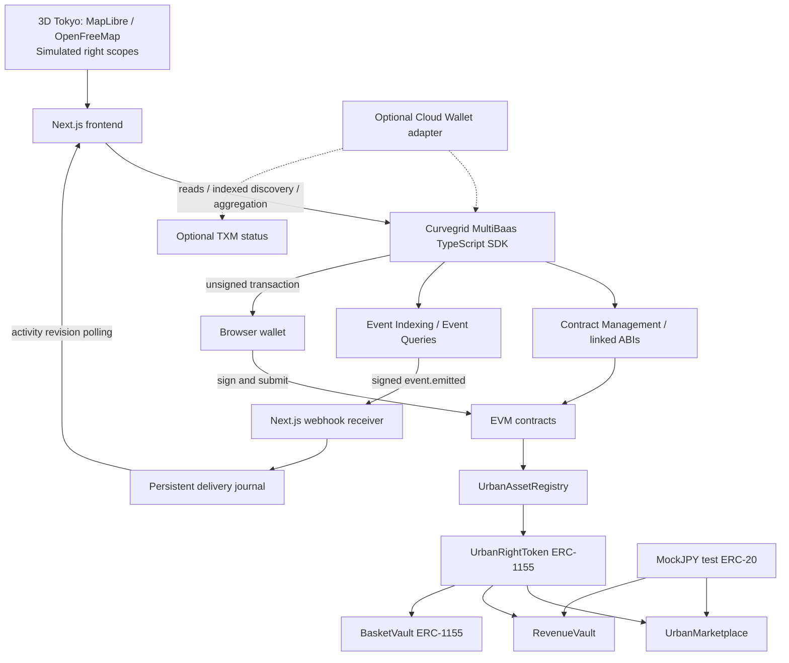

# TOKENIZE TOKYO

**TOKENIZE TOKYO turns dormant urban assets into programmable rights that can be funded, traded, and composed into new financial products.**

Turn dormant city assets into productive capital.


## Current implementation status

This is a locally implemented hackathon prototype. The browser opens in **SIMULATED DEMO** mode with clearly labeled fictional asset listings. A separate local Anvil execution validates the real Solidity contracts, settlement transfers, revenue accounting and basket custody. These are two different validation environments; the demo browser does **not** submit transactions to Anvil.

The MultiBaas SDK, deployment/link scripts, indexed market queries, unsigned transaction composition, signed webhook receiver and operator adapters are implemented. **A MultiBaas deployment and credentials have not been supplied. No successful live MultiBaas integration, Cloud Wallet operation or TXM transaction is claimed.** In `multibaas` mode the app requires that service and fails visibly instead of switching to simulated data.

No public frontend, public-chain deployment or ENSv2 integration has been published. See [implementation report](docs/IMPLEMENTATION_REPORT.md) for reproducible evidence and remaining work.

## Problem

Unused roofs, vacant rooms and idle plots already exist. Their owners, prospective users, operators and capital providers lack a shared way to discover opportunities and specify which rights are actually available. A token representing an entire building does not express a roof's permitted purpose, duration, transfer restrictions or deposited-revenue entitlement.

## Solution

3D digital twin → scoped rights → verification → primary funding → activation → secondary trading → financial composition.

The map is the interface: category and lifecycle filters reveal relevant spaces, City X-ray exposes scope layers, My spaces highlights holdings, and Compose connects the roofs underlying a basket. Funding and Funded are derived from issuer sales of the defined supply; these labels do not certify project economics. Activation metrics are separate from trading metrics. Registration or tokenization alone never counts as a social outcome.

The **Urban Rights Protocol** separates the physical asset record from its contractual rights:

- Asset: issuer, canonical geography reference, metadata, type, verification status.
- Right: underlying asset, issuer, type, supply, terms URI/hash, start/end, transfer policy, scope, purpose, verification/activation status. All rights in one protocol deployment settle in the same immutable test ERC-20.
- Exclusive usage: indivisible; identical or whole-asset scopes cannot overlap in time with another exclusive use. Half-open intervals allow adjacent periods. Verification rechecks conflicts to defeat competing pending applications.
- Revenue share: coexists with usage rights and represents only a share of actual eligible deposits. The demo verifier remains responsible for validating the underlying authority and terms.

Canonical scopes are roof, interior, wall, land and whole asset. These are bounded scope identifiers, **not an arbitrary polygon-intersection engine or surveyed floor plan**. Duplicate verification of an identical geography hash is rejected; semantic aliases or fraudulent geometry still require verifier review.

## Demo use cases

**Rooftop solar:** Owner registers a demo roof → verifier approves → owner defines a revenue right → verifier approves → investors purchase → verifier activates → operator deposits MockJPY → holders claim → rights trade → compatible rights enter Tokyo Solar Basket.

**Vacant home:** Owner defines a single usage right with dates, purpose, repair conditions in the terms and a transfer policy. The same registry and marketplace handle the right. No ownership sale of a real house is implied.

Demo sites in Nihonbashi, Kanda and Kuramae are fictional opportunities positioned on a real basemap. The names and polygons do not establish that a real property is vacant, available, owned by the issuer or for sale.

## Architecture



The current city basemap is OpenStreetMap/OpenFreeMap with extruded buildings. **PLATEAU/Cesium/Re:Earth are not integrated.** A future PLATEAU importer can replace the geometry provider without changing rights settlement; its object identifiers must be canonicalized by the verifier.

## How we use MultiBaas

| Feature              | Product responsibility                                                                                     | Current evidence                                                       |
| -------------------- | ---------------------------------------------------------------------------------------------------------- | ---------------------------------------------------------------------- |
| Contract management  | Upload/link all six contracts using official Forge MultiBaas library; start event sync at deployment block | Script implemented; live execution pending                             |
| TypeScript SDK       | Contract reads and unsigned transaction composition; user signs in browser                                 | SDK adapter tests and typecheck pass; live pending                     |
| Event indexing       | Discover assets, issued rights, listings, transfers, claims and baskets                                    | Event catalog and deployment-scoped queries implemented                |
| Event Queries        | Paginated lifecycle retrieval; server-side `add` aggregation for sale volume, deposits and claims          | Query shape and pagination tests pass; live data pending               |
| Webhooks             | HMAC-verified `event.emitted` changes activity revision and triggers frontend query refresh                | Actual local HTTP handler tests pass; external delivery pending        |
| RBAC / API keys      | DApp User-only public key; separate deployment/operator key                                                | Env separation and permission probe implemented; console setup pending |
| Cloud Wallet         | Optional allowlisted verifier / activation / revenue operator                                              | Adapter only; no Azure configuration or execution                      |
| TXM                  | Status lookup for Cloud Wallet transactions                                                                | Adapter only; no transactions to demonstrate                           |
| Transaction Explorer | Inspect decoded issue, purchase, deposit and basket transactions                                           | Inspection procedure below; live deployment pending                    |
| Safe Accounts        | Possible administrator authority                                                                           | Not implemented                                                        |

### Indexed views and consistency

`src/lib/queries.ts` defines the event queries and exact event argument names. Every query filters by contract address, so unrelated deployments cannot pollute market totals. `src/lib/multibaas.ts` calls SDK `executeArbitraryEventQuery`, pages 500 rows at a time, and refuses to render a silently truncated result above 100,000 rows per stream.

The app folds returned lifecycle events into a transient view in `projection.ts`; it does not run a separate persistent chain indexer. Financial totals are also aggregated by MultiBaas. Current portfolio balances and claimable amounts come from SDK contract reads, while discovery and history come from the event index. Event Query does not expose log ordering in the installed SDK field types; tied asset lifecycle transitions within one block are reconciled with an SDK contract read.

A signed delivery updates a persistent activity journal. Browsers poll its revision every two seconds, then refetch MultiBaas queries; a 15-second query refresh also handles index lag or missed deliveries. This is webhook-triggered **polling**, not a WebSocket push service. Chain confirmation and indexed visibility can occur at different times. There is no market-wide instantaneous-consistency guarantee.

The current UI retrieves full bounded streams and filters them locally. Large production cities need narrower queries, incremental ranges, finalized-block policy and a database-backed delivery store. City-scale throughput has not been benchmarked.

## Smart contracts

| Contract             | Responsibility                                                                                                                                                                  |
| -------------------- | ------------------------------------------------------------------------------------------------------------------------------------------------------------------------------- |
| `UrbanAssetRegistry` | Open draft registration, submit, verifier approval/rejection, metadata freezing and unique verified geography hash                                                              |
| `UrbanRightToken`    | Typed/scoped ERC-1155 rights, independent right verification, time conflict checks, activation/closure, allowlist/nontransferable policies and pre-transfer revenue checkpoints |
| `UrbanMarketplace`   | Fixed primary/secondary orders for rights and basket shares, partial purchases, cancel, atomic payment and token delivery                                                       |
| `RevenueVault`       | Actual ERC-20 deposits for operating revenue rights; cumulative reward accounting, retained fractional accrual and independent claims                                           |
| `BasketVault`        | Fixed-ratio custody of 2–8 distinct compatible revenue rights, atomic deposit-and-mint, proportional redemption and harvested revenue distribution                              |
| `MockJPY`            | Explicitly worthless 18-decimal test token with a public bounded faucet                                                                                                         |

Marketplace orders do not escrow rights. Balance is checked at purchase; an order can become stale if its seller transfers away the backing balance. Failed transfers revert the whole purchase including payment. Multiple listings do not guarantee execution or liquidity.

Basket issuance never exists without custody: `depositUnderlying` and `mintBasketShares` both perform deposit + mint atomically. A right may back only one basket pool in this implementation to prevent shared-vault revenue from crossing pools. Creating a definition reserves those rights; this restriction is a prototype limitation. Expired/closed receipts remain transferable for return/redemption, but the marketplace rejects trading expired rights and baskets with incompatible underlying rights. Tiny integer rounding dust remains in vaults. No yield is synthesized.

## Setup

Prerequisites: Node.js 22+, npm, Foundry (`forge`, `anvil`, `cast`; tested with 1.5.0), Git and Python 3 for Forge MultiBaas linking. Solidity is pinned to 0.8.28, Paris EVM, with OpenZeppelin 5.4.0 and forge-std pinned in submodules.

### 1. Run the browser demo

```sh
git submodule update --init --recursive
npm ci
cp .env.example .env.local
npm run dev
```

Open <http://127.0.0.1:3000>. Keep `NEXT_PUBLIC_APP_MODE=demo`. The app needs internet access for the OpenFreeMap basemap and WebGL for 3D; asset cards remain usable when tiles fail. The predev/prebuild hook copies the matching MapLibre v6 workers into `public/maplibre`.

Use the **Demo actor** selector for Owner A, Investor B, Investor C and Demo verifier. **Reset demo** clears only this app's simulated city. Browser state is localStorage simulation, not a wallet or blockchain connection. For deployment build: `npm run build` then `npm start`.

### 2. Validate the real local contracts

In terminal one:

```sh
npm run anvil
```

In terminal two:

```sh
npm run test:contracts
npm run deploy:local
npm run demo:seed
```

`deploy:local` is deliberately limited to localhost Anvil's unlocked development account. **Never use Anvil development accounts on a public network.** `demo:seed` additionally checks chain ID 31337 and a fresh registry. It sends 50 local transactions and asserts proportional claims, no inherited past revenue, secondary ownership, basket custody and redemption. An `eth_call` simulation asserts a conflicting exclusive right is rejected.

Addresses go into `deployments/31337.json`; receipts into `deployments/local-demo-receipts.json`. Restarting Anvil loses this chain unless you explicitly configure its state persistence. Rerunning deploy produces a new manifest; rerun seed for that deployment.

### 3. Connect a real MultiBaas deployment later

1. Create a MultiBaas deployment on your chosen EVM testnet. Confirm its chain ID, RPC and faucet with the service. This repo does not guess a Curvegrid testnet RPC or assume Sepolia support in your deployment.
2. Create a key belonging **only to DApp User** for reads, event queries and unsigned composition. Set `NEXT_PUBLIC_MULTIBAAS_URL` and `NEXT_PUBLIC_MULTIBAAS_DAPP_KEY` locally. Public env variables are shipped to the browser; never place an admin/operator key in them.
3. Create a separate server/deployment key with the necessary contract management permissions. Set `MULTIBAAS_URL`, `MULTIBAAS_API_KEY`, `NETWORK_RPC_URL`, `DEPLOYER_ADDRESS`, `ADMIN_ADDRESS` and `DEPLOYMENT_FILE`. Store secrets in ignored `.env.local` or a secret manager. Never paste them into a commit, screenshot or chat.
4. Configure allowed CORS origins in MultiBaas for `http://127.0.0.1:3000`, `http://localhost:3000` if used, and the exact HTTPS frontend origin. Use the least permissions needed for each key.
5. Fund a testnet-only deployment wallet and deploy using an encrypted Foundry keystore. For example, after exporting the non-secret variables into your shell:

```sh
cd contracts
forge script script/Deploy.s.sol:Deploy --rpc-url "$NETWORK_RPC_URL" --account tokyo-deployer --sender "$DEPLOYER_ADDRESS" --broadcast
cd ..
```

6. Set `DEPLOYMENT_FILE=deployments/<chain-id>.json` in `.env.local`. Run:

```sh
npm run multibaas:link
npx tsx scripts/write-public-env.ts deployments/<chain-id>.json
```

Copy the generated **public** address entries from `deployments/frontend-addresses.env` into `.env.local`, without overwriting secret values. Set the actual `NEXT_PUBLIC_CHAIN_ID`, an optional public `NEXT_PUBLIC_RPC_URL`, and `NEXT_PUBLIC_APP_MODE=multibaas`. Restart/rebuild Next.js after public env changes.

The link command checks MultiBaas/deployment chain agreement, runs the official Forge MultiBaas library to upload/link ABIs, and sets sync start to the deployment block. Deploy and link are deliberately separate: FFI linking must not create a misleading live deployment record during a Forge dry run.

7. In MultiBaas confirm all six contract labels: `urbanassetregistry`, `urbanrighttoken`, `urbanmarketplace`, `revenuevault`, `basketvault`, `mockjpy`. Check event synchronization is enabled and caught up, including ERC-1155 single/batch transfers and `RightScopeDefined`.
8. Connect a browser test wallet on the same chain. The faucet mints only MockJPY; native gas must come from the chain's test faucet. The deployer/admin must grant `VERIFIER_ROLE` to the intended demo verifier. Use the UI to register and verify at least one asset so the event query has data.
9. Run `npm run multibaas:verify`. It checks chain, address linking, indexing progress, SDK read, unsigned transaction composition, nonempty registration query, sales aggregation and denial of an admin endpoint to the public key. Also manually confirm the key's sole group is DApp User; one denied endpoint is not a complete RBAC audit.

### 4. Configure signed webhooks

Expose the local Node server through an HTTPS development tunnel, or deploy it with persistent storage. In MultiBaas subscribe `event.emitted` to `https://<app-origin>/api/webhooks/multibaas`; set its secret as server-only `MULTIBAAS_WEBHOOK_SECRET`. Synchronize server time.

The handler verifies **HMAC-SHA256(raw request body + X-MultiBaas-Timestamp)** against the hex `X-MultiBaas-Signature`, checks a five-minute timestamp window, enforces a one-MiB body limit, validates the array payload, and accepts events only from the configured contract addresses. Delivery IDs are hashed into an atomic, exclusive file publication for retry-safe deduplication. Invalid signatures fail closed. Storage failures return a retryable 503.

Set `WEBHOOK_DATA_DIR` to a persistent private volume accessible to both API routes. This implementation targets **one Node service**, not ephemeral serverless instances or multiple unrelated filesystems. For horizontal scaling use a shared database with a unique delivery ID and transactional publication. Set a retention policy before prolonged usage.

Trigger `AssetVerified`, `ListingPurchased` or `RevenueDeposited` from the wallet. Confirm delivery success in MultiBaas, a changed `/api/activity` revision, and updated indexed data in the browser. Send the same delivery again and confirm no duplicate activity. Local signature/route tests are already present; real external delivery remains a required integration check.

### 5. Optional Cloud Wallet and TXM

Only after the core flow works, configure an Azure-backed Cloud Wallet through MultiBaas and set `MULTIBAAS_OPERATOR_ADDRESS`. Grant only the required verifier permission and provide test gas/MockJPY. The adapter permits bounded RevenueVault approvals and deposits, plus verification/activation/closure. It is a server-side CLI, not an unauthenticated public transaction endpoint.

```sh
npm run operator -- registry verifyAsset 1 true
npm run operator -- rights activateRight 1
npm run operator -- status <transaction-hash>
```

`BrowserOperator` and `CloudWalletOperator` implement the same signer interface. The Cloud path uses `signAndSubmit`/nonce management and looks up the resulting transaction in TXM. Until executed with valid credentials, describe this as **implemented adapter, unverified integration**. Safe initiation, automated schedules and automatic revenue collection are not implemented.

## How to inspect TOKENIZE TOKYO transactions in MultiBaas

Once deployed and linked, open the deployment's Transaction Explorer and search the transaction hash shown by the app. Check the contract address matches the manifest, then inspect decoded inputs and events:

| Action                       | Function / evidence                                                                          |
| ---------------------------- | -------------------------------------------------------------------------------------------- |
| Register and issue           | `registerAsset`, `createScopedRight`; `AssetRegistered`, `RightCreated`, `RightScopeDefined` |
| Verify                       | `verifyAsset`, `verifyRight`; verifier sender and approved status                            |
| Primary / secondary purchase | `purchase`; `ListingPurchased`, MockJPY `Transfer`, rights `TransferSingle`                  |
| Revenue                      | `depositRevenue`, `claim`; ERC-20 movement and `RevenueDeposited` / `RevenueClaimed`         |
| Basket                       | `depositUnderlying`; transfers **to BasketVault**, `UnderlyingDeposited`, `BasketMinted`     |
| Redeem                       | `redeem`; burned basket shares and underlying return transfers                               |

The recorded local hashes refer to Anvil only and will not appear in a remote MultiBaas explorer. Attach live testnet hashes to the submission after the real run.

## Testing

```sh
npm run typecheck
npm run test:coverage
npm run test:contracts
forge coverage --root contracts --ir-minimum --report summary
npm run build
npx playwright install chromium
npm run test:e2e
```

Unit tests cover authorization, verification, primary/secondary atomicity, cancellation, restricted transfers, actual funded revenue, double claims, old/new holder accounting, rounding fuzz cases, spatial conflicts, competing pending requests, basket compatibility/custody/claims/redemption, expiry and canonical geography duplication.

TypeScript tests cover transaction validation, SDK composition and paginated query contracts, event projections, HMAC tampering/replay, concurrent deduplication and the HTTP receiver-to-activity revision path. SDK transport tests use controlled responses; they are **not** live deployment tests. Playwright exercises simulation purchase→revenue→secondary→basket, registration/verification/conflict rejection, mobile layout and actual WebGL map interaction. The map test requires external style availability; all financial browser tests operate without a live chain.

Coverage is scoped, not a whole-product assurance: V8 reports the instrumented projection/webhook core; Forge `--ir-minimum` warns of approximate source mapping. See the implementation report for measured results. No external security audit has been performed.

## Four-minute demo flow

Start with a reset simulation and prefilled fictional solar assets. For live mode rehearse wallet confirmations and indexing latency in advance; it may take longer than four minutes.

| Time      | Action                                                                                                                                                                                                                                                               |
| --------- | -------------------------------------------------------------------------------------------------------------------------------------------------------------------------------------------------------------------------------------------------------------------- |
| 0:00–0:25 | Explore Tokyo. Filter Rooftop, switch City X-ray. Explain: “We tokenize what a space can do.”                                                                                                                                                                        |
| 0:25–1:10 | Owner A registers a roof in Tokenize. Submit; switch Demo verifier and approve asset. Owner issues a Usage Right with supply 1, scope Roof and exclusive enabled; verifier approves. Attempt the same interval with a different purpose and show conflict rejection. |
| 1:10–1:40 | Investor B acquires 10 units of Nihonbashi Solar Revenue Share after reviewing terms. Portfolio shows the right.                                                                                                                                                     |
| 1:40–2:10 | Demo verifier activates the solar right in Tokenize. Deposit 10,000 MockJPY. Investor B claims 1,000 MockJPY. Explain that real mode requires an actual vault deposit.                                                                                               |
| 2:10–2:40 | Investor B lists 5 units for resale. Investor C buys this secondary offer and 5 Kanda units.                                                                                                                                                                         |
| 2:40–3:35 | Investor C selects both solar rights in Compose, creates Tokyo Solar Basket, then deposits and mints 5 shares. Highlight the underlying roofs and real custody requirement. Show portfolio or list basket shares.                                                    |
| 3:35–4:00 | City overview. Separate trading totals from simulated activated space and generation capacity. “We tokenize Tokyo to put dormant assets back to work.”                                                                                                               |

## Limitations

- All assets and spatial highlights are demo/simulated; real ownership verification is not performed. `VERIFIER_ROLE` simulates evidence review. Neither a map, a token nor a namespace proves property ownership.
- PLATEAU data does not grant real-world property rights; PLATEAU is not yet integrated here.
- This is not a public securities offering. Financial/regulatory treatment, enforceable legal agreements, identity/KYC, tax, disputes and real-world operator performance are not implemented.
- No promised yield, guaranteed resale liquidity, risk-free basket or measured social outcome. Active square meters/capacity are simulated estimates. Project activation is a verifier action, not an automatic engineering or funding certification.
- Metadata and evidence are bounded inline JSON/terms references; document storage, verified evidence upload and production content moderation are not implemented. The app does not fetch arbitrary metadata URLs server-side.
- MockJPY is not a real stablecoin. The local chain is ephemeral. Test wallets and keys must never be reused for real assets.
- Canonical scopes are coarse; no arbitrary floor subdivision, semantic geometry deduplication or real solar engineering model. Multiple revenue issuances rely on verifier review for consistent financial terms.
- One basket pool per underlying right; no lending, fund administration, auction, CCA, World ID, Safe or production ENSv2 integration. [ENSv2 design](docs/ENSV2_DESIGN.md) addresses the same-chain authority issue before implementation.
- Live MultiBaas, public frontend, external webhook delivery, Cloud Wallet and TXM are still unverified. Core code should not be described as a completed sponsor integration until these checks pass.

## MultiBaas experience — factual local feedback

**Worked well in local development:** the generated TypeScript SDK supplies explicit API and response types for reads, unsigned calls and ad-hoc event queries. The official Forge library provides an existing contract upload/link path, avoiding a custom management client. The event model maps naturally to separate asset, right and financial lifecycles.

**Friction observed:** older frontend examples include a chain argument that the installed 1.1.1 SDK methods no longer accept. Event query operators/aggregators needed checking against the official sample (`equal`, `add`); generic SQL-like assumptions would have been wrong. Event Query field types do not include a log index, so tied asset lifecycle transitions require reconciliation. Deployment and linking needed distinct steps because Forge simulation executes FFI too.

**Suggestions based on that work:** version-match example code to SDK releases; provide a typed end-to-end aggregate-query example with pagination and ordering; offer a documented log ordinal or current-state projection recipe. Webhook examples that include retries, persistent deduplication and cache refresh would help application teams.

**Not evaluated:** hosted-service latency/reliability, index backfill duration, Azure setup, Cloud Wallet signing and TXM behavior. No feedback about using those services is invented.

## Team and submission checklist

Team member names and social handles: **to be filled by the team**. Do not infer identities from a local filesystem username.

Before submitting:

- [ ] Publish the intended source repository with recursive submodules and an accessible live demo.
- [ ] Fill team members, social handles, public URL, chain ID, live addresses and transaction links.
- [ ] Complete the MultiBaas live checklist above and replace pending statuses only with observed results.
- [ ] Record one signed webhook causing a visible indexed refresh.
- [ ] Record a four-minute walkthrough and collect feedback from actual hosted-service use.
- [ ] Recheck the current sponsor requirements and submission deadline.

**README self-review:** product summary, architecture, concrete integration responsibilities, setup, tests, demo, limitations and factual developer feedback are included. Team/social details, public deployment evidence and live Curvegrid verification are incomplete, so the submission is not yet ready. The [official Curvegrid prize page](https://ethglobal.com/events/tokyo2026/prizes/curvegrid) is the source of sponsor requirements; award eligibility or selection is not guaranteed.

## References

- [MultiBaas frontend guide](https://docs.curvegrid.com/multibaas/getting-started/build-a-frontend/)
- [Event indexing](https://docs.curvegrid.com/multibaas/event-indexing/)
- [Webhook signature specification](https://docs.curvegrid.com/multibaas/webhooks/)
- [Official TypeScript SDK](https://github.com/curvegrid/multibaas-sdk-typescript)
- [Official Forge MultiBaas library](https://github.com/curvegrid/forge-multibaas)
- [MapLibre documentation](https://maplibre.org/maplibre-gl-js/docs/), [OpenFreeMap](https://openfreemap.org/quick_start/)
