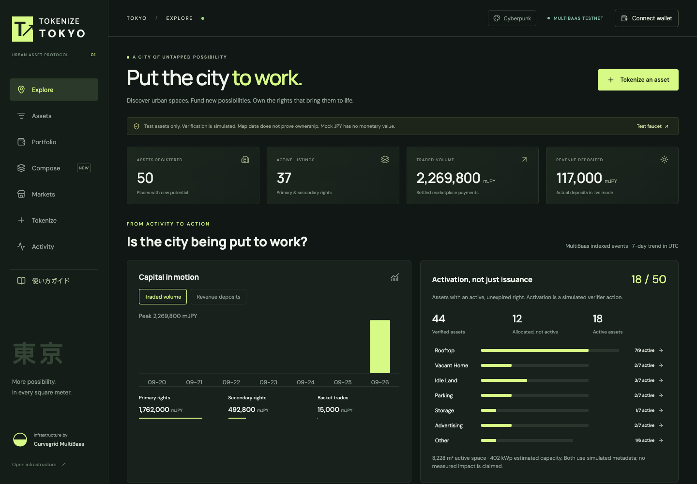
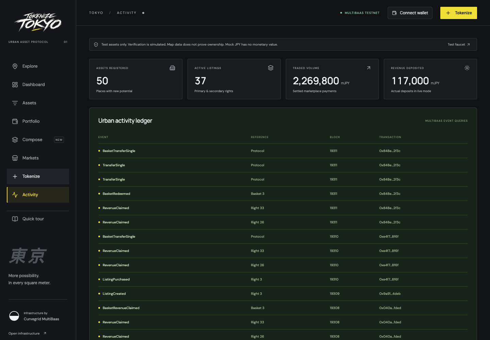
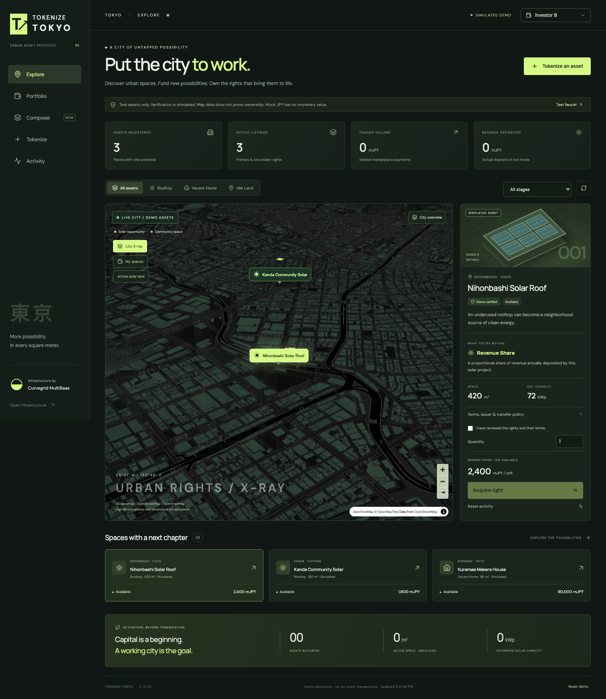
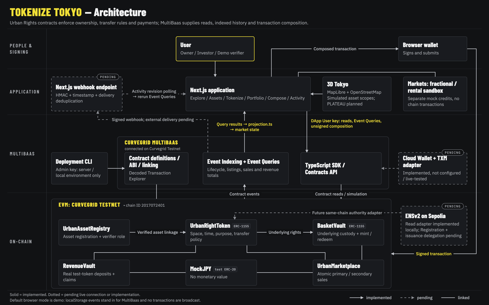
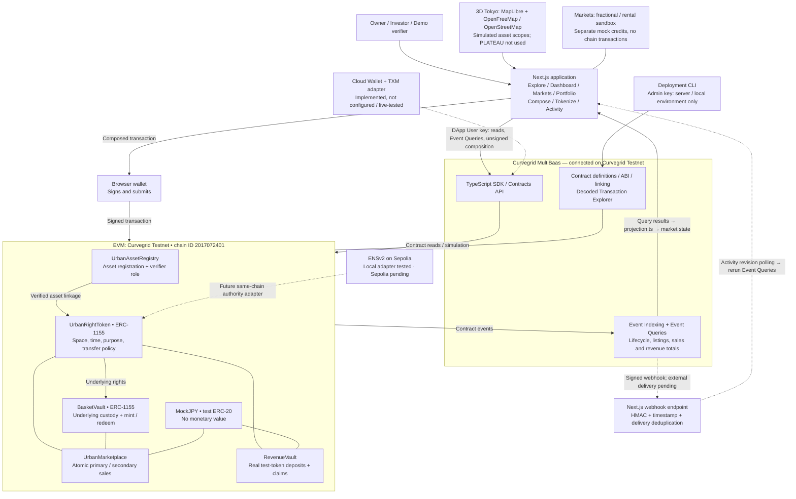
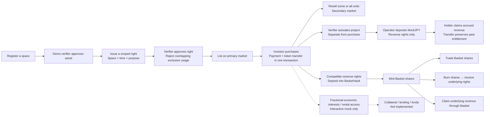
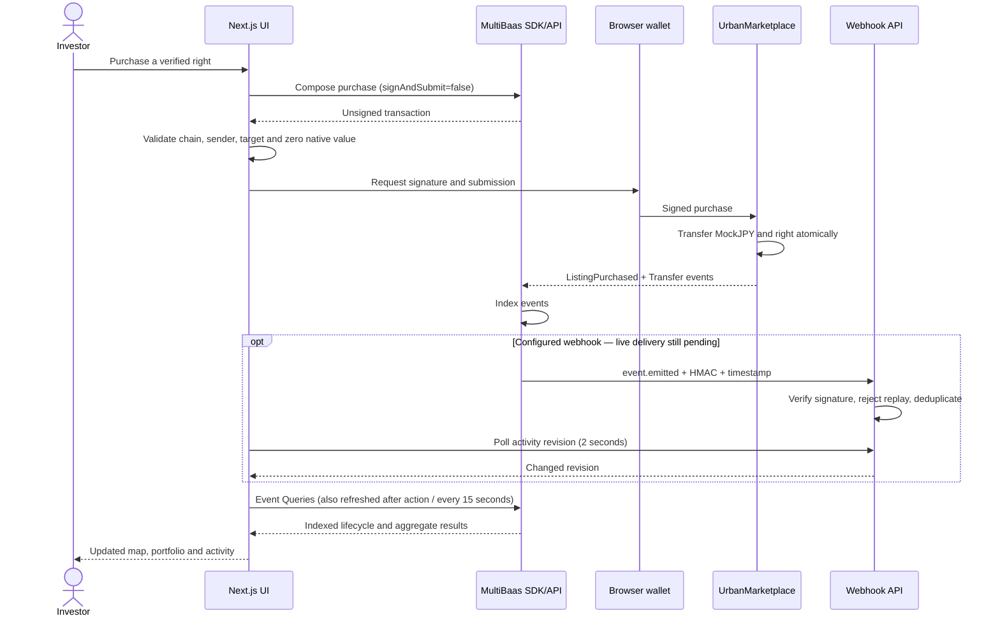
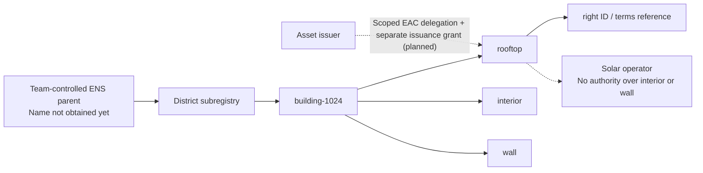

# TOKENIZE TOKYO


## (a) One-sentence summary

**TOKENIZE TOKYO turns Tokyo's dormant urban spaces into scoped, time-bounded ERC-1155 rights (usage and revenue share) that can be verified, funded, traded and bundled into baskets, with every market view built from Curvegrid MultiBaas event queries and every transaction composed by MultiBaas and signed in the user's own wallet.**

**Initial launch / 初期提供:** asset registration is intended for pre-approved companies only. Registration is open in this demo so anyone can try it; real company and ownership checks are not performed. 初期提供は事前審査を通過した法人企業に限定する方針です。デモでは誰でも登録を体験でき、実際の法人審査・所有権確認は行いません。See [Operational readiness / 本番運用に必要な工程](#operational-readiness--本番運用に必要な工程).

## Status at a glance

Checked on 2026-09-26.

| Status | What |
| --- | --- |
| **Live on Curvegrid Testnet** (chain ID `2017072401`) | All six contracts deployed, linked and indexed by a Curvegrid MultiBaas deployment. `npm run multibaas:verify` passes end to end (chain, linking, indexing, SDK read, unsigned composition, Event Query with `add` aggregation, admin-endpoint denial for the DApp key). 448 scripted transactions are on chain: 50 assets, 44 rights, 69 sales, 20 revenue deposits, 630 indexed events, 2,269,800 mJPY traded volume ([verification report](deployments/testnet-demo-verification.json)). |
| **Live in the browser (`multibaas` mode)** | Built with `NEXT_PUBLIC_APP_MODE=multibaas` and the origin registered in MultiBaas CORS, the app renders Explore stats, the analytics panel and the Activity ledger from MultiBaas Event Queries with zero console errors, loading in about 5 s over 32 requests. See [Screenshots](#screenshots). |
| **Simulated** | Default `demo` mode and the hosted demo (localStorage events, no chain transactions). Asset/right verification (a `VERIFIER_ROLE` test key, no real evidence review). All sites are fictional positions on a real basemap. **Markets → Fractional market / Rental market** use separate mock credits. MockJPY has no monetary value. |
| **Implemented, not exercised live** | Webhook delivery from MultiBaas, Cloud Wallet operator, TXM, and browser-wallet signing of a purchase in `multibaas` mode (the 448 on-chain transactions used scripted signers). |
| **Pending** | ENSv2: local adapter tested · Sepolia pending (details in [ENSv2](#ensv2-spatial-namespaces-and-delegated-authority)). |
| **Not used** | PLATEAU 3D city data (a possible future data source). The map is MapLibre with OpenFreeMap / OpenStreetMap tiles. |

In `multibaas` mode the app fails visibly instead of falling back to simulated data.

---

## Hosted demo

**Public URL: https://tokenize-tokyo.vercel.app/** (responds with the **SIMULATED DEMO** build as of 2026-09-26.)

Deployed on Vercel in `demo` mode. It creates no blockchain transactions. Demo events and holdings are stored per browser in localStorage and are not shared between visitors. The Curvegrid Testnet deployment described below is not connected to this URL. ENS, Cloud Wallet and live webhook delivery are not enabled here.

Deploy from the linked project directory:

```bash
vercel deploy --prod --yes --scope natsukiyamaguchi-8631s-projects \
  --build-env NEXT_PUBLIC_APP_MODE=demo --env NEXT_PUBLIC_APP_MODE=demo
```

`.vercelignore` allows only application source, public assets and required build inputs. It excludes all local environment files, `.data/` signer material, deployment receipts, contract artifacts and research files. No admin key or private key is needed for this deployment. `vercel.json` selects Next.js, `npm ci`, `npm run build`, and the Tokyo function region. The MapLibre worker is copied from the pinned dependency during `prebuild`.

Deployment currently uses the CLI; GitHub automatic deployment is not connected. Before enabling live MultiBaas on Vercel, configure only the DApp User key for client use, add the public origin to MultiBaas CORS, and replace the filesystem webhook store with a durable database. The hosted webhook endpoint deliberately returns 503 while its secret is absent.

## Pitch: Dormant Capital

Tokyo does not lack assets. It has assets that do nothing.

| Figure                                                                    | Value          | Source                                                                          |
| ------------------------------------------------------------------------- | -------------- | ------------------------------------------------------------------------------- |
| Vacant homes in Tokyo                                                     | 896,500        | MIC Statistics Bureau, 2023 Housing and Land Survey (令和5年住宅・土地統計調査) |
| of which "other vacant homes" (not for rent, not for sale, not secondary) | 214,200        | same survey                                                                     |
| Unused land in the 23 wards                                               | about 1,303 ha | Tokyo Metropolitan Government, 2021 Land Use Survey (令和3年 土地利用現況調査)  |
| Detached houses with rooftop solar                                        | about 6.0%     | TMG Bureau of Environment, FY2022 survey (2022年度実績)                         |

Sources:

- Vacant homes: MIC, 2023 Housing and Land Survey, Tokyo summary by the TMG Bureau of Housing Policy <https://www.juutakuseisaku.metro.tokyo.lg.jp/akiya/learn/genjyo> (detail tables on e-Stat <https://www.e-stat.go.jp/dbview?sid=0004021631>).
- Unused land: TMG Bureau of Urban Development, "Land Use in Tokyo, 2021 survey of the 23 wards" <https://www.toshiseibi.metro.tokyo.lg.jp/about/chousa/tochi_c/tochi_kekka_r3>.
- Rooftop solar: TMG Bureau of Environment, Tokyo solar installation survey, FY2022 results (detached houses 6.01%, all housing 5.79%, all buildings 4.99%) <https://www.kankyo.metro.tokyo.lg.jp/climate/renewable_energy/solar_energy/200300a20210608150837623>.

The owner of a vacant house or an idle roof has no way to sell _part of what the space can do_ (the roof for 10 years of solar, the ground floor on weekends as a workshop) without selling or leasing the whole property through a bespoke contract. Capital providers have no shared registry of what is available, what is already committed, and what revenue has actually been paid.

## Urban Rights Protocol

A right is **space × time × usage × cash flow**.

| Dimension | On-chain field                                                                                                                                                   | Where                          |
| --------- | ---------------------------------------------------------------------------------------------------------------------------------------------------------------- | ------------------------------ |
| Space     | `assetId` + canonical `scope`: roof=0, interior=1, wall=2, land=3, whole asset=4                                                                                 | `UrbanRightToken.SpatialScope` |
| Time      | `startAt`, `endAt` as a half-open interval `[start, end)`                                                                                                        | `UrbanRightToken.Right`        |
| Usage     | `rightType` (Usage, Revenue Share, Lease, Other), `purpose` hash, `exclusive` flag, transfer policy (Open, Allowlist, Nontransferable), `termsURI` + `termsHash` | `UrbanRightToken.RightRequest` |
| Cash flow | Revenue Share rights receive a pro-rata share of MockJPY actually deposited into `RevenueVault`                                                                  | `RevenueVault`                 |

Every right is an ERC-1155 token id with a fixed supply. Assets and rights have **separate** verification lifecycles (asset: Draft, Pending, Verified, Rejected; right: Pending, Verified, Active, Closed, Rejected).

**Conflict engine** (`UrbanRightToken.findConflict`):

- Two rights on the same asset conflict when at least one is exclusive, the scopes match or either is "whole asset", and the intervals overlap: `start < other.endAt && other.startAt < end`. Adjacent periods (`end == other.start`) do not conflict.
- Only Verified or Active rights block; the check runs at creation **and again at `verifyRight`**, so two competing pending applications cannot both be approved.
- Exclusive usage must have `supply == 1` (indivisible).
- Revenue Share rights (`rightType == 1`) are skipped by the engine and cannot be exclusive, so **revenue rights coexist with usage rights** on the same space: a workshop can use the interior while investors hold the roof's solar revenue.
- Only one asset can be verified per canonical `geoReference` hash (`verifiedAssetByGeo`), and only the verified asset's issuer can create rights on it.

This is a bounded, canonical-scope engine, not an arbitrary polygon intersection or surveyed floor plan.

## Product

Sidebar navigation (`src/components/Dashboard.tsx`): **Explore, Dashboard, Markets, Portfolio, Compose, Activity**, plus **Quick tour**. The header **Tokenize** action opens the creation dialog from any page.

- **Explore**: 3D Tokyo (MapLibre GL, OpenFreeMap vector tiles from OpenStreetMap data, extruded buildings), map-first. **Filters** and **Map tools** expand on demand; clicking a space opens its terms and purchase panel.
  - Filters highlight every matching space without selecting a result or moving the camera. **Reset filters** clears category, lifecycle and **My spaces** together while preserving the current map position and zoom. At city scale, compact markers replace full labels; hover or focus reveals the name.
  - **City X-ray**: a layer that shows right scopes (roof, interior, wall, land) on each building.
  - **Opportunity Lens**: lights up about 150 client-side, clearly labeled demo sites representing the kind of dormant supply the statistics describe. These are a visual demo dataset, not on-chain assets and not claims about real properties.
- **Dashboard**: an analysis view, not an asset table. Seven-day trade/deposit chart; primary, secondary and Basket turnover; activation by asset type; deposited versus withdrawn revenue; pending-review and activation signals linked to actions. The dashboard contains no embedded map or asset-detail panel. Clicking an asset type opens Explore with that filter applied. Figures come from the current mode's event stream; fictional metadata is never presented as measured impact.
- **Portfolio**: holdings, claimable revenue, resale listings, basket redemption. Each holding shows **Claim revenue** (enabled only when something is claimable), **List for resale** and **Redeem** for basket shares.
- **Compose**: bundle 2 to 8 compatible revenue rights into a Tokyo Solar Basket (ERC-1155 shares backed by custody of the underlying rights).
- **Markets**: one entry point with **All assets / Funding / Fractional / Rental** tabs. **All assets** is the searchable directory, with category/state filters and offer-price sorting; filters persist across tabs and navigation. **View on map** opens the selected space in Explore. **Funding** contains the launchpad’s fixed-price issuer offers (marketplace contracts in live mode). **Fractional / Rental** remain explicitly labeled mock markets with separate mock credits. Tokenize’s **View campaign** opens Funding directly; Portfolio’s mock-market action opens Fractional.
- **Tokenize**: a modal over the current screen with three steps, **Space → Right → Publish**. Register an asset, request verification, verifier approves, issuer defines a scoped right, verifier approves, issuer lists it. **Working on** resumes a registered asset; **＋ New space** creates one. The map and draft stay in place.
- **Activity**: urban activity ledger built from MultiBaas Event Queries (or the simulated stream in `demo` mode); 20 events per page, newest first, with Previous / Next and Latest controls. It paginates the loaded history in the UI, not the SDK queries. Links to the MultiBaas deployment.
- **Quick tour**: an optional English walkthrough. Floating cards highlight the next control with an arrow while the map stays visible. Choose buying a right or listing a space; the guide waits for the real app action, can be closed or restarted, and never signs or submits a transaction for you.
- **Lifecycle stage** per asset (`src/lib/lifecycle.ts`): Dormant, Available, Funding, Funded, Active. "Funded" means the issuer sold its full supply; it is not a certification of project economics.

**Theme.** Cyberpunk is the main theme (`http://127.0.0.1:3000/` or `?theme=cyberpunk`): charcoal surfaces, one yellow accent, a custom brush wordmark. The header has no theme switch. The earlier green design is available only through `?theme=original` for comparison. See [design variants and logo attribution](docs/DESIGN_VARIANTS.md).

**Catalog.** The browser catalog has **53 fictional spaces across seven categories**: rooftop solar, vacant-home workshops, idle-land pop-ups, parking, storage, wall advertising and community spaces. Non-solar examples are single, exclusive **usage rights** with purpose-specific terms and dates. Parking, storage and advertising use the contract's `Other` type with a validated metadata subtype. Explore presents all seven categories together in one asset-type filter, with a single visible selection.

Four examples start **Active**: Kodenmacho Operating Solar Roof, Okachimachi Operating Solar Roof, Bakurocho Reopened Makers House and Higashi-kanda Operating Storage. Explore → Filters → Active shows them; the dashboard counts 720 m² of simulated active space and 100 kWp of estimated solar capacity. They represent already-operating projects, not projects funded through this platform. No purchases, deposits or returns are fabricated by activation. Catalog upgrades append the examples without resetting existing browser holdings or user-created assets. Nihonbashi and Kanda remain available for the funding/activation walkthrough.

**稼働サンプル。** 屋根2件・再開した空き家1件・倉庫1件をActiveの模擬データとして用意しています。実際の現地稼働や収益を示すものではありません。以前のデモ履歴を残して追加され、地図のActiveフィルターとダッシュボードで稼働前後を比較できます。

**ENS namespace dashboard.** Open **Namespaces** in the sidebar or `/?view=namespaces`. Search and expand City → District → Asset → Space → Right, inspect the full example name, and return to the corresponding map space. Paths derive from the current asset/right data and the validated local namespace builder. All names are **unregistered previews** under the illustrative `tokenizetokyo.eth` parent; its ownership is not verified. The issuer address belongs to the Urban Rights record, not a verified ENS controller. Scoped delegation is shown as a planned flow, with no grant or registration transaction performed. See [ENSv2 design and remaining implementation](docs/ENSV2_DESIGN.md).

**ENS階層画面。** メニューのNamespacesで都市・区・アセット・空間・権利の関係を確認できます。実発行されたENSの一覧ではなく、現在のアセット情報から生成した名前空間のプレビューです。ENSの登録・解決・権限委譲は未接続で、画面でもその状態を明示しています。

### Scripted activity on Curvegrid Testnet

On 2026-09-26, `demo:seed:testnet` added 49 fictional assets using **448 confirmed transactions** through MultiBaas unsigned composition and four local test signers. Including the pre-existing asset, Event Queries returned **50 assets, 44 rights, 72 listings, 69 sales, 3 baskets and 630 indexed events**. The scenario made 20 revenue deposits. Volume was **2,269,800 MockJPY**, deposits **117,000 MockJPY**, and withdrawals from RevenueVault **25,800 MockJPY**. These are scripted test quantities, not adoption, real capital or realized investment returns.

- [Transaction hashes and actors](deployments/testnet-demo-receipts.json) — public metadata only; private signer keys remain in ignored `.data/` with restricted permissions.
- [Verification report](deployments/testnet-demo-verification.json) — 426 scenario actions matched by transaction hash and event name, SDK custody/balance checks for every basket, event totals reconciled against server-side Event Query aggregates.
- `npm run demo:verify:testnet` — read-only verification. The Free-plan indexer took time to catch up; rerun after syncing rather than treating partial rows as complete market state.
- `npm run demo:seed:testnet` — sends a bounded scenario on chain `2017072401` only. Maximum 650 transactions and 0.7 test ETH including actor funding; current run used about 0.333. It journals signed hashes before submission and resumes without repeating confirmed actions. Never delete its journal to rerun a completed scenario.

A browser built in `multibaas` mode reads these transactions from Event Queries (see [Screenshots](#screenshots)). `demo` mode never imports them into localStorage. Scripted signing is not a browser-wallet rehearsal; a browser-wallet purchase in `multibaas` mode has not been performed yet.

### How to inspect TOKENIZE TOKYO transactions in MultiBaas

1. Open the MultiBaas deployment for **Curvegrid Testnet**, then **Blockchain → TX Explorer**.
2. Copy a `hash` from `deployments/testnet-demo-receipts.json`, for example an action ending in `/issue`, `/secondary-purchase`, `/revenue-1`, `basket-0/mint` or `basket-0/redeem`.
3. Search the hash and inspect **Overview**, **Function Details**, and **Event Details**. The linked ABI decodes the function and emitted events.
4. For Basket custody, use the linked rights contract's `balanceOf(BasketVault, rightId)` and compare it with the basket share supply. The verification script performs these reads through MultiBaas.

The current Activity link opens the deployment, not a validated per-hash deep link. Curvegrid Testnet RPC requires a provisioned endpoint/API key; do not publish that URL or invent Etherscan transaction URLs for this chain. The planned Sepolia deployment will have separate addresses and Sepolia explorer links. See the official [Transaction Explorer guide](https://docs.curvegrid.com/multibaas/tx-explorer/) and [Curvegrid Testnet description](https://docs.curvegrid.com/multibaas/networks/curvegrid-testnet/).

## RWA launchpad — fixed-price issuer offers

**Markets → Launchpad** is the entry point for primary funding. After a Revenue Share is issued and verified, **Tokenize → Publish** lets the issuer choose units to offer and a unit price, previews the full-subscription target, and launches the offer through the existing marketplace transaction. The issuer can retain part of the supply. Usage rights can also be offered, but exclusive usage remains indivisible.

Each card shows the offered right, unit price, gross amount raised, full-subscription amount, supporting wallet count and subscription progress. **Review rights & participate** opens the map's terms and purchase panel. The same funding progress appears there. `fundingCampaigns()` uses `ListingCreated` for the original offer quantity and `ListingPurchased` for payments and wallet counts; secondary investor sales do not increase the issuer campaign total. In MultiBaas mode these events come from Event Queries; in demo mode they come from the explicitly simulated event stream.

This is **keep-what-you-raise fixed-price funding**, not all-or-nothing crowdfunding. Payments transfer directly to the seller when rights transfer atomically. There is no campaign escrow, funding deadline, automatic refund, milestone disbursement or independent use-of-funds enforcement. The displayed target is offered units × price, not a claim that the project has enough capital to operate. Fully subscribed and activated are separate states. Contracts have not changed for this UI addition.

## Secondary financial markets — interactive mock

**Markets → Fractional market / Rental market** is a separate, clearly marked sandbox. Each offer includes a small 3D map crop centered on its demo location, with a category badge. Previews load lazily and release their WebGL renderer after capture; a category icon remains available if external map tiles fail. Shared attribution is shown below the list. Market explanations are expandable:

- **Fractional market:** acquire shares of a mock right pool's economic interest, reserve shares for resale, and explicitly simulate a buyer settling the resale. Inventory checks prevent duplicate simulated sales.
- **Rental market:** choose a duration, preview the price, confirm a mock access pass, and return access. The original token stays with its owner. Early return does not simulate a refund.
- **Portfolio → Fractionalize / lend · mock:** use a held protocol right as a reference for a new fraction pool or rental offer. Creating a mock market does not move or encumber the token.

**Return scenarios:** selected quantities feed an interactive calculator. For fractional interests, users enter holding months, annual distributable income for the whole pool, exit price per share, and their fees/costs. Income is allocated pro rata, and holding-period ROI is `(income + resale proceeds − purchase cost − costs) / (purchase cost + costs)`. This is not an annualized rate. For rental access, the calculation models the renter's business revenue minus rental and operating costs, not a passive return to a token investor. Both show a cost/proceeds chart, net profit or loss, and a break-even price. No income assumption is prefilled; the no-income/no-resale stress case shows a total loss. Calculators never accrue income, change credits or submit transactions.

This sandbox has its own **mock credits** and localStorage. It does not use MockJPY, MultiBaas, token custody or protocol balances. Fractional economic interests do not grant simultaneous exclusive use of a physical space. No actual income, enforceable access, collateral loan or production fractionalization contract is implemented. The sandbox demonstrates the next market layer separately from the tested Solidity workflows.

## Screenshots

**`multibaas` mode, live on Curvegrid Testnet.** The current Explore map in `multibaas` mode after the scripted scenario: 150 dormant demo sites, 50 tokenized assets and 18 activated ones on the live counter, all read through MultiBaas Event Queries:



The Activity ledger and stats from MultiBaas Event Queries after the scripted scenario (50 assets, 37 active listings, 2,269,800 mJPY volume, 117,000 mJPY deposited; latest indexed events at the top):



**`demo` mode.** The 3D Explore map and the City X-ray layer:




These four captures come from earlier builds with the green (Original) styling; the sidebar labels and header controls have changed since. Captures of the current Cyberpunk UI: [Explore](docs/screenshots/cyberpunk-explore.png), [Tokenize](docs/screenshots/cyberpunk-tokenize.png), [Markets](docs/screenshots/cyberpunk-markets.png), [mobile](docs/screenshots/cyberpunk-mobile.png).

## Architecture

The city is the discovery interface. **Urban Rights contracts enforce ownership of tokens, transfer rules and payments; MultiBaas supplies reads, indexed history and transaction composition.** Owning a token or ENS name is not proof of ownership of a building.

### Product and infrastructure



<details>
<summary>Diagram source (Mermaid)</summary>



</details>

Solid paths describe implemented architecture; dotted paths are pending live connection or implementation as labelled. **The default browser mode is `demo`**: it substitutes localStorage events for MultiBaas and does not broadcast transactions. A `multibaas` build reads live Event Queries from Curvegrid Testnet. The testnet seed script uses MultiBaas composition with local test signers; it does not prove a browser-wallet or Cloud Wallet rehearsal.

### What happens after tokenization?



Revenue starts with a token deposit, not with a timer or advertised yield. Usage rights and revenue rights have different meaning: holding revenue units does not grant roof access. Buying all primary units can mark a project **Funded**; **Activated** requires a separate action and does not certify real construction.

### Signing, indexing and refreshing



The receiver is implemented for a single persistent Node server. A changed webhook revision triggers another MultiBaas query; the webhook payload itself is not treated as authoritative market state.

The [feature status matrix](docs/FEATURE_STATUS.md) separates tested contracts, browser simulation, live service checks and mocks. The [remaining tasks](docs/REMAINING_TASKS.md) identify what is still needed for the full submitted demo.

### ENSv2: spatial namespaces and delegated authority

**Status: local adapter tested · Sepolia pending.**

Target hierarchy:



`src/lib/ens/` now builds namespace paths, reads name state and canonical parent/subregistry pointers at one Sepolia block, checks expiry, reads an operator's explicit EAC roles, and prepares a narrow unsigned grant/revoke call descriptor. Its 9 unit tests pass (`src/lib/ens/registry.test.ts`); **no live ENS registration, delegation or Universal Resolver verification has been performed**. `npm run ens:inspect` uses explicitly configured Sepolia RPC and registry values, with no fabricated fallback names or addresses. This diagnostic uses direct read-only RPC; product transaction integration remains MultiBaas-first.

Authoritative ENS issuance needs a **Sepolia deployment of both Urban Rights and MultiBaas**; Curvegrid Testnet cannot directly enforce a Sepolia namespace. The existing testnet stays available. `UrbanNamespaceAuthority` and the delegated issuance contract entry point remain to be implemented. A resolver edit or EAC namespace grant must not confer issuance or verifier authority on its own.

The [ENS-track deck](docs/pitch/ens.html) is written on the premise that the Sepolia integration ships; until then the status above is the accurate one. See the [ENSv2 specification and milestones](docs/ENSV2_DESIGN.md) and [ENS implementation notes](docs/pitch/ENS_IMPLEMENTATION.md).

## Smart contracts

Solidity 0.8.28, Paris EVM, via-IR, OpenZeppelin 5, Foundry. `contracts/src/`.

| Contract             | What it does                                                                                                                                                                                                                                                                                      |
| -------------------- | ------------------------------------------------------------------------------------------------------------------------------------------------------------------------------------------------------------------------------------------------------------------------------------------------- |
| `UrbanAssetRegistry` | Anyone registers a draft asset (geo hash, metadata, type). Issuer requests verification; `VERIFIER_ROLE` approves or rejects. One verified asset per canonical geo hash. Metadata is frozen after submission; rejected assets can be revised and resubmitted.                                     |
| `UrbanRightToken`    | ERC-1155 rights with type, supply, terms URI/hash, time window, transfer policy, scope, purpose, exclusivity. Conflict engine, right verification, activation, closure, allowlist and nontransferable policies. Its `_update` hook checkpoints revenue for sender and receiver on every transfer. |
| `UrbanMarketplace`   | Fixed-price primary and secondary listings for rights and basket shares, partial fills, cancel. Payment (MockJPY) and token delivery in one atomic `purchase`. Listings do not escrow tokens.                                                                                                     |
| `RevenueVault`       | Deposits allowed only for Active revenue rights inside their time window. Cumulative reward-per-share index (scale 1e27), per-holder checkpoints, claims. Buyers do not inherit revenue earned before they bought.                                                                                |
| `BasketVault`        | ERC-1155 basket shares. Fixed-ratio custody of 2 to 8 revenue rights; deposit and mint are atomic (no unbacked shares); redeem returns the underlying; harvests revenue from `RevenueVault` and redistributes per share. One basket per underlying right.                                         |
| `MockJPY`            | "Mock JPY - TEST ONLY" (mJPY), 18 decimals, public faucet capped at 1,000,000 per call. No monetary value.                                                                                                                                                                                        |

**Tests (counted 2026-09-26):** 25 Foundry tests in 3 suites (`Protocol.t.sol` 13 including a rounding fuzz test, `Spatial.t.sol` 5, `EdgeCases.t.sol` 7), 64 Vitest tests in 13 files, 24 Playwright end-to-end tests in 10 files. The original local Anvil run recorded 50 real transactions with assertions (`deployments/local-demo-receipts.json`). The expanded `demo:seed` now includes all seven catalog sites and will send additional transactions on a fresh deployment.

Local Anvil addresses (chain 31337, not a public network) are in `deployments/31337.json`.

## (b) How we used MultiBaas

MultiBaas is the app's only data and transaction backend in `multibaas` mode. There is no custom indexer and no RPC read path.

**1. Contract management (Forge MultiBaas).** `npm run multibaas:link` (`scripts/link-multibaas.ts`) checks the MultiBaas chain id against the deployment manifest with `ChainsApi.getChainStatus`, then runs `contracts/script/Link.s.sol`, which calls `MultiBaas.linkContractWithOptions` from `curvegrid/forge-multibaas` for all six contracts with labels `urbanassetregistry`, `urbanrighttoken`, `urbanmarketplace`, `revenuevault`, `basketvault`, `mockjpy`, and sets event sync to start at the deployment block. Deploy and link are separate steps because Forge also runs FFI during simulation.

**2. Reads via the SDK.** `readContract()` in `src/lib/multibaas.ts` calls `ContractsApi.callContractFunction(address, label, method, { args, formatInts: "as_strings" })` for `balanceOf`, `claimable`, `getAsset` and MockJPY `balanceOf`. Integers come back as strings to avoid precision loss.

**3. Discovery and history via Event Queries.** `src/lib/queries.ts` declares 24 event streams (asset lifecycle, `RightCreated`, `RightScopeDefined`, verification/activation/closure, listings, purchases, revenue, basket events, and ERC-1155 `TransferSingle`/`TransferBatch` for both rights and baskets). Each query is built as an `EventQuery` filtered by `FieldType.ContractAddress` so another deployment cannot pollute the view, selects input fields by `inputIndex` (their position in the event ABI) plus `BlockNumber`, `TxHash`, `TriggeredAt`, ordered by block. `EventQueriesApi.executeArbitraryEventQuery(query, offset, 50)` is paged 50 rows at a time (the maximum the API accepts), fetched in bounded batches of 4 streams, and the app refuses to render if a stream exceeds 100,000 rows.

**4. Server-side aggregation.** Trade volume, total revenue deposited and total claimed use Event Query aggregation (`aggregator: "add"` on `totalPrice` / `amount`), so dashboard totals are computed by MultiBaas, not by summing in the browser.

**5. Unsigned transactions, signed by the user's wallet.** `sendViaMultiBaas()` calls `callContractFunction(..., { args, from, signAndSubmit: false })`, requires a `TransactionToSignResponse`, rejects any `submitted` response, then validates the returned transaction (`to` equals the expected contract, `from` equals the connected account, `value` is zero, `data` is hex) before handing it to `eth_sendTransaction`. The wallet is used only for signing, submission and receipt polling, never as a second data source. The chain id of the wallet must match `NEXT_PUBLIC_CHAIN_ID`.

**6. Webhooks.** `POST /api/webhooks/multibaas` reads the raw body (hard cap 1 MiB of actual bytes), verifies `HMAC-SHA256(rawBody + X-MultiBaas-Timestamp)` against the hex `X-MultiBaas-Signature` with `timingSafeEqual`, rejects timestamps outside 5 minutes, validates the payload with Zod, accepts only `event.emitted` from the six configured contract addresses, and stores each delivery once using an exclusive hard link keyed by `sha256(delivery id)` (retry-safe dedup). `GET /api/activity` returns a revision hash; the browser polls it every 2 s and re-runs the event queries when it changes, with a 15 s full refresh as fallback. This is webhook-triggered polling, not push.

**7. Key separation.** The browser only ever gets `NEXT_PUBLIC_MULTIBAAS_DAPP_KEY`, a key in the DApp User group (reads, event queries, unsigned composition). The admin/server key `MULTIBAAS_API_KEY` is used only by `scripts/*` and `src/server/operator.ts`, which throws if loaded in a browser. `npm run multibaas:verify` proves the frontend key cannot call `AdminApi.listApiKeys` (expects 401/403) and fails otherwise.

**8. Readiness check.** `npm run multibaas:verify` (`scripts/verify-multibaas.ts`) checks chain id, that each address is linked with the right label (`AddressesApi.getAddress`), that indexing is enabled and caught up (`ContractsApi.getEventIndexingStatus`); these two are Administrators-only, so they use `MULTIBAAS_API_KEY`. With the DApp User key it then runs an SDK read (`nextAssetId`), an unsigned composition of `registerAsset` (not submitted), a non-empty `AssetRegistered` query, the volume aggregation, and the admin-endpoint denial.

**9. Operator (optional Cloud Wallet + TXM).** `CloudWalletOperator` (`src/server/operator.ts`, CLI `npm run operator`) calls `callContractFunction` with `signAndSubmit: true, nonceManagement: true` from a MultiBaas Cloud Wallet, restricted to an allowlist (`verifyAsset`, `verifyRight`, `activateRight`, `closeRight`, `depositRevenue`, and MockJPY `approve` only to RevenueVault with a cap of 1e24), and reads status back through `TxmApi.listWalletTransactions`. `BrowserOperator` implements the same interface through the wallet path. Cloud Wallet requires an Azure-backed wallet configured in MultiBaas and has not been executed.

## What becomes programmable

- **Ownership.** A right to part of a space for a period is an ERC-1155 token id with fixed supply, scope (roof, interior, wall, land, whole asset), time window and terms hash (`UrbanRightToken`).
- **Transactions.** `UrbanMarketplace.purchase` moves MockJPY payment and the right (or basket shares) in one atomic transaction, with partial fills for primary and secondary listings.
- **Permissions.** Each right carries a transfer policy enforced on every transfer: Open, Allowlist (both sides must be allowed via `setAllowed`) or Nontransferable. Verification is two-stage: the asset is verified first (`verifyAsset`), then each right separately (`verifyRight`, which re-runs the conflict check).
- **Financial workflows.** `RevenueVault` distributes deposited revenue with a reward-per-share index and per-holder checkpoints on every transfer; `BasketVault` bundles 2 to 8 revenue rights into custody-backed basket shares that harvest and redistribute that revenue.

## Why Curvegrid

- **One backend for reads, history, aggregates and transaction composition.** An RWA dashboard lives or dies on lifecycle history (who verified, when it activated, what was actually paid). Event Queries with contract-address filters and `add` aggregation give that without running our own indexer or database.
- **Non-custodial by default.** `signAndSubmit: false` lets the backend build the transaction while the investor keeps the key. The same `callContractFunction` with `signAndSubmit: true` gives an operator path (Cloud Wallet + TXM) for the verifier and revenue operator roles that should not live in a browser.
- **RBAC fits RWA roles.** A DApp User key in the browser and an admin key on the server map cleanly to "public investors" vs "platform operator".
- **Signed webhooks** give an auditable trigger for dashboard refresh when revenue is deposited or a right is verified.

## (c) Team and social handles

**Team: Urban Rights Lab**

| Member | Role | GitHub | X |
| --- | --- | --- | --- |
| natsuki | Product, protocol design, full-stack | [@natsukingly](https://github.com/natsukingly) | [@0x_natto](https://x.com/0x_natto) |

- Repository: <https://github.com/natsukingly/tokenize-tokyo>
- Live demo: <https://tokenize-tokyo.vercel.app/> (simulated demo mode; the MultiBaas-mode build is run locally, see Mode 3)
- Demo video: `TODO before submission`

## (d) Setup and testing

Prerequisites: Node.js 22+, npm, Foundry 1.5.0 (`forge`, `anvil`), Git, Python 3 (for Forge MultiBaas linking). Internet access for OpenFreeMap tiles and WebGL for 3D; asset cards still work if tiles fail.

```sh
git submodule update --init --recursive
npm ci
cp .env.example .env.local
```

### Mode 1: demo (no keys, no chain)

Keep `NEXT_PUBLIC_APP_MODE=demo`.

```sh
npm run dev            # http://127.0.0.1:3000
```

Use the **Demo role** selector (Owner A, Investor B, Investor C, Demo verifier). State is simulated in localStorage and the header shows **SIMULATED DEMO**. **Reset demo** clears it.

### Mode 2: local contracts on Anvil (no MultiBaas)

```sh
npm run anvil          # terminal 1
npm run deploy:local   # terminal 2: deploys 6 contracts, writes deployments/31337.json
npm run demo:seed      # local catalog txs with assertions; writes deployments/local-demo-receipts.json
```

`deploy:local` uses Anvil's unlocked dev account and `demo:seed` refuses to run unless chain id is 31337 and the registry is fresh. Never reuse Anvil accounts on a public network. The browser demo does not talk to Anvil.

### Mode 3: multibaas

These are the steps we ran against Curvegrid Testnet (chain ID 2017072401) on the MultiBaas Free plan.

1. Create a MultiBaas deployment on **Curvegrid Testnet**.
2. Create three API keys:
   - **Administrators** group, for `scripts/*` (`MULTIBAAS_API_KEY`).
   - **DApp User** group only, for the browser (`NEXT_PUBLIC_MULTIBAAS_DAPP_KEY`).
   - A key with **"use as public Web3 key"**. Curvegrid Testnet RPC is reached through it: `NETWORK_RPC_URL=https://<deployment>.multibaas.com/web3/<key>`.
3. In **Admin > CORS**, add `http://127.0.0.1:3000` (and your HTTPS origin) so the browser can call MultiBaas.
4. Fund a fresh test deployer key from **Blockchain > Faucet** inside MultiBaas (1 ETH per request).
5. In `.env.local` set `MULTIBAAS_URL`, `MULTIBAAS_API_KEY`, `NETWORK_RPC_URL`, `DEPLOYER_ADDRESS`, `ADMIN_ADDRESS`, `DEPLOYMENT_FILE=deployments/2017072401.json`.
6. Deploy (writes `deployments/2017072401.json`). Use a test-only key; a Foundry keystore (`--account <keystore> --sender "$DEPLOYER_ADDRESS"`) works the same way:
   ```sh
   cd contracts && forge script script/Deploy.s.sol:Deploy --rpc-url "$NETWORK_RPC_URL" --broadcast --private-key <test deployer key> && cd ..
   ```
7. Link all six contracts through Forge MultiBaas and export public addresses:
   ```sh
   npm run multibaas:link
   npx tsx scripts/write-public-env.ts deployments/2017072401.json   # writes deployments/frontend-addresses.env
   ```
8. Copy the `NEXT_PUBLIC_*_ADDRESS` lines into `.env.local`, set `NEXT_PUBLIC_APP_MODE=multibaas`, `NEXT_PUBLIC_MULTIBAAS_URL`, `NEXT_PUBLIC_MULTIBAAS_DAPP_KEY`, `NEXT_PUBLIC_CHAIN_ID=2017072401`. Restart `npm run dev`.
9. Seed at least one asset and one right. We used `cast send` for `registerAsset`, `requestVerification`, `verifyAsset`, `createScopedRight` and `verifyRight` (verifier calls come from `ADMIN_ADDRESS`, which `Deploy.s.sol` grants `VERIFIER_ROLE`; it defaults to the deployer).
10. Verify. `PROBE_ADDRESS` must be a **funded** address, because MultiBaas estimates gas for unsigned composition against the sender's balance:
    ```sh
    PROBE_ADDRESS=<funded address> npm run multibaas:verify
    ```
11. Webhooks: subscribe `event.emitted` to `https://<origin>/api/webhooks/multibaas`, set `MULTIBAAS_WEBHOOK_SECRET` (server only) and a persistent `WEBHOOK_DATA_DIR`. Designed for a single Node server, not serverless. Not yet exercised live.
12. Optional operator (Cloud Wallet configured in MultiBaas, `MULTIBAAS_OPERATOR_ADDRESS` set; not yet exercised live):
    ```sh
    npm run operator -- registry verifyAsset 1 true
    npm run operator -- rights activateRight 1
    npm run operator -- status <txHash>
    ```

### Tests and scripts

Test counts on 2026-09-26: `npm run typecheck` passes; Vitest **64 tests in 13 files** pass; Foundry **25 tests in 3 suites** pass; Playwright lists **24 tests in 10 files** (`npx playwright test --list`).

| Command | What it runs |
| --- | --- |
| `npm run dev` / `npm run build` / `npm run start` | Next.js dev server, production build, production server on `127.0.0.1` (`predev`/`prebuild` copy the MapLibre worker) |
| `npm run typecheck` | `tsc --noEmit` |
| `npm run test` | Vitest, 64 tests: projection, lifecycle, analytics, funding, SDK adapter with controlled responses, tx validation, webhook HMAC/replay/dedup and route, asset catalog, Opportunity Lens sites, mock markets, return scenarios, ENSv2 registry adapter |
| `npm run test:coverage` | Vitest with coverage (used by CI) |
| `npm run test:contracts` | Foundry, 25 tests: authorization, lifecycle, atomic trades, revenue accounting, fuzzed rounding, conflicts, baskets, expiry |
| `npm run test:e2e` | Playwright, 24 tests on `demo` mode (starts `npm run dev` itself): trade, revenue and baskets; verification and conflicts; Assets directory; Activity paging; analytics; Opportunity Lens and filters; Launchpad and return scenarios; onboarding, Quick tour and mock markets; Tokenize modal; pitch flow; Cyberpunk/Original themes and mobile layout |
| `npm run anvil` | Local Anvil node on `127.0.0.1:8545` |
| `npm run deploy:local` | Deploys the six contracts to Anvil, writes `deployments/31337.json` |
| `npm run demo:seed` | Real-contract flow on Anvil with assertions (after `anvil` + `deploy:local`) |
| `npm run multibaas:link` | Links all six contracts to MultiBaas through Forge MultiBaas (Mode 3) |
| `npm run multibaas:verify` | Live MultiBaas readiness check (Mode 3) |
| `npm run demo:seed:testnet` | Sends the bounded scripted scenario on Curvegrid Testnet only (sends real test transactions) |
| `npm run demo:verify:testnet` | Read-only check of the scripted scenario against Event Queries and SDK reads |
| `npm run ens:inspect` | Read-only ENSv2 diagnostic against explicitly configured Sepolia values (`ENSV2_RPC_URL`, `ENSV2_PARENT_REGISTRY`, `ENSV2_NAMESPACE_PATH`) |
| `npm run operator` | Optional Cloud Wallet + TXM operator CLI (not exercised live) |
| `npx tsx scripts/write-public-env.ts <deployment.json>` | Writes `deployments/frontend-addresses.env` with the public `NEXT_PUBLIC_*_ADDRESS` lines (not an npm script) |

CI (`.github/workflows/ci.yml`) runs typecheck, Vitest with coverage, Foundry, build and Playwright.

## (e) Experience with MultiBaas

Based on the live run on 2026-09-26: a MultiBaas Free-plan deployment on Curvegrid Testnet (chain ID 2017072401, PoA with instant mining). The console showed the Free-plan limits: event indexing at 2 events/s (100 blocks back), 30,000 API calls per month, 10 active smart contracts (we use 6), unlimited Cloud Wallet.

**Wins**

- **Forge MultiBaas linked all six contracts on the first try.** `npm run multibaas:link` ran `Link.s.sol` via FFI and printed "API key validation successful / Creating contract 'urbanassetregistry 1.0' / Creating address ... alias / Contract linked successfully" for each contract.
- **Indexing caught up to head within seconds.** `getEventIndexingStatus` reported `isProcessingPastLogs=false` with `startBlockNumber` 18853, so the readiness check could assert "indexed and caught up" instead of waiting.
- **The testnet needed no outside infrastructure.** The deployment's Web3 key endpoint gave us an RPC for Curvegrid Testnet, and the built-in faucet (1 ETH per request) funded a fresh deployer key. The six-contract deploy used about 11.1M gas, about 0.027 ETH at 2.4 gwei.
- **One call shape for reads and composition.** `callContractFunction` served the SDK read (`nextAssetId` returned 2 after seeding) and unsigned composition of `registerAsset` (`signAndSubmit: false`) with the same method.
- **Event Queries replaced an indexer.** With address-filtered queries the `AssetRegistered` query returned the seeded row, and `add` aggregation on `ListingPurchased.totalPrice` returned `[{"value":null}]` before any sale. The app has no custom indexer or database.
- **RBAC did what we expected for the browser key.** The DApp User key could read chain status (`/chains/ethereum/status` 200), address data (`/addresses/{addr}` 200) and run queries (`/queries` 200), and `AdminApi.listApiKeys` was denied to it.

**Challenges (all found on the live run and fixed in code)**

- **Event Query inputs are selected by position, not by name.** Our first queries used `select` items of type `input` with `name`. MultiBaas answered `400 {"status":400,"message":"invalid request"}` and nothing more. The fix was `inputIndex` (the input's position in the event ABI); `src/lib/queries.ts` keeps each event's `fields` in ABI order, so the index is the array position.
- **Page size is capped at 50.** `POST /queries` with `limit` above 50 returns the same bare `400 "invalid request"`. We had been paging 500 rows at a time; `queryRows()` in `src/lib/multibaas.ts` now pages by 50. Both errors return the same body, so the response alone does not say which part of the request is wrong.
- **The DApp User key cannot read address or indexing status.** `AddressesApi.getAddress` and `getEventIndexingStatus` return 403 for DApp User. `scripts/verify-multibaas.ts` now uses the Administrators key (`MULTIBAAS_API_KEY`) for those two checks and the DApp key for chain status, reads, composition and queries.
- **Unsigned composition fails for an unfunded sender.** `callContractFunction` with `signAndSubmit: false` returned `400 "gas required exceeds allowance (0)"` when `from` had zero balance, because MultiBaas estimates gas against the sender's balance. The verify script now takes a funded `PROBE_ADDRESS`. A new user with an empty wallet would hit the same error before seeing a transaction to sign.
- **Event Query values need wire-format normalization.** `bytes32` values arrived as JSON byte arrays; dynamic Basket arrays also arrived as JSON strings. `projection.ts` now normalizes both, with tests and live Basket projection verification.
- **Overloaded functions have API-specific names.** For this linked ABI, `totalSupply` selected the no-argument overload; `totalSupply(uint256)` and its selector were rejected. `totalSupply0` successfully read the per-ID supply. The testnet verification script documents that observed method name.
- **A successful transaction is not immediate index completeness.** During the batch, Event Queries returned partial history. We now match every meaningful scripted action by hash/event and reconcile aggregates before recording verification success.
- **No log index in Event Query results.** We can order by block but not by position within a block. When two lifecycle events for one asset share a block, `loadMarket()` resolves the asset status with an SDK `getAsset` read. Right status is projected order-independently (Closed beats Active beats Verified).
- **Browser access needed a CORS entry.** `http://127.0.0.1:3000` had to be added in Admin > CORS before the browser could call the API.

**Feedback for the Curvegrid team**

1. **Return a reason in the 400 body.** "invalid request" for both an unknown `name` field and an oversized `limit` cost us the most time. Naming the field ("select[0]: name is not supported, use inputIndex" or "limit must be <= 50") would make both one-line fixes.
2. **Document the 50-row page limit** on the Event Query endpoint and in the SDK doc comment for `executeArbitraryEventQuery`.
3. **Allow selecting event inputs by name.** The ABI is already linked, so `name` would be more ergonomic and would not break when an event signature gains a field.
4. **Let the DApp User group read indexing status (read-only).** A frontend could then show "index catching up" without holding an admin key.
5. **Explain or relax the funded-sender requirement for unsigned composition,** for example by skipping the balance-based gas check when `signAndSubmit` is false, or by returning a clearer error.
6. **Return `bytes32` values as hex in Event Query results,** or document the byte-array form.
7. **Expose a log index** (or a per-transaction ordinal) as an Event Query field.

**Browser UI in `multibaas` mode (exercised live):** after the CORS entry, a `NEXT_PUBLIC_APP_MODE=multibaas` build rendered Explore stats, the analytics panel and the Activity ledger from Event Queries with zero console errors, loading in about 5 s over 32 requests.

**Not exercised live yet:** webhook delivery, Cloud Wallet signing, TXM, and browser-wallet signing of a purchase in `multibaas` mode (the on-chain scenario used scripted signers). The webhook receiver and Cloud Wallet operator are implemented and covered only by local tests.

## Operational readiness / 本番運用に必要な工程

### English

**Initial launch policy:** only companies that have passed prior screening will be allowed to register assets. Company approval must be followed by separate verification of authority over each asset and each right being offered.

**Demo exception:** registration is open so anyone can try the flow. Company screening and real ownership/authority checks are not performed. The current prototype contract accepts draft registrations from any address; a company eligibility gate is **not implemented**. The policy notice is not access control.

The protocol implements approval states, token transfers and payment accounting. These controls rely on reviewers' decisions; they do not establish the truth of an applicant's real-world claims. The hosted demo simulates these operations in browser storage. The Solidity controls described below refer to the protocol implementation, not on-chain transactions by the hosted demo.

| Important process | Current state | Required before production |
| --- | --- | --- |
| Company screening and registration eligibility | Planned policy only; demo registration is open. No company screening or company allowlist is implemented. | Screen corporate applicants and authorized representatives; bind approved companies to authorized accounts and enforce eligibility at registration. |
| Asset and issuance authority | Asset approval requires `VERIFIER_ROLE`; only a verified asset's registered issuer can create rights. No real evidence is reviewed. | Check identity, ownership or delegated authority, and whether that authority covers the proposed space, purpose and period. |
| Duplicate places and conflicting rights | One verified asset per exact `geoReference`; exclusive-use conflicts are checked within the same asset and canonical scope. The form hashes coordinates, so changed coordinates can produce a different ID for the same real location. | Establish canonical place/space identities, reconcile duplicate claims and existing off-platform agreements, and review spatial boundaries. |
| Terms and token-to-contract relationship | Terms URI/hash and transfer policies are recorded; each right needs separate approval before trading. | Establish the real-world agreement, the holder's entitlements, performance obligations, transfer conditions and remedies. Recorded terms do not by themselves establish enforceability. |
| Funding and protection of proceeds | The Launchpad displays fixed-price primary sales. Payments go directly to the seller. No minimum-goal refund or funding escrow exists. | Define funding deadlines, cancellation/refund rules, escrow and milestone-based release where required by the offering. |
| Activation | A verifier marks a right Active. Solidity checks lifecycle eligibility and start time; the demo simulator uses a simpler check. No physical inspection or funding-goal check is performed. | Confirm installation, handover or service commencement with dated evidence. Keep funded, activated and revenue-producing states separate. |
| Revenue verification | The vault distributes settlement tokens actually deposited and preserves accrued claims across transfers. It does not verify the source or completeness of project income. | Reconcile external receipts, expenses and deposits; define reporting responsibilities and responses to missing payments. |
| Reverification, disputes and recovery | Individual live rights can be closed. There is no complete asset-wide revocation, ownership-change review, appeal, compensation or recovery process. | Define review expiry, change notifications, suspension/revocation, dispute handling and consequences for holders, accrued revenue and baskets. |
| Governance and production readiness | Admin/verifier roles and selected transfer restrictions exist. Independent review is not enforced; the initial admin also receives the verifier role. Production legal structuring, compliance workflows and an external security audit are not implemented/completed. | Define accountable reviewers, separation of duties, evidence protection, recovery and incident response; complete the applicable professional and security reviews before handling real assets or funds. |

**ENS names do not prove property ownership. MultiBaas indexes contract activity; it does not validate ownership documents, physical operation or the origin of revenue.** See [the detailed trust model and code references](docs/TRUST_MODEL.md).

### 日本語

**初期提供方針：資産を登録できるのは、事前審査を通過した法人企業に限定します。** 法人審査を通過した場合も、個々の資産に対する権限と、販売する権利の内容は別途確認します。

**デモでの例外：登録フローを体験できるよう、誰でも操作できます。** 実際の法人審査・所有権・発行権限の確認は行いません。現在のプロトタイプのコントラクトは任意のアドレスから下書き登録を受け付け、法人の登録資格を制限する仕組みは**未実装**です。注意書きの表示だけでアクセス制御を実施しているわけではありません。

実装しているのは承認状態、トークン移転、代金・分配金の計算です。これらは審査担当者の判断を前提としており、申請者の現実世界での申告が真実かどうかを自動的に証明しません。公開デモはブラウザ内で処理を模擬します。以下のコントラクト上の制御はプロトコル実装の説明であり、公開デモの操作がオンチェーンで実行されることを意味しません。

| 重要な工程 | 現在の状態 | 本番化に必要な対応 |
| --- | --- | --- |
| 法人審査・登録資格 | 初期提供の方針のみ。デモは登録可能で、法人審査・承認済み法人の登録制限は未実装。 | 法人と担当者の権限を審査し、承認済み法人と操作アカウントを紐付け、登録時に資格を確認する。 |
| 資産・権利の発行権限 | 資産の承認には `VERIFIER_ROLE` が必要。承認済み資産の登録者だけが権利を発行できるが、実際の証拠審査は行わない。 | 本人・所有権または委任権限を確認し、対象空間・用途・期間についてその権利を設定できるか審査する。 |
| 場所の重複・権利の競合 | 同じ `geoReference` の二重承認と、同一資産・空間区分内の排他的利用の競合は防ぐ。フォームは座標からIDを作るため、座標を変えると同じ実在場所でも別IDになり得る。 | 場所・空間の正規IDを整備し、重複申請、既存の外部契約、空間の境界を照合する。 |
| 契約条件とトークンの対応 | 条件のURI・ハッシュ、譲渡方針を記録。取引前に権利単位の承認が必要。 | 保有者が現実に得る権利、履行義務、譲渡条件、不履行時の対応を契約で定義する。条件の記録だけで実効性を保証しない。 |
| 資金募集・代金の保全 | Launchpadは固定価格の一次販売を集計する。代金は売り手に直接渡り、目標未達時の返金・資金預託は未実装。 | 募集期限、中止・返金条件、必要な資金預託、事業進捗に応じた資金解放を定義する。 |
| 稼働確認（Activated） | 確認担当がActiveへ変更。コントラクトは状態・開始時刻を確認するが、デモは簡略化。現地確認や調達目標達成の確認はない。 | 設備設置・引渡し・利用開始を日付付き証拠で確認する。資金調達完了、稼働開始、収益発生を分けて扱う。 |
| 収益確認 | Vaultへ実際に入金されたテストトークンを分配し、譲渡前後の未受取額を管理する。事業収益の出所・全額入金は確認しない。 | 外部の売上・経費・入金を照合し、報告責任と未入金時の対応を定義する。 |
| 再審査・紛争・復旧 | 個別の権利を終了する機能はあるが、資産全体の承認取消、所有者変更時の審査、異議申立て、補償・復旧は未整備。 | 審査期限、変更通知、停止・取消、紛争処理と、保有者・未受取収益・バスケットへの影響を定義する。 |
| 審査体制・本番運用 | 管理者・確認担当のロールと一部の譲渡制限はある。独立審査は強制せず、初期管理者が確認担当を兼ねる。法的構成・コンプライアンス業務・外部セキュリティ監査は未整備または未実施。 | 審査責任者、職務分離、証拠情報の保護、復旧・事故対応を整備し、実在資産・実資金を扱う前に必要な専門家確認とセキュリティ評価を行う。 |

**ENSの名前は不動産の所有権証明ではありません。MultiBaasはコントラクトの活動を記録・集計しますが、所有権資料、現地の稼働、収益の出所は検証しません。** [詳細な信頼モデルとコード参照](docs/TRUST_MODEL.md)も確認してください。

## Disclaimers

See [Trust model and missing production processes](docs/TRUST_MODEL.md) for the boundary between contract permission checks and real-world authority verification, duplicate-place review, funding protection, activation evidence and dispute handling.

The app banner (Dashboard, Portfolio and Activity) shows: **"Test assets only. Verification is simulated. Map data does not prove ownership. Mock JPY has no monetary value."** In the map-first Explore view the banner is replaced by the **About this map** panel: **"Test assets only. Verification, highlighted spaces and dimensions are simulated. Map data does not prove property ownership."** and **"3D basemap: OpenStreetMap / OpenFreeMap. Mock JPY has no monetary value."** The vacant-home demo site states: **"No residential or property ownership is sold."** The Markets sandbox states that mock credits are separate from MockJPY.

- All demo sites, including Opportunity Lens sites, are fictional positions on a real basemap. They do not assert that any real property is vacant, available or owned by anyone.
- `VERIFIER_ROLE` stands in for evidence review; no real ownership or authority is checked.
- MockJPY is a valueless test token. No yield is promised; revenue is only what is actually deposited.
- This is not a securities offering. Legal structuring, KYC, tax and enforceable real-world agreements are not implemented.
- The map uses MapLibre with OpenFreeMap/OpenStreetMap tiles. No 3D city model dataset is integrated; PLATEAU is not used (a possible future data source).
- No external security audit has been performed.

## Project documents

Status and evidence:

- [Feature implementation matrix](docs/FEATURE_STATUS.md): local, on-chain, mock and pending status per feature.
- [Remaining tasks](docs/REMAINING_TASKS.md): submission gates and Sepolia/ENS milestones.
- [Implementation report](docs/IMPLEMENTATION_REPORT.md): what was built, what was executed, what remains unverified.
- [ENSv2 specification](docs/ENSV2_DESIGN.md) and [ENS implementation notes](docs/pitch/ENS_IMPLEMENTATION.md): local adapter tested · Sepolia pending.
- [Design variants](docs/DESIGN_VARIANTS.md): Cyberpunk and Original themes, logo attribution.

Pitch and judging material:

- [Latest four-minute demo: Concept → Map → Tokenize → Funding](docs/DEMO_SCENARIO.md): current screen names, issuer/buyer actions, funding example and honest demo boundaries.

- Decks: [general five-slide deck](docs/pitch/index.html), [Curvegrid track deck](docs/pitch/curvegrid.html), [ENS track deck](docs/pitch/ens.html) (written on the premise that the ENS integration ships). The decks include an optional rehearsal clock (T), notes (N) and a local-demo shortcut (D).
- [Four-minute pitch script](docs/pitch-script.md) and [pitch runbook with exact demo actions](docs/PITCH_DEMO.md). Statistics are dated and sourced in the runbook.
- [Showcase copy](docs/showcase.md), [Q&A cheat sheet](docs/qa-cheatsheet.md), adversarial Q&A ([EN](docs/qa-adversarial.en.md) / [JA](docs/qa-adversarial.ja.md)).

## References

- MultiBaas docs: <https://docs.curvegrid.com/multibaas/>
- MultiBaas TypeScript SDK: <https://github.com/curvegrid/multibaas-sdk-typescript>
- Forge MultiBaas: <https://github.com/curvegrid/forge-multibaas>
- MapLibre GL JS: <https://maplibre.org/>, OpenFreeMap: <https://openfreemap.org/>
