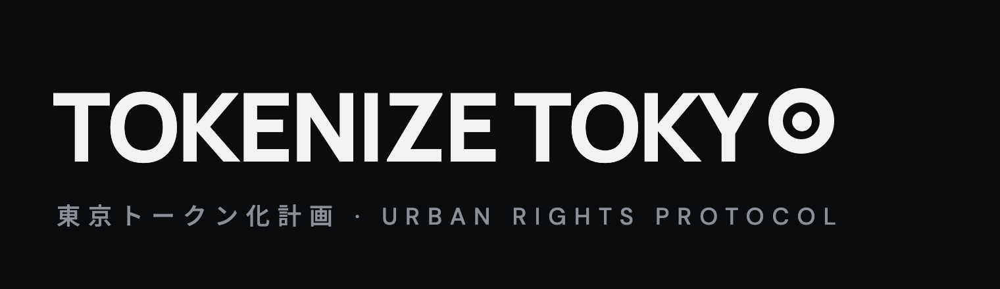
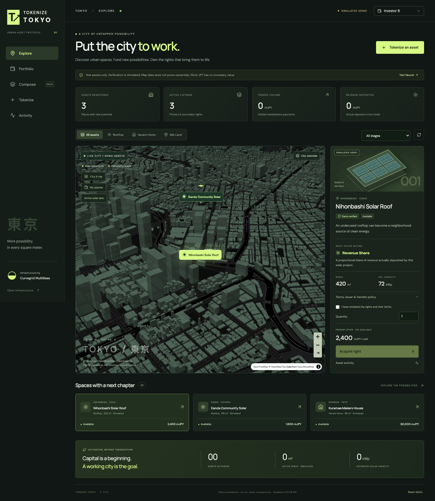
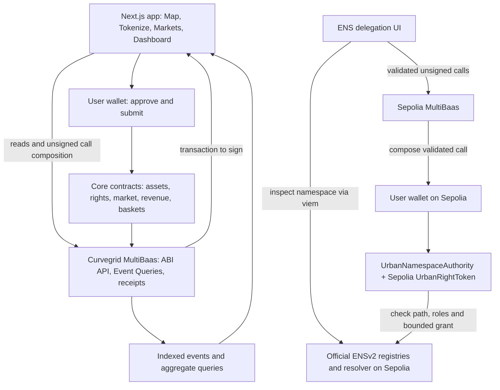

# TOKENIZE TOKYO



**東京トークン化計画 · ETHGlobal Tokyo 2026 · Classic / From Scratch**

## Tagline

**Turn idle city spaces into programmable urban rights.**

TOKENIZE TOKYO turns rooftops, vacant buildings and other underused spaces into scoped, time-bounded usage and revenue-share rights. People can discover projects on a Tokyo map, fund them through primary sales, trade rights, receive deposited revenue and combine compatible rights into baskets.

**For ENS judges:** [live ENSv2 permissions demo](https://tokenize-tokyo.vercel.app/ens) · [90-second runbook and code map](docs/ENS_PRIZE_DEMO.md)

**For sponsor judges:** [Curvegrid / MultiBaas code and evidence](#curvegrid--multibaas-integration) · [ENSv2 code and evidence](#ens--ensv2-integration) · [Demo, GitHub and video](#links)



## Problem

A rooftop can host solar panels. A vacant building can host a workshop. An unused lot can host a pop-up market. Yet the space owner, project operator and funder often need to negotiate each arrangement separately.

The missing building block is a clear, transferable description of **which space, for which purpose, during which period, with which economic rights**. A token that represents an entire building does not express these smaller, practical agreements.

Even after a project raises money, participants need to distinguish approval, funding, physical activation and actual revenue. A dashboard that only displays token prices cannot answer who verified a project, what holders bought or whether any income was deposited.

## Solution

We model an urban right as **space × time × usage × cash flow**.

Each asset has a location, issuer and project description. Its rights specify a spatial scope, purpose, start/end dates, quantity, terms and transfer policy. Usage rights represent access to a defined space; revenue rights represent a proportional claim on funds actually deposited into the project's vault.

The product connects three layers:

- **Discover and explain:** a map, asset directory, project overview and editable operating assumptions make the proposed use understandable before purchase.
- **Issue and transact:** verified rights can be offered at a fixed price, purchased with MockJPY, resold and, where compatible, combined into baskets.
- **Operate and account:** separate activation, revenue deposits, holder claims and transaction history make project progress inspectable.

Curvegrid MultiBaas supplies the contract API, indexed activity and transaction monitoring. ENSv2 gives spaces a hierarchical identity and lets an issuer delegate bounded issuance authority to an operator.

The prototype uses fictional sites and valueless test tokens. It does not sell property ownership or verify real ownership documents. Initial production registration is intended for pre-approved companies; the current demo does not enforce that eligibility policy. [Trust model and production gaps](docs/TRUST_MODEL.md)

## How it works

1. **Describe a space.** Select a location and asset category, then edit the project overview, intended customers, operations, use of funds and risks. Optional budget, revenue and cost assumptions produce illustrative operating scenarios.
2. **Register and review the asset.** The issuer registers a geographic reference and metadata. A verifier approves or rejects the asset.
3. **Define a right.** Choose a scope such as rooftop, interior, wall or land; set the purpose, time window, supply, terms and transfer policy. The contract checks conflicting exclusive uses. Each right requires separate verification before trading.
4. **Fund through a primary offer.** The issuer lists verified units at a fixed price. A buyer approves the exact MockJPY payment and purchases units in an atomic token/payment transaction. Primary-sale progress is shown in the Launchpad.
5. **Activate the project.** A verifier separately marks an eligible right Active. Raising funds does not automatically establish physical operation.
6. **Deposit and claim revenue.** The vault distributes only settlement tokens actually deposited. Transfer checkpoints preserve income accrued to previous holders.
7. **Resell or compose.** Holders can list transferable rights or deposit compatible revenue rights into a fixed-ratio basket. Basket shares are backed by underlying ERC-1155 custody and redeem for those rights.

For example, a holder of 10 out of 100 units receives 10% of a 10,000 mJPY deposit: 1,000 mJPY. If they later sell five units, already accrued income remains theirs; subsequent deposits follow the new balances.

**Post-acquisition management:** the new FractionVault splits deposited revenue rights into smaller tradable shares, distributes deposited income and redeems shares for whole underlying units. RentalEscrow lends exclusive usage rights for a prepaid period, with expiry, early return and lender recovery. Contracts and wallet UI are implemented and verified against local Anvil; the two extensions still need public deployment and MultiBaas linking. [Implementation, code map and deployment guide](docs/FINANCE_IMPLEMENTATION.md)

**Current boundaries:** primary-sale payments go directly to the seller; there is no funding-goal escrow or automatic refund. Project scenarios are editable assumptions, not promised returns. The wallet-free `/demo` retains its separate mock-credit fractional/rental simulation. See [feature status](docs/FEATURE_STATUS.md).

### Try the demo

**Beyond Tokyo — `/cities`:** use **City preview** in the sidebar to switch between Tokyo, New York and Hong Kong, or play a three-city closing tour. Real city maps accompany illustrative use cases; overseas markets are expansion previews. [Presentation guide and scope](docs/CITY_PREVIEW.md)

**Live testnet flow — [open the app](https://tokenize-tokyo.vercel.app/):**

1. Connect an injected wallet such as MetaMask or Rabby and switch to Curvegrid Testnet.
2. In the wallet panel, request test ETH if needed and mint MockJPY.
3. Select a listed right, review the project description and terms, and choose **Acquire right**.
4. Confirm the payment approval and purchase separately in the wallet.
5. Open **View transaction** to inspect the decoded function, events and receipt; then check your holdings and the indexed activity.

**Wallet-free walkthrough — [open /demo](https://tokenize-tokyo.vercel.app/demo):** explore the map, try **Tokenize**, inspect Funding and Dashboard, and use the simulated roles to exercise the lifecycle. This route stores simulated events in the browser and sends no blockchain transactions. The [demo runbook](docs/DEMO_SCENARIO.md) describes the presentation sequence.

**Recorded execution evidence:**

- [Scripted testnet verification](deployments/testnet-demo-verification.json): 448 confirmed scenario transactions, 50 assets, 44 rights, three baskets, 69 sales and 630 indexed events at the report's timestamp. These are seeded test activities, not user adoption.
- [Browser transaction report](deployments/browser-wallet-verification.json): test-gas onboarding, mint, approval, purchase, secondary listing, cancellation and decoded explorer checks on the public site.
- [Open a confirmed purchase](https://tokenize-tokyo.vercel.app/tx/0xd9221275db9a9d369110577bbeeb25ce751bf0f05f9823458743d555bbc5e9c8).

The browser report uses a controlled test signer through an injected EIP-1193 provider. It is not evidence of manual wallet-extension testing. Reports are dated snapshots; older reports predate the ENS deployment.

## Technical implementation

### Architecture

The application uses Next.js, React, TypeScript and MapLibre. Solidity contracts are built and tested with Foundry. The main market uses the MultiBaas TypeScript SDK for contract reads, event queries, unsigned transaction composition and receipts. ENS namespace validation additionally uses viem reads on Sepolia.



The hosted market and ENSv2 integration now run on **Sepolia** through a dedicated MultiBaas environment. The earlier **Curvegrid Testnet** deployment remains separate; balances are not bridged or migrated. See [data provenance](docs/SEPOLIA_CUTOVER.md).

### Smart contracts

| Contract and source                                                      | Responsibility                                                                                           | Key entry points                                                    |
| ------------------------------------------------------------------------ | -------------------------------------------------------------------------------------------------------- | ------------------------------------------------------------------- |
| [UrbanAssetRegistry.sol](contracts/src/UrbanAssetRegistry.sol)           | Asset metadata, issuer and verification lifecycle; exact geographic-reference uniqueness at verification | `registerAsset`, `requestVerification`, `verifyAsset`               |
| [UrbanRightToken.sol](contracts/src/UrbanRightToken.sol)                 | ERC-1155 rights with spatial/time constraints, transfer policies and separate verification/activation    | `createScopedRight`, `findConflict`, `verifyRight`, `activateRight` |
| [UrbanMarketplace.sol](contracts/src/UrbanMarketplace.sol)               | Fixed-price primary/secondary listings and atomic MockJPY settlement; partial fills                      | `createListing`, `purchase`, `cancelListing`                        |
| [RevenueVault.sol](contracts/src/RevenueVault.sol)                       | Transfer-aware distribution of deposited revenue                                                         | `depositRevenue`, `checkpoint`, `claimable`, `claim`                |
| [BasketVault.sol](contracts/src/BasketVault.sol)                         | Custody-backed baskets of 2–8 compatible revenue rights; distribution and redemption                     | `createBasket`, `mintBasketShares`, `redeem`, `claimRevenue`        |
| [FractionVault.sol](contracts/src/FractionVault.sol)                     | Custody-backed fractions of one revenue right, share trading, income and whole-unit redemption; public deployment pending | `createPool`, `deposit`, `purchase`, `claimRevenue`, `redeem` |
| [RentalEscrow.sol](contracts/src/RentalEscrow.sol)                       | Prepaid temporary use of an escrowed exclusive usage right; public deployment pending | `createOffer`, `rent`, `userOf`, `returnRental`, `withdraw` |
| [MockJPY.sol](contracts/src/MockJPY.sol)                                 | Freely minted, 18-decimal settlement token for testing                                                   | `mint`                                                              |
| [UrbanNamespaceAuthority.sol](contracts/src/UrbanNamespaceAuthority.sol) | Sepolia ENS binding and bounded operator grants, consumed by delegated issuance                          | `bindSpace`, `grantIssuance`, `revokeIssuance`, `consume`           |

Conflict checks apply within the same asset and overlapping canonical scopes, including whole-asset scope. Time intervals are half-open, so adjacent bookings can coexist. These checks do not detect arbitrary physical geometry overlaps or off-platform agreements. Verification is role-gated, but the demo's initial administrator also receives the verifier role.

### Frontend and data model

| Area                                     | Relevant code                                                                                                                                |
| ---------------------------------------- | -------------------------------------------------------------------------------------------------------------------------------------------- |
| Main application and asset detail        | [Dashboard.tsx](src/components/Dashboard.tsx)                                                                                                |
| Map and asset directory                  | [TokyoMap.tsx](src/components/TokyoMap.tsx), [AssetDirectory.tsx](src/components/AssetDirectory.tsx)                                         |
| Space → Right → Publish flow             | [TokenizeFlow.tsx](src/components/TokenizeFlow.tsx)                                                                                          |
| Project overview and operating scenarios | [ProjectPlan.tsx](src/components/ProjectPlan.tsx), [project-plan.ts](src/lib/project-plan.ts)                                                |
| Funding and financial activity           | [Launchpad.tsx](src/components/Launchpad.tsx), [MarketOverview.tsx](src/components/MarketOverview.tsx), [PlatformCharts.tsx](src/components/PlatformCharts.tsx), [analytics.ts](src/lib/analytics.ts) |
| Event replay and metadata                | [projection.ts](src/lib/projection.ts), [model.ts](src/lib/model.ts)                                                                         |
| Browser wallet and test-gas onboarding   | [use-browser-wallet.ts](src/lib/use-browser-wallet.ts), [test-gas API](src/app/api/test-gas/route.ts)                                        |
| Fractional and rental wallet flows | [RightsFinance.tsx](src/components/RightsFinance.tsx), [rights-finance.ts](src/lib/rights-finance.ts) |
| Explicit simulation mode                 | [demo route](src/app/demo/page.tsx), [demo.ts](src/lib/demo.ts)                                                                              |

Project drafts are prepared examples for seven asset categories, not a runtime AI service. Descriptions and assumptions persist in inline asset metadata; UTF-8 content is encoded as base64 JSON and checked against the contract's 4 KB limit. The map uses OpenFreeMap/OpenStreetMap; PLATEAU data is not integrated.

### Deployment

Status updated on **2026-09-27**:

| Environment        | Chain ID     | Manifest / evidence                                                                                                       | Status                                                                                                                    |
| ------------------ | ------------ | ------------------------------------------------------------------------------------------------------------------------- | ------------------------------------------------------------------------------------------------------------------------- |
| Earlier market     | `2017072401` | [Curvegrid Testnet manifest](deployments/2017072401.json), [browser report](deployments/browser-wallet-verification.json) | Six core contracts deployed and linked to MultiBaas; wallet market flow exercised                                         |
| ENSv2 protocol     | `11155111`   | [Sepolia manifest](deployments/11155111.json), [official-contract preflight](deployments/ens-v2-sepolia-preflight.json)   | Hosted market and ENS binding live; public registration, resolution, delegation and revocation verified |
| Local contracts    | `31337`      | [Anvil manifest](deployments/31337.json)                                                                                  | Local contract development and scripted scenarios                                                                         |
| Fractional / rental extensions | `31337` | [Isolated browser verification](deployments/finance-local-verification.json) | Implemented and tested on local Anvil; two additional public contract links and frontend configuration pending |
| Browser simulation | None         | [demo.ts](src/lib/demo.ts)                                                                                                | LocalStorage simulation; no on-chain settlement                                                                           |

The manifests contain exact contract addresses and indexing start blocks. Identical numeric addresses across chains refer to separate deployments. The rooftop of asset #1 has a verified Sepolia ENS binding; other generated names remain clearly marked previews. See the [ENS integration](#ens--ensv2-integration).

Hosting uses Vercel. Configure production environment variables before `vercel deploy --prod`; `NEXT_PUBLIC_*` values are compiled into the frontend. See [.env.example](.env.example) and [.vercelignore](.vercelignore). A local README/source change does not update the hosted build.

### How to run

**Prerequisites:** Node.js 22, npm and Git. Contract work also requires Foundry (`forge`, `anvil`); Forge MultiBaas linking requires Python 3. CI pins Foundry 1.5.0.

```bash
git clone --recurse-submodules https://github.com/natsukingly/tokenize-tokyo.git
cd tokenize-tokyo
npm ci
cp .env.example .env.local
npm run dev
```

The example environment defaults to `NEXT_PUBLIC_APP_MODE=demo`. Open [localhost:3000/demo](http://127.0.0.1:3000/demo) for a wallet-free walkthrough. For an existing checkout, initialize dependencies with `git submodule update --init --recursive` and keep your existing environment configuration.

**Local contract scenario:** start `npm run anvil` in one terminal; in another run:

```bash
npm run deploy:local
npm run demo:seed
```

This sends local transactions. The browser's demo mode continues to use its simulator; it does not automatically read Anvil.

**MultiBaas mode:** set the following in `.env.local`, using matching addresses from your deployment manifest:

```dotenv
NEXT_PUBLIC_APP_MODE=multibaas
NEXT_PUBLIC_CHAIN_ID=2017072401
NEXT_PUBLIC_MULTIBAAS_URL=<your MultiBaas deployment URL>
NEXT_PUBLIC_MULTIBAAS_DAPP_KEY=<DApp User group key>
NEXT_PUBLIC_RPC_URL=<wallet RPC URL>
NEXT_PUBLIC_REGISTRY_ADDRESS=<registry>
NEXT_PUBLIC_RIGHTS_ADDRESS=<rights>
NEXT_PUBLIC_MARKET_ADDRESS=<market>
NEXT_PUBLIC_REVENUE_ADDRESS=<revenue>
NEXT_PUBLIC_BASKET_ADDRESS=<basket>
NEXT_PUBLIC_SETTLEMENT_ADDRESS=<settlement>
```

Register your local/hosted origin in MultiBaas CORS. For a newly deployed protocol, configure server-only `MULTIBAAS_URL`, `MULTIBAAS_API_KEY`, `NETWORK_RPC_URL` and `DEPLOYMENT_FILE`, then run `npm run multibaas:link`. Deployment and linking are separate; [Deploy.s.sol](contracts/script/Deploy.s.sol) deploys contracts and [Link.s.sol](contracts/script/Link.s.sol) registers their ABIs and addresses. Use the `curvegrid` Foundry profile for Curvegrid Testnet's Paris target; the default profile targets Cancun for the ENSv2 work.

Run `PROBE_ADDRESS=<funded-test-address> npm run multibaas:verify` to check chain identity, links, indexing, reads, unsigned composition, aggregation and frontend-key restrictions. The probe is not submitted.

Keep administrative and signing keys server/local only. The browser uses a restricted DApp key; wallet RPC uses a Web3 key. Optional test-gas onboarding uses a separate server-only `MULTIBAAS_FAUCET_KEY` and `APP_ORIGIN`. The faucet verifies an expiring EOA signature; its local cooldown is not a distributed rate limiter.

**ENS setup:** use a separate, gitignored `.env.sepolia` and a Sepolia MultiBaas deployment. [Setup script](scripts/setup-ens-sepolia.ts) and [ENS design](docs/ENSV2_DESIGN.md) document the configuration.

```bash
forge build --root contracts
npm run ens:setup:sepolia -- --env .env.sepolia
```

Without `--broadcast`, setup only checks the official contracts. Adding `--broadcast` deploys a new protocol and registers the configured namespace using Sepolia test funds. After deployment, set `ENSV2_DEPLOYMENT_FILE` to that manifest and run `npm run ens:link:multibaas -- --env .env.sepolia` to link the nine required protocol/ENS contracts. Enable the frontend ENS variables only after that separate deployment is configured. The delegation proof script also requires explicit `--broadcast`; it is not a read-only health check.

### Validation

| Command / source                                                          | What it checks                                                                                                                                                                                          |
| ------------------------------------------------------------------------- | ------------------------------------------------------------------------------------------------------------------------------------------------------------------------------------------------------- |
| `npm run typecheck`                                                       | TypeScript consistency                                                                                                                                                                                  |
| `npm test` / `npm run test:coverage`                                      | Projections, analytics, wallet validation, ENS calls and other unit behavior                                                                                                                            |
| `npm run test:contracts`                                                  | [Core protocol](contracts/test/Protocol.t.sol), [spatial constraints](contracts/test/Spatial.t.sol), [edge cases](contracts/test/EdgeCases.t.sol), [ENS delegation](contracts/test/ENSDelegation.t.sol) |
| `npm run test:finance` | [Browser transactions against isolated Anvil](contract-e2e/finance.spec.ts): custody, fractional purchase/income/redemption, rental/return/recovery and activity; uses a local MultiBaas API fixture, not the hosted service |
| `npm run build`                                                           | Production Next.js build                                                                                                                                                                                |
| `npx playwright install chromium`, then `npm run test:e2e -- --workers=1` | UI scenarios; run with demo configuration                                                                                                                                                               |
| `npm run multibaas:verify`                                                | MultiBaas configuration and API readiness; requires configured credentials and funded probe                                                                                                             |
| `npm run demo:verify:testnet`                                             | Scripted transaction/event reconciliation and basket custody                                                                                                                                            |

[CI configuration](.github/workflows/ci.yml) runs typecheck, coverage, contract tests, production build and browser tests. For opt-in real testnet browser transactions, see [wallet-live.spec.ts](tests/wallet-live.spec.ts) and the [recorded result](deployments/browser-wallet-verification.json). Test reports describe their own execution dates; the table above is a reproducible check list, not a claim that every check was rerun for this README update.

## Sponsor integrations

### Curvegrid / MultiBaas Integration

**MultiBaas is used for contract onboarding, contract interaction, event indexing, ABI-backed REST APIs and transaction monitoring.** It powers both the RWA lifecycle and the dashboard; it is part of the live market's read/write path.

| Use                                                | How TOKENIZE TOKYO uses it                                                                                                                                                                                                      | Relevant code — start here                                                                                                                                                                                                                                           |
| -------------------------------------------------- | ------------------------------------------------------------------------------------------------------------------------------------------------------------------------------------------------------------------------------- | -------------------------------------------------------------------------------------------------------------------------------------------------------------------------------------------------------------------------------------------------------------------- |
| **1. Deployment workflow and contract onboarding** | Foundry broadcasts deployment. Forge MultiBaas then links six contract ABIs, addresses, labels and the deployment start block for indexing.                                                                                     | [Deploy.s.sol](contracts/script/Deploy.s.sol); [Link.s.sol: `link`](contracts/script/Link.s.sol#L20); [link-multibaas.ts](scripts/link-multibaas.ts)                                                                                                                 |
| **2. Contract interaction**                        | Read balances, claimable revenue and asset state. Compose registration, approval, purchase, revenue and basket transactions with `signAndSubmit: false`; the user's wallet signs and submits.                                   | [multibaas.ts: `readContract`](src/lib/multibaas.ts#L29), [`sendViaMultiBaas`](src/lib/multibaas.ts#L168), [`sendAtMultiBaas`](src/lib/multibaas.ts#L214); [transactions.ts: `walletTransaction`](src/lib/transactions.ts#L1)                                        |
| **3. Event indexing and dashboard aggregation**    | Discover assets/rights/listings, reconstruct lifecycle and holder activity, and query trade/deposit/claim totals with the `add` aggregator. Queries filter by contract address and paginate 50 rows at a time.                  | [queries.ts: `eventQuery`](src/lib/queries.ts#L154); [multibaas.ts: `queryRows`](src/lib/multibaas.ts#L44), [`loadMarket`](src/lib/multibaas.ts#L61); [projection.ts: `project`](src/lib/projection.ts#L42); [MarketOverview.tsx](src/components/MarketOverview.tsx) |
| **4. ABI-backed REST API access**                  | Linked ABIs expose contract functions through the MultiBaas API. The TypeScript SDK's `ContractsApi`, `EventQueriesApi` and `ChainsApi` use the deployment's `/api/v0` endpoint. No custom per-contract REST wrapper is needed. | [multibaas.ts: `clients`](src/lib/multibaas.ts#L15); [config.ts: contract labels](src/lib/config.ts#L17); [Link.s.sol](contracts/script/Link.s.sol)                                                                                                                  |
| **5. Transaction monitoring and explorer**         | Poll receipts via `ChainsApi.getTransactionReceipt`. Display decoded calls, transfers, status and receipts at a shareable `/tx/[hash]` URL using `getTransaction` and `getTransactionReceipt`.                                  | [multibaas.ts: confirmation polling](src/lib/multibaas.ts#L253); [TransactionExplorer.tsx](src/components/TransactionExplorer.tsx#L18); [transaction page](src/app/tx/[hash]/page.tsx)                                                                               |

**Deployment attribution:** MultiBaas manages the linked contracts and their API/indexing. On-chain deployment is performed by Foundry; the project does not claim that the MultiBaas SDK broadcasts those deployments.

**New fractional/rental flows:** [rights-finance.ts](src/lib/rights-finance.ts) uses `loadFinance` for ABI-backed reads, `sendFinanceIntent` for validated unsigned calls and receipt tracking, and `loadFinanceActivity` for eleven indexed event types. [link-finance-multibaas.ts](scripts/link-finance-multibaas.ts) registers the two extension ABIs and addresses. Their [browser verification](deployments/finance-local-verification.json) uses real local Anvil contracts with a MultiBaas API fixture; public linking and live-service verification are pending. [Exact code map and rollout steps](docs/FINANCE_IMPLEMENTATION.md)

The main transaction path is implemented as follows:

```text
UI action
  → ContractsApi.callContractFunction(..., { from, args, signAndSubmit: false })
  → validate returned sender, recipient, value and calldata
  → wallet eth_sendTransaction
  → ChainsApi.getTransactionReceipt
  → EventQueriesApi.executeArbitraryEventQuery
  → refreshed holdings, lifecycle and dashboard
```

The app rechecks the connected account and chain before signing, including between approval and purchase. Failed API reads remain visible; `multibaas` mode does not silently substitute simulated data. The core market has no custom event indexer; ENS namespace inspection is an explicit separate Sepolia RPC read path.

**Proof and verification:**

- [Live decoded purchase](https://tokenize-tokyo.vercel.app/tx/0xd9221275db9a9d369110577bbeeb25ce751bf0f05f9823458743d555bbc5e9c8) → inspect the call and receipt without a MultiBaas console account.
- [verify-multibaas.ts](scripts/verify-multibaas.ts) → checks chain/link/indexing readiness, unsigned composition, aggregation and denial of admin access to the DApp key.
- [verify-testnet-demo.ts](scripts/verify-testnet-demo.ts) → reconciles scenario hashes with indexed events; [report](deployments/testnet-demo-verification.json) and [receipts](deployments/testnet-demo-receipts.json).
- [multibaas.test.ts](src/lib/multibaas.test.ts), [transactions.test.ts](src/lib/transactions.test.ts), [projection.test.ts](src/lib/projection.test.ts) → API adapter, transaction validation and projection regression coverage.

**Additional integrations implemented but not exercised live:** [signed webhook handler](src/app/api/webhooks/multibaas/route.ts) with [signature validation and deduplication](src/lib/webhook.ts), and [Cloud Wallet / TXM operator](src/server/operator.ts). Hosted webhook delivery needs durable storage. Cloud Wallet operator configuration and live signature verification are complete on Curvegrid Testnet and Sepolia; operator transactions and TXM have not been exercised live. The current hosted flow uses browser signatures and polling.

Optional [Privy + MetaMask onboarding](src/components/PrivyConnection.tsx) and a [Cloud Wallet setup CLI](scripts/setup-cloud-wallet.ts) are available. Privy activation is still required. Azure Cloud Wallet setup and live signature verification are recorded in [the verification report](deployments/cloud-wallet-verification.json); live embedded login and sponsored tokenization remain pending. See [wallet setup and activation status](docs/WALLET_SETUP.md).

**Developer experience:** ABI linking and one SDK for reads, events, aggregates and transaction composition removed the need for a custom indexer. We had to account for positional event selectors (`inputIndex`), the 50-row query limit, bytes32/array normalization and indexing delay after a receipt. Clearer pagination errors, field-name selectors and log-index ordering would simplify integration. These workarounds are visible in [queries.ts](src/lib/queries.ts), [multibaas.ts](src/lib/multibaas.ts) and [projection.ts](src/lib/projection.ts).

### ENS / ENSv2 Integration

**ENSv2 is used for spatial identity and delegated authority.** A registered path ties a human-readable space name to an asset and scope. An operator must hold both the required ENS role and an issuer-defined application grant before creating a right on the issuer's behalf.

Registered Sepolia name:

```text
rooftop.building-1.chiyoda.tokenizetokyo-demo-2026.eth
└ space └ building └ district └ project namespace
```

| Use                                                     | How TOKENIZE TOKYO uses it                                                                                                                                                      | Relevant code — start here                                                                                                                                                                                                                                                                                                  |
| ------------------------------------------------------- | ------------------------------------------------------------------------------------------------------------------------------------------------------------------------------- | --------------------------------------------------------------------------------------------------------------------------------------------------------------------------------------------------------------------------------------------------------------------------------------------------------------------------- |
| **Namespace registration**                              | Commit/reveal through the official ENSv2 registrar; create the city/district/building registry hierarchy and leaf resolver.                                                     | [setup-ens-sepolia.ts](scripts/setup-ens-sepolia.ts); [deployment.ts](src/lib/ens/deployment.ts)                                                                                                                                                                                                                            |
| **Resolve and inspect a space**                         | Follow registry links, inspect expiry/roles and read resolver text records identifying the chain, rights contract, asset, scope and authority.                                  | [registry.ts: `inspectNamespace`](src/lib/ens/registry.ts#L99); [authority.ts: `loadEnsBinding`](src/lib/ens/authority.ts#L65); [NamespaceDashboard.tsx](src/components/NamespaceDashboard.tsx)                                                                                                                             |
| **Bind ENS identity to the protocol**                   | Validate the namespace path and bind it to a verified asset's canonical scope.                                                                                                  | [UrbanNamespaceAuthority.sol: `bindSpace`](contracts/src/UrbanNamespaceAuthority.sol#L54), [`_validatePath`](contracts/src/UrbanNamespaceAuthority.sol#L134)                                                                                                                                                                |
| **Grant, revoke and enforce issuance**                  | Enforce the operator's ENS role plus the issuer's purpose, time, quantity and validity limits. Consume quota atomically when delegated issuance creates a right for the issuer. | [UrbanNamespaceAuthority.sol: `grantIssuance`](contracts/src/UrbanNamespaceAuthority.sol#L88), [`revokeIssuance`](contracts/src/UrbanNamespaceAuthority.sol#L102), [`consume`](contracts/src/UrbanNamespaceAuthority.sol#L108); [UrbanRightToken.sol: `createScopedRightForIssuer`](contracts/src/UrbanRightToken.sol#L139) |
| **Wallet actions and audit trail**                      | Grant/revoke from the UI, verify composed calldata against the requested action, and query permission events through Sepolia MultiBaas.                                         | [EnsDelegation.tsx](src/components/EnsDelegation.tsx#L30); [multibaas.ts: `sendVerifiedCallViaMultiBaas`](src/lib/multibaas.ts#L188); [events.ts: `loadEnsAudit`](src/lib/ens/events.ts#L5); [link-ens-multibaas.ts](scripts/link-ens-multibaas.ts)                                                                         |
| **Verify official contracts and permission boundaries** | Compare official runtime bytecode with pinned artifacts; test role/grant separation, revocation, expiry, wrong scope and issuance quota.                                        | [ens-preflight.ts](scripts/ens-preflight.ts); [official artifact provenance](contracts/test/fixtures/ensv2/README.md); [ENSDelegation.t.sol](contracts/test/ENSDelegation.t.sol); [registry tests](src/lib/ens/registry.test.ts); [transaction tests](src/lib/ens/transactions.test.ts)                                     |

The application uses official ENSv2 contracts pinned to source commit `71a3b7339dbc55ab47667abdfe8303bac4f4c24e`. Resolver text records include `urban.chainId`, `urban.rightsContract`, `urban.assetId`, `urban.scope` and `urban.authority`. No payment-address record is configured.

ENS namespace permissions alone do not authorize issuance: `UrbanNamespaceAuthority` also checks the issuer's bounded grant. Delegated rights are minted to the asset issuer and remain subject to separate verifier approval. Revocation stops future issuance; it does not erase existing token balances or accrued revenue.

**Public Sepolia evidence:**

- [Deployment manifest](deployments/11155111.json) records the deployed authority, registries, resolver and `locallyForked: false`.
- [Namespace registration transaction](https://sepolia.etherscan.io/tx/0xa4e8e8fe110aa51bbe10f9f4e2c43af58af20f51bd769e5c73604f90dc4db858).
- [Asset/scope binding transaction](https://sepolia.etherscan.io/tx/0xb6e13414008b877a8e3feb6332146869a7bacd257c170431f009b299a1535078).
- [Official-contract preflight report](deployments/ens-v2-sepolia-preflight.json).
- [Public delegation proof](deployments/ens-v2-sepolia-delegation-proof.json): an operator issued 10 units of right #1 to the issuer; attempts for the interior, another asset and after ENS-role revocation were rejected. Test permissions were revoked afterward. [Delegated issuance transaction](https://sepolia.etherscan.io/tx/0x10da73ed264c75e700f147fc687b0a4298a04cd818c1e72c18eca09df4cd0696).

**Release status:** the hosted application uses Sepolia and nine linked MultiBaas contracts. The [ENS permissions demo](https://tokenize-tokyo.vercel.app/ens) reads the registered binding, checks recorded transaction receipts, exposes wallet actions and simulates current reporter permissions. [Demo guide, exact code paths and evidence](docs/ENS_PRIZE_DEMO.md). Earlier finalized logs are explicitly identified as a verified public archive; subsequent activity is indexed by MultiBaas. Real browser-extension signing remains a separate presentation rehearsal from automated contract and RPC checks.

**Report-only delegation:** the dedicated rooftop Permissioned Resolver grants an energy reporter access to just `urban.energyReport`. Protected record writes are denied; revocation blocks future reporting while preserving the existing report. The UI reads the report through Universal Resolver V2 and checks current permissions with read-only calls. Code: [reports.ts](src/lib/ens/reports.ts), [EnsShowcase.tsx](src/components/EnsShowcase.tsx). Evidence: [public reporting proof](deployments/ens-v2-sepolia-report-proof.json).

ENS names establish protocol identity and permissions; they do not prove real-world property ownership.

## What we built during the hackathon

For the **Classic / From Scratch** submission, the project-specific work in this repository includes:

- The urban-rights model and Solidity contracts for asset review, scoped rights, fixed-price settlement, revenue distribution, baskets and ENS-bound issuance.
- Custody-backed revenue-right fractions and temporary rental of exclusive usage rights, including wallet flows and real local-chain browser verification; public deployment is pending.
- The map-first interface, asset directory, Tokenize flow, project descriptions, operating scenarios, funding views, portfolio, analytics and transaction explorer.
- The MultiBaas integration: contract linking, API reads/writes, event queries, aggregates, receipt tracking and verification scripts.
- The ENSv2 integration: namespace setup, asset binding, bounded delegation, revocation, frontend actions and permission tests.
- The wallet-free simulator, testnet seeding, browser transaction verification, contract/unit/UI tests and demo materials.

We build on existing Next.js/React, MapLibre, viem, OpenZeppelin, Foundry, the MultiBaas SDK/Forge MultiBaas and official ENSv2 contracts. Those dependencies and the basemap are existing infrastructure; the application logic and integrations above are the project contribution.

**Team — Urban Rights Lab**

| Member  | Role                                             | Profiles                                                                                        |
| ------- | ------------------------------------------------ | ----------------------------------------------------------------------------------------------- |
| natsuki | Product, protocol design, full-stack development | [GitHub: @natsukingly](https://github.com/natsukingly) · [X: @0x_natto](https://x.com/0x_natto) |

**AI assistance:** Codex assisted with implementation, verification work and documentation. The editable project-plan templates are AI-authored examples, not live model output. An alternative generated wordmark and its prompt are documented in [brand asset provenance](docs/BRAND_ASSET_PROMPT.md); [design variants](docs/DESIGN_VARIANTS.md) records the visual alternatives.

**Remaining before submission:** add the demo video URL and live ENS page to the showcase, rehearse browser-wallet signing on the hosted Sepolia ENS flow, and reconcile the pitch with the final deployed behavior. [Submission checklist](docs/SUBMISSION_CHECKLIST.md) · [remaining tasks](docs/REMAINING_TASKS.md)

## Links

- **Demo:** [live Sepolia app](https://tokenize-tokyo.vercel.app/) · [ENSv2 permissions](https://tokenize-tokyo.vercel.app/ens) · [wallet-free simulation](https://tokenize-tokyo.vercel.app/demo)
- **GitHub:** [natsukingly/tokenize-tokyo](https://github.com/natsukingly/tokenize-tokyo)
- **Video:** **Pending — add the recorded demo URL before submission.**
- **Demo guide:** [presentation sequence](docs/DEMO_SCENARIO.md)
- **Technical details:** [implementation report](docs/IMPLEMENTATION_REPORT.md) · [ENS design](docs/ENSV2_DESIGN.md) · [trust model](docs/TRUST_MODEL.md)
- **Pitch materials:** [general deck](docs/pitch/index.html) · [Curvegrid deck](docs/pitch/curvegrid.html) · [ENS deck](docs/pitch/ens.html) — update release claims against the final deployment before presenting.
- **Integration references:** [MultiBaas documentation](https://docs.curvegrid.com/multibaas/) · [TypeScript SDK](https://github.com/curvegrid/multibaas-sdk-typescript) · [Forge MultiBaas](https://github.com/curvegrid/forge-multibaas)

## License

Project-authored code is [MIT licensed](LICENSE). Dependencies, ENS fixtures and third-party fonts retain their own licenses; the root license does not relicense those materials.
