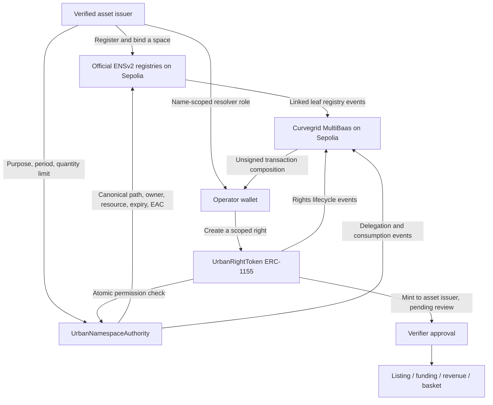

# ENSv2: registered spaces and delegated issuance

Status: **public Sepolia registration, resolution, asset binding and delegated ERC-1155 issuance are verified**. The operator issued 10 units of right #1 to the asset issuer; interior/other-asset issuance and issuance after ENS-role revocation were rejected. Test permissions were revoked afterward. The hosted main app now uses Sepolia MultiBaas. Nine contracts are linked; the registered space, binding and permission history are available in ENS Index. The original Curvegrid Testnet deployment remains intact. See [cutover and data provenance](SEPOLIA_CUTOVER.md).

日本語: **公開Sepoliaで登録・名前解決・資産との紐付け・委譲先からのERC-1155発行を確認済み**。担当者から登録者へRight #1を10口発行し、内装・別資産・ENS権限取消後の発行は拒否された。検証後の権限は取消済み。Sepolia用MultiBaasへの9契約の接続・DApp権限制限・CORS設定・公開サイト切替が完了。ENS Indexから登録済み空間と権限履歴を確認できる。既存Curvegrid Testnetの資産・履歴は保持する。

## Public evidence

- Network: Ethereum Sepolia (`11155111`). [Deployment manifest](../deployments/11155111.json), [delegation proof](../deployments/ens-v2-sepolia-delegation-proof.json).
- Registered name: `rooftop.building-1.chiyoda.tokenizetokyo-demo-2026.eth`.
- [Parent registration](https://sepolia.etherscan.io/tx/0xa4e8e8fe110aa51bbe10f9f4e2c43af58af20f51bd769e5c73604f90dc4db858), [space binding](https://sepolia.etherscan.io/tx/0xb6e13414008b877a8e3feb6332146869a7bacd257c170431f009b299a1535078), [delegated issuance](https://sepolia.etherscan.io/tx/0x10da73ed264c75e700f147fc687b0a4298a04cd818c1e72c18eca09df4cd0696), [ENS-role revocation](https://sepolia.etherscan.io/tx/0xa4ca4b5be431ebb9fe19f819d142288058cafbe88fd54fda586afb1a5dbf0989).
- New MultiBaas deployment: `tokenize-tokyo-sepolia`, Ethereum Sepolia, Free plan. DApp permissions, nine contract links, unsigned composition, ENS binding reads and hosted cutover are verified. Initial finalized RPC records cover the setup before MultiBaas indexing starts; they are explicitly labelled. Browser-extension signing of the entire delegated issuance flow remains a separate rehearsal.
- Fifteen official-bytecode Foundry integration tests (including 256 quota fuzz cases), the full 41-test contract suite and the local Sepolia fork also passed.

## Why the rights also move to Sepolia

The permission check happens **inside** `UrbanRightToken.createScopedRightForIssuer`. That transaction calls `UrbanNamespaceAuthority`, which reads the official ENSv2 registries. All contracts must be on Sepolia (11155111). A Curvegrid Testnet contract cannot perform this direct read on another chain. The old six-contract deployment and its activity are preserved; existing tokens are not bridged or automatically migrated.

権利の発行処理からENS権限を直接確認するため、ENSだけでなくRegistry / ERC-1155 Rights / Marketplace / RevenueVault / BasketVault / MockJPY / AuthorityをSepolia上に配置する。MultiBaasもSepoliaに接続する。Curvegridはネットワーク名ではなく、MultiBaasによる読み取り・索引・取引組み立てを担う。



## Exact authorization boundary

- `bindSpace(assetId, scope, labels)` requires the verified asset issuer and a four-label path below the official `.eth` registry: parent / district / building-ID / scope. The leaf controller must be the issuer. Canonical asset geometry, ENS resource and controller are pinned.
- Each child registry must come from the official VerifiableFactory and use the pinned UserRegistry implementation. Both forward subregistry pointers and backward parent pointers are checked. Root permissions that violate emancipation are rejected.
- Parent links and token transfer permission are **irreversibly locked for these newly created test names**. This prevents transfer-away-and-back from reviving stale permissions. This deployment script only creates a fresh test parent; it does not modify an existing mainnet name.
- The operator needs the official name-scoped `ROLE_SET_RESOLVER` (bit 24) **and** a separate issuer-approved `grantIssuance`. The ENS role alone never permits minting. The application grant fixes purpose, kind, transfer policy, exclusivity, start/end bounds, expiry and a cumulative unit quota.
- The required ENS role lets an operator replace the leaf resolver. Resolver content remains descriptive, never an ownership proof or an authority source. The prototype uses an issuer-owned PermissionedResolver to publish protocol references.
- Revoking either the application grant or the required ENS role blocks future issuance. Rebinding increments a nonce; unregistering/re-registering changes the ENS resource. Both invalidate stale grants. An explicit new issuer grant resets its quota. Regranting the ENS role can reactivate an otherwise unrevoked application grant; revoke the application grant when permanently ending an operator's authorization.
- Newly issued rights go to the **asset issuer**, not the operator. Existing supply, scope, conflict and verifier checks remain. Revocation does not burn existing tokens or erase accrued income.
- Verification is a separate role, but the demo admin can also be a verifier; organizational separation of duties and actual property evidence review remain production work.

日本語: ENS権限とアプリ側の発行許可を両方確認する。屋根だけの委譲で内装や別資産の権利は作れない。用途・期間・数量などの上限を発行時に強制し、受取先は登録者。発行後は審査待ちで、市場に出すにはVerifierの承認が必要。委譲取消は今後の発行を止めるもので、すでに保有された権利の没収ではない。

## What the name points to

A registered space name has its own **controller, registry entry and resolver**, not a separate wallet. Text records identify `urban.chainId`, `urban.rightsContract`, `urban.assetId`, `urban.scope` and `urban.authority`. No payment-address record is added. A space can have multiple ERC-1155 right IDs; those IDs are not individually registered ENS names by this prototype. Generated `right-N` nodes remain previews.

日本語: 空間名のtextレコードにチェーン・権利コントラクト・資産ID・空間種別・Authorityを記録する。NFT一つごとのウォレットを作るわけではなく、送金先addrレコードも設定しない。同じ空間から複数の権利が発行できる。UI上の `right-N` 階層は依然として未登録プレビューである。

## Pinned official deployment

Reference: [`71a3b7339dbc55ab47667abdfe8303bac4f4c24e`](https://github.com/ensdomains/contracts-v2/tree/71a3b7339dbc55ab47667abdfe8303bac4f4c24e/contracts/deployments/sepolia). This deployed revision initializes registries using `Grant[]`; an older source checkout's initializer is incompatible.

`npm run ens:preflight` reads seven official deployments from Sepolia and compares runtime code against pinned artifacts, masking immutable constructor fields. The report is in [`../deployments/ens-v2-sepolia-preflight.json`](../deployments/ens-v2-sepolia-preflight.json). Constants live in `src/lib/ens/deployment.ts`; fixtures contain actual official ABI/bytecode, source hashes and MIT attribution. Own contracts use Solidity 0.8.28 / Cancun; official artifacts were compiled with 0.8.25. Use `FOUNDRY_PROFILE=curvegrid` for future legacy Curvegrid builds (Paris).

## Deployment and resume

Create **`.env.sepolia`** with the relevant variables from `.env.example`. Keep the signing key local; this file is ignored by git. The setup script does not implicitly load `.env.local`.

```sh
forge build --root contracts
npm run ens:preflight
npm run ens:setup:sepolia -- --env .env.sepolia
npm run ens:setup:sepolia -- --env .env.sepolia --broadcast
```

The default is read-only. Broadcast is Sepolia-only, uses a fresh `ENSV2_PARENT_LABEL`, creates seven protocol contracts and three registry proxies plus a resolver, obtains a test name through the official registrar with faucet MockUSDC, creates the hierarchy, locks the path, adds records, registers a simulated sample asset, binds it and checks Universal Resolver output. It signs locally and caps gas price / total maximum gas cost. Private journal files save signed transaction hashes before submission; rerunning the same command resumes rather than issuing duplicate transactions. Do not delete a journal after a timeout. A stale `setup.lock` may be removed only after confirming no setup process is running.

The sample asset verification is a demo admin action, not independent evidence review. No real asset, fiat payment or legal entitlement is created.

`--local-fork` is restricted to loopback RPC and marks the manifest as fork-only. It must never be uploaded as public deployment evidence.

## MultiBaas and browser activation

1. Configure a **separate Sepolia MultiBaas deployment**, admin key, restricted DApp key, CORS origins and RPC. Do not reuse Curvegrid Testnet addresses.
2. Set `ENSV2_DEPLOYMENT_FILE` to the completed public manifest, then run:
   ```sh
   npm run ens:link:multibaas -- --env .env.sepolia
   ```
   This links seven protocol contracts, the leaf-name registry and resolver: **nine linked addresses**. Parent hierarchy reads use the Sepolia RPC; setup writes are local-signer CLI operations. The browser delegates and issues through MultiBaas unsigned composition and its own wallet.
3. Export public addresses with `scripts/write-public-env.ts`, set `NEXT_PUBLIC_CHAIN_ID=11155111`, Sepolia RPC / MultiBaas / DApp key, and `NEXT_PUBLIC_ENSV2_AUTHORITY_ADDRESS`, `NEXT_PUBLIC_ENSV2_PARENT`, `NEXT_PUBLIC_ENSV2_ASSET_ID=1`, `NEXT_PUBLIC_ENSV2_SCOPE=0`. Rebuild; public variables are compiled into Next.js. Keep server admin credentials separate.
4. In ENS Index select the registered rooftop. The issuer can grant a 30-day solar revenue allowance or revoke it. Two wallet confirmations are explained before signing. The operator sees only its available quota and prepares rights for the issuer. The modal verifies the chain, deployment, binding and canonical path; failed reads never become fake live status. Transaction hashes link to Sepolia Etherscan; permission history uses MultiBaas Event Queries.
5. Before changing the public app network, verify SDK reads, linking, event indexing, exact unsigned calldata, account/chain-change handling, browser receipt confirmation and one full delegated issuance. Preserve the previous Vercel deployment for rollback.

## Evidence and remaining work

Complete: 15 official-bytecode Foundry tests; registration/resolution/binding on a local Sepolia fork; ABI-encoded browser intent checks; conditional ENS Index controls; reproducible setup and linking scripts. Tests cover incorrect scope/asset, no application grant, ENS/app revocation, expiry, quotas, purpose/policy/period, re-registration, transfer locks, rebinding, wrong chain, spatial conflicts and mint recipient/review status.

Still required for a **live browser demonstration**: the public manifest and registration receipts, separate Sepolia MultiBaas configuration/linking, issuer/operator wallet rehearsal and indexed event verification. ENS prize eligibility is not claimed from local tests alone. [Official requirements](https://ethglobal.com/events/tokyo2026/prizes/ens) and beta deployments must be rechecked before submission.

Official references: [deployments](https://docs.ens.domains/learn/deployments/), [Permissioned Registry](https://docs.ens.domains/ensv2/permissioned-registry/), [Enhanced Access Control](https://docs.ens.domains/ensv2/enhanced-access-control/), [Verifiable Factory](https://docs.ens.domains/ensv2/verifiable-factory/).
