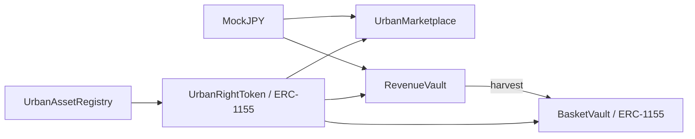

# TOKENIZE TOKYO — ローカル実装報告

## 1. 実装した機能

新規プロジェクトを `/Users/yamaguchinatsuki/Projects/tokenize-tokyo` に作成しました。

- MapLibre / OpenFreeMapによる東京の3D建物表示、屋根・屋内・壁・土地の模擬スコープ、カテゴリ／ライフサイクル絞り込み、X-ray、保有空間、Basketの接続線。
- AssetとRightを分離した登録・確認・発行フロー。屋根のRevenue Shareと空き家のUsage Rightを同じプロトコルで扱います。
- 排他的な空間・期間の重複をオンチェーンで拒否。Whole assetと部分空間の競合、隣接期間、Revenue Rightとの共存、複数の未確認申請の競争もテストしました。
- 固定価格の一次／二次売買、部分購入、取消、ERC-20決済とERC-1155移転の原子性。
- 実入金に基づくRevenueVault、移転前後の累積収益記録、二重claim防止。
- 複数収益権の実保管に基づくBasket発行・売買・償還・収益claim。
- Portfolio、履歴、取引指標、Funding／Funded／Activeの区別、模擬の稼働面積・発電容量。
- ブラウザデモの役割切替、ローカル保存、リセット、レスポンシブ画面。

**ブラウザデモは明示的なシミュレーションです。** 別途、実際のSolidityをAnvilに配置して50件のトランザクションを実行しました。ローカルUIとAnvilをMultiBaas経由で結んだ実証は、サービス未作成のため未実施です。

## 2. 変更ファイル

既存リポジトリがなかったため新規作成です。主要構成は以下のとおりです。完全なファイル一覧は末尾にあります。

| 領域         | ファイル／ディレクトリ                                                                           |
| ------------ | ------------------------------------------------------------------------------------------------ |
| UI / 地図    | `src/components/Dashboard.tsx`, `TokyoMap.tsx`, `src/app/globals.css`                            |
| MultiBaas    | `src/lib/multibaas.ts`, `queries.ts`, `projection.ts`, `transactions.ts`                         |
| Webhooks     | `src/lib/webhook.ts`, `src/app/api/webhooks/multibaas/route.ts`, `src/app/api/activity/route.ts` |
| デモ／データ | `src/lib/demo.ts`, `model.ts`, `lifecycle.ts`, `config.ts`                                       |
| Operator     | `src/server/operator.ts`, `scripts/operator.ts`                                                  |
| コントラクト | `contracts/src/` の6 contracts、`contracts/test/` の3 suites                                     |
| デプロイ     | `contracts/script/`, `scripts/link-multibaas.ts`, `verify-multibaas.ts`, `seed.ts`               |
| 検証         | `src/lib/*.test.ts`, `tests/demo.spec.ts`, CI workflow                                           |
| ドキュメント | `README.md`, 本報告, `docs/ENSV2_DESIGN.md`, `docs/screenshots/`                                 |

## 3. Smart contract architecture



権利発行者と資産発行者は一致する必要があり、資産確認と権利確認を独立させています。未確認Rightは移転／出品できません。収益は実際の入金額だけを分配し、移転前の累積分は旧保有者に残します。Basketは固定比率の原資産を保管してからsharesを発行します。

スコープは5種類の正規化された識別子です。任意の3Dポリゴン交差判定や実測区画の証明ではありません。同一geoReferenceの二重確認は防ぎますが、異なる識別子で同一物件を装う行為はverifierの確認対象です。

## 4. Curvegrid利用機能

| 機能                     | 実装                                                           | 実サービスでの確認                           |
| ------------------------ | -------------------------------------------------------------- | -------------------------------------------- |
| Contract Management      | official Forge MultiBaasによる6件のupload/link/sync設定        | 未実施                                       |
| TypeScript SDK           | read、unsigned compose、Event Queries                          | 型・制御されたSDK応答テストのみ              |
| Event Indexing / Queries | lifecycle、sales、transfer、revenue、basketの取得と集計        | 未実施                                       |
| Webhooks                 | HMAC・時刻・payload検証、重複排除、activity revision、UI再取得 | ローカルHTTP routeで確認。外部delivery未実施 |
| RBAC / API Keys          | public DApp Userとserver/adminの設定分離、権限probe            | console上の権限確認未実施                    |
| Cloud Wallet / TXM       | operator adapterとstatus CLI                                   | Azure／wallet未設定、利用実績なし            |
| Transaction Explorer     | decoded transaction確認手順                                    | live hash未取得                              |
| Safe / ENSv2             | Safe未実装、ENSv2は設計書のみ                                  | 未実施                                       |

Webhookの更新通知は2秒ごとのrevision pollingで伝達し、その後MultiBaas Event Queriesを再実行します。独自のチェーンindexerは運用しません。イベントをブラウザの一時的な表示モデルへ変換しています。

## 5. MultiBaas上で確認すべき設定

1. 対象チェーンとdeployment manifestのchain ID一致。
2. 6 contractのABI、label、addressとevent sync開始block。
3. `RightScopeDefined`、ERC-1155 single/batch transfersを含むevent indexingの追従。
4. 公開キーの所属groupがDApp Userのみであること。管理キーのpublic env混入がないこと。
5. localhostと公開frontendのCORS origin。
6. `event.emitted`のHTTPS配送先、server-only secret、署名・重複配送の動作。
7. `.data`相当の永続ボリュームと時刻同期。複数server／serverlessには共有DBへ移行が必要。
8. `npm run multibaas:verify`、実際のwallet purchase、indexed更新、webhook更新を順番に確認。
9. Cloud Walletを使う場合のみAzure、operatorの権限・test gas、TXM statusを確認。

## 6. Deployment addresses

**ローカルAnvilのみ / chain ID 31337 / RPC http://127.0.0.1:8545。公開チェーンのアドレスではありません。** Anvilを再起動すると、状態を保存していない場合は失われます。

| Contract           | Address                                      |
| ------------------ | -------------------------------------------- |
| UrbanAssetRegistry | `0x7a2088a1bFc9d81c55368AE168C2C02570cB814F` |
| UrbanRightToken    | `0xc5a5C42992dECbae36851359345FE25997F5C42d` |
| UrbanMarketplace   | `0x84eA74d481Ee0A5332c457a4d796187F6Ba67fEB` |
| RevenueVault       | `0x67d269191c92Caf3cD7723F116c85e6E9bf55933` |
| BasketVault        | `0xc3e53F4d16Ae77Db1c982e75a937B9f60FE63690` |
| MockJPY            | `0x09635F643e140090A9A8Dcd712eD6285858ceBef` |

Manifest: [31337.json](../deployments/31337.json)。実行証跡: [local-demo-receipts.json](../deployments/local-demo-receipts.json)。ローカル実行記録時刻: `2026-09-26T06:17:04.298Z`。

## 7. Test結果

| 検証                        | 結果                                                                                       |
| --------------------------- | ------------------------------------------------------------------------------------------ |
| TypeScript型チェック        | PASS                                                                                       |
| Vitest                      | 33 tests PASS / 6 files                                                                    |
| Foundry                     | 25 tests PASS / 3 suites。丸め誤差のfuzzも実行                                             |
| Playwright                  | 4 tests PASS。購入→収益→二次売買→Basket償還、登録→確認→空間競合、mobile、3Dフィルタ／X-ray |
| ローカルEVM統合             | 50件のconfirmed transactions、全assertion PASS                                             |
| Next.js production build    | PASS                                                                                       |
| npm audit                   | 0 vulnerabilities（実行時点）                                                              |
| ブラウザvisual確認          | 実画面を保存して確認。撮影時page errors 0                                                  |
| MultiBaas live verification | 未設定のため失敗。missing URL / DApp User keyを明示して停止                                |

V8の計測対象として出力されたprojection/webhookのstatement coverageは96.9%、line coverageは98.87%です。アプリ全体のcoverage値ではありません。Forge coverageは計測対象全体でlines 83.62%、statements 83.55%、branches 55.45%、functions 85.48%。主要contractのlinesは90.11–100%でした。`--ir-minimum`によるソースマッピングの近似警告があります。Coverageやテスト通過は外部監査の代替ではありません。

初回の地図テストでは外部タイル待ちで失敗しました。overlay初期化を`load`から`style.load`へ移し、修正後に全4件のE2Eを再実行して通過しました。SDKテストは実クライアントのメソッド境界を検証するmock transportであり、 hosted serviceの成功と混同しません。

## 8. Demo手順

```sh
cd /Users/yamaguchinatsuki/Projects/tokenize-tokyo
npm run dev
```

<http://127.0.0.1:3000> を開きます。詳細な4分台本と、Anvil・MultiBaas接続の別々の再現手順は[README](../README.md)にあります。

1. Exploreで屋根・空き家を絞り込み、City X-rayで権利範囲を表示。
2. Owner AでTokenize。登録、提出、Demo verifierの確認、Right発行と確認。
3. 同一屋根／同一期間の排他的Usage Rightを再発行して競合拒否を表示。
4. Investor Bで既存のSolar Revenue Shareを購入。
5. Demo verifierで稼働状態へ変更し、MockJPYをdeposit。Bでclaim。
6. Bでresale listing、Cで購入。
7. Cが2種類のSolar Revenue Shareを選んでBasket定義を作成し、deposit & mint。
8. PortfolioでBasketを確認、必要に応じて出品またはredeem。

ブラウザデモの操作はシミュレーションです。実Solidityの同じ金融フローは`npm run deploy:local && npm run demo:seed`で検証します。

## 9. 未完了項目

- 実MultiBaasへのlink/read/compose/query、browser wallet取引、外部webhookの一続きの検証。
- 公開testnet・frontend公開・GitHub公開・提出動画。
- PLATEAU importer、任意ポリゴン／個別フロアの厳密な競合判定、実所有権・法務確認。
- ENSv2のSepoliaでの名前登録・権限委譲。実装前にMultiBaasとのsame-chain構成を決定する必要あり。
- Cloud Wallet／TXMの実行、Safe、auction、Activation Proposal Market、Uniswap等の追加スポンサー。
- 都市規模のquery性能測定、incremental/finality/reorg運用方針、共有DBによるwebhookの水平拡張。
- Evidence文書の永続アップロード、現実の発電計測、資金調達の事業条件との法的連動、全保有者分布のdashboard。

契約とUIのコアはローカル検証済みですが、元のDefinition of Doneのうち「実MultiBaasがindex/queryし、外部webhookがUIを更新する」はまだ達成していません。

## 10. ETHGlobal submission前に人間が行うこと

- MultiBaas deploymentを作成し、READMEに沿って`.env.local`へ設定する。秘密値をチャットへ貼る必要はありません。
- testnet用wallet、native gas、verifier authority、必要ならAzure Cloud Walletを用意する。
- team名・メンバー・social handles・公開repo・live demo URLをREADMEに記載する。
- 実サービスを使ったdeveloper feedback、decoded transactionの証跡、署名webhookの画面更新を残す。
- 所有権確認が模擬であること、全データのDemo表示を動画と提出文にも維持する。
- 最新の賞要件と締切を公式ページで再確認し、提出する。

### README自己レビュー

説明、課題、solution、use cases、図、機能別MultiBaas利用、contracts、setup、tests、demo、limitations、実作業に基づくDX feedbackを含めました。**team情報・公開先・live integration証跡が未記入のため、審査提出準備完了とは評価していません。** CurvegridのRWAとDashboardの両方を説明できる設計ですが、受賞や応募要件充足を保証しません。

## 完全な作成ファイル一覧

外部依存の中身、生成ビルド、cache、秘密値用envは除外しています。

```text
.env.example
.github/workflows/ci.yml
.gitignore
.gitmodules
.prettierignore
AGENTS.md
CLAUDE.md
README.md
contracts/foundry.lock
contracts/foundry.toml
contracts/script/Deploy.s.sol
contracts/script/Link.s.sol
contracts/src/BasketVault.sol
contracts/src/MockJPY.sol
contracts/src/RevenueVault.sol
contracts/src/UrbanAssetRegistry.sol
contracts/src/UrbanMarketplace.sol
contracts/src/UrbanRightToken.sol
contracts/test/EdgeCases.t.sol
contracts/test/Protocol.t.sol
contracts/test/Spatial.t.sol
deployments/31337.json
deployments/local-demo-receipts.json
docs/ENSV2_DESIGN.md
docs/IMPLEMENTATION_REPORT.md
docs/screenshots/basket-map.png
docs/screenshots/compose.png
docs/screenshots/explore.png
docs/screenshots/xray.png
next-env.d.ts
next.config.ts
package-lock.json
package.json
playwright.config.ts
scripts/copy-maplibre-worker.mjs
scripts/env.ts
scripts/link-multibaas.ts
scripts/operator.ts
scripts/seed.ts
scripts/verify-multibaas.ts
scripts/write-public-env.ts
src/app/api/activity/route.ts
src/app/api/webhooks/multibaas/route.ts
src/app/globals.css
src/app/layout.tsx
src/app/page.tsx
src/components/Dashboard.tsx
src/components/TokyoMap.tsx
src/lib/config.ts
src/lib/demo.ts
src/lib/lifecycle.test.ts
src/lib/lifecycle.ts
src/lib/model.ts
src/lib/multibaas.test.ts
src/lib/multibaas.ts
src/lib/projection.test.ts
src/lib/projection.ts
src/lib/queries.ts
src/lib/transactions.test.ts
src/lib/transactions.ts
src/lib/webhook-route.test.ts
src/lib/webhook.test.ts
src/lib/webhook.ts
src/server/operator.ts
tests/demo.spec.ts
tsconfig.json
vitest.config.ts
```

Pinned dependencies: `contracts/lib/forge-multibaas`, `contracts/lib/forge-std`, `contracts/lib/openzeppelin-contracts`（Git submodules）。
