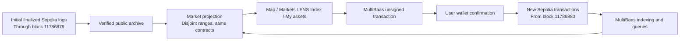

# Sepolia connection and data provenance

Updated 2026-09-27. This is a separate test deployment, not a bridge or migration of balances.

## What stays on Curvegrid Testnet

The existing 50 assets and 448 scripted transactions remain on chain `2017072401`. The browser-only demo contains 265 fictional assets. Neither dataset is copied into Sepolia balances or presented as Sepolia activity.

## Sepolia integration

Nine contracts are linked to the separate Sepolia MultiBaas deployment: the six market contracts, `UrbanNamespaceAuthority`, the building's ENSv2 registry and its resolver. The public DApp key can read contracts and compose unsigned transactions; it cannot list or administer API keys. CORS permits the production application and the two local development origins. Credentials stay in ignored local configuration.

The free plan permits indexing from up to 100 blocks before the chain head. The initial ENS-linked asset and its first right were created before that window. Their **six market events and four ENS permission events** are preserved as verified public Sepolia RPC logs through finalized block `11786879`, with its canonical block hash. MultiBaas indexes subsequent events from **`11786880`**. The archive is [public JSON](../src/lib/generated/sepolia-bootstrap.json), not simulated activity and not a claim that MultiBaas backfilled those records.

The application checks chain ID and all six contract addresses before using this initial archive. It combines disjoint block ranges, so a later full MultiBaas backfill cannot duplicate registrations, rights or volume. Current permissions and balances are read from contracts. Permission history and Activity explain the initial source.



## Reproduce the checks

```sh
# Existing links are preserved on rerun; missing links fail if the history window expired.
npx tsx scripts/link-ens-multibaas.ts --env .env.sepolia \
  --bootstrap src/lib/generated/sepolia-bootstrap.json
npx tsx scripts/verify-sepolia-integration.ts --env .env.sepolia

# Read-only checks by default. --broadcast explicitly executes/resumes the bounded scenario.
npx tsx scripts/seed-sepolia.ts --env .env.sepolia
```

The small Sepolia scenario uses the existing ENS-issued rooftop right, parking income, advertising income and vacant-space usage. It exercises purchase, resale, activation, deposited income and a mixed basket. Its maximum budget is 0.018 test ETH including actor funding, and it journals signed hashes before broadcast to avoid repeated actions after interruption. Confirmed transactions are published separately in `deployments/sepolia-demo-receipts.json`. A prepared scenario is not evidence of completion: consult its receipts and the latest `sepolia-multibaas-verification.json`.

## 日本語

既存のCurvegrid Testnetの50資産・448件の取引は残します。Sepoliaは別ネットワークであり、残高・権利・取引履歴を移行済みとは扱いません。ブラウザ内の265資産も実チェーンの集計に混ぜません。

Sepolia用MultiBaasへ9契約を接続しました。無料プランの過去ログ取得範囲より前に作成した1資産・1権利については、確定済みの公開RPCログを初期記録として保存しています。それ以降の取引はMultiBaasで索引・取得します。初期記録と新規記録のブロック範囲を分け、二重集計を防いでいます。

実演用にはENS付き屋根・駐車場収益・広告収益・空きスペース利用の少数案件を用意します。実所有権の確認、KYB、現実の収益や金融規制への準拠を実証するものではありません。ウォレットからの通し操作と公開サイトの切り替えは、SDK接続の成功とは別に確認します。
