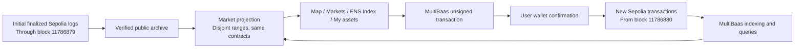

# Sepolia connection and data provenance

Updated 2026-09-27. The [hosted main application](https://tokenize-tokyo.vercel.app/) now uses Sepolia. Production deployment: `dpl_4cbF55bu8bXPukdkk8XT7boWmJqC`. This is a separate test deployment, not a bridge or migration of balances.

## Additional city data — 2026-09-27

The subsequent available-funds run expanded public Sepolia to **88 assets, 47 rights and 12 active rights** with 392 additional confirmed transactions. The 200-asset catalog is prepared but not fully issued; 112 registrations remain. The issuer retains approximately 0.00453 Sepolia ETH. See [current data and resume instructions](SEPOLIA_CITY_DATA.md). The small four-asset scenario below is the earlier baseline; its exact snapshot totals should not be rerun after this expansion.

日本語: 追加実行後のSepoliaは88資産・47権利・稼働中12件です。追加392取引を確認し、約0.00453 Sepolia ETHを残しました。200資産までは未完了で、残り112資産は後から再開できます。以下の4資産の記録は拡充前の基準値です。

## What stays on Curvegrid Testnet

The existing 50 assets and 448 scripted transactions remain on chain `2017072401`. The browser-only demo contains 265 fictional assets. Neither dataset is copied into Sepolia balances or presented as Sepolia activity.

## Sepolia integration

Nine contracts are linked to the separate Sepolia MultiBaas deployment: the six market contracts, `UrbanNamespaceAuthority`, the building's ENSv2 registry and its resolver. The public DApp key can read contracts and compose unsigned transactions; it cannot list or administer API keys. CORS permits the production application and local development origins. Credentials stay in ignored local configuration.

The free plan permits indexing from up to 100 blocks before the chain head. The initial ENS-linked asset and its first right were created before that window. Their **six market events and four ENS permission events** are preserved as verified public Sepolia RPC logs through finalized block `11786879`, with its canonical block hash. MultiBaas indexes subsequent events from **`11786880`**. The archive is [public JSON](../src/lib/generated/sepolia-bootstrap.json), not simulated activity and not a claim that MultiBaas backfilled those records.

The application checks chain ID and all six contract addresses before using this initial archive. It combines disjoint block ranges, so a later full MultiBaas backfill cannot duplicate registrations, rights or volume. Current permissions and balances are read from contracts. Permission history and Activity explain the initial source.



## Reproduce the checks

```sh
# Existing links are preserved on rerun; missing links fail if the history window expired.
npx tsx scripts/link-ens-multibaas.ts --env .env.sepolia \
  --bootstrap src/lib/generated/sepolia-bootstrap.json
npx tsx scripts/verify-sepolia-integration.ts --env .env.sepolia
# Verify the completed seed snapshot, before additional user trades change its totals.
npx tsx scripts/verify-sepolia-integration.ts --env .env.sepolia --scenario

# Read-only checks by default. --broadcast explicitly executes/resumes the bounded scenario.
npx tsx scripts/seed-sepolia.ts --env .env.sepolia
```

The small Sepolia scenario uses the existing ENS-issued rooftop right, parking income, advertising income and vacant-space usage. It exercises purchase, resale, activation, deposited income and a mixed basket. Its maximum budget is 0.018 test ETH including actor funding, and it journals signed hashes before broadcast to avoid repeated actions after interruption. Confirmed transactions are published separately in `deployments/sepolia-demo-receipts.json`. The completed run used 0.017101395808561817 test ETH including actor funding. Its 51 confirmed transactions include 41 market actions, all matched by transaction hash and block to indexed events. The snapshot contains four assets, four rights (three active), one mixed basket, 37,700 MockJPY traded and 5,800 MockJPY deposited. Each of the three underlying rights has two units held in the basket vault, backing one share for the issuer and one for the test investor after redemption. See the [public receipts](../deployments/sepolia-demo-receipts.json) and [verification report](../deployments/sepolia-multibaas-verification.json). These amounts are test tokens, not real returns.

## 日本語

既存のCurvegrid Testnetの50資産・448件の取引は残します。Sepoliaは別ネットワークであり、残高・権利・取引履歴を移行済みとは扱いません。ブラウザ内の265資産も実チェーンの集計に混ぜません。

Sepolia用MultiBaasへ9契約を接続しました。無料プランの過去ログ取得範囲より前に作成した1資産・1権利については、確定済みの公開RPCログを初期記録として保存しています。それ以降の取引はMultiBaasで索引・取得します。初期記録と新規記録のブロック範囲を分け、二重集計を防いでいます。

実演用にENS付き屋根・駐車場収益・広告収益・空きスペース利用の4資産・4権利を発行し、3権利を稼働状態にしました。混合バスケット1件を作成し、購入・収益分配・償還を含む51件のテスト取引が成功。41件の市場操作をMultiBaasのイベントと照合し、売買37,700 MockJPY・収益入金5,800 MockJPY・預託された原資産の数量も一致しました。公開サイトのSepolia表示とENS登録・権限履歴を確認済みです。実ウォレット拡張による全工程の手動リハーサルは残ります。

これは実所有権の確認、KYB、現実の収益や金融規制への準拠を実証するものではありません。MockJPYに金銭的価値はなく、既存チェーンからの残高移行も行っていません。
