# Trust model: what the demo does not prove

TOKENIZE TOKYO models programmable rights. It does not establish that an applicant has authority over a real location.

**Initial launch policy:** asset registration will be limited to companies that have passed prior screening. Company approval will not replace separate review of authority over each asset and each proposed right. This policy is not yet enforced by a company-screening or company-allowlist system.

**Demo exception:** anyone may try the registration flow. The current prototype contract accepts draft submissions from any address; submission does not establish ownership or permission to sell a right. No actual company or ownership checks are performed.

The hosted demo uses browser-local simulated events and switchable demo roles. The Solidity controls below describe the protocol implementation; they are not proof of real-world checks or of on-chain execution by the hosted demo.

| Process | Implemented boundary | Missing production process |
| --- | --- | --- |
| Applicant and authority | `UrbanAssetRegistry` records the submitting address. Only `VERIFIER_ROLE` approves a pending asset. | Establish the applicant's identity and authority to grant this particular right. Ownership alone must not be assumed to authorize every use; delegated authority and its limits also need evidence review. The demo verifier performs no document or site review. |
| Right issuance and sale | Only the registered issuer of a verified asset can create a right. New rights start pending; the verifier must separately approve them before trading. | Review purpose, spatial extent, dates, existing obligations and the agreement linking token possession to an enforceable real-world claim. Terms URI/hash records content, not its truth or enforceability. |
| Duplicate locations | At most one asset can be approved per exact `geoReference` hash. The conflict engine checks overlapping exclusive uses within the same asset and canonical scope. | Resolve applications to a trusted canonical site/space identity. The current form hashes coordinates; a slightly different coordinate produces a different ID. Distinct IDs and prior off-platform agreements are not reconciled. Scope categories are not surveyed geometry. |
| Funding | Primary issuer sales are aggregated into a funding progress view. Marketplace settlement transfers payment directly to the seller atomically with the right. | Funding escrow, funding deadlines, minimum-goal refunds, cancellation rules and milestone-based release are not implemented. The current Launchpad is a fixed-price offering, not an all-or-nothing crowdfunding contract. |
| Activation | A verifier can set an eligible right to Active. Solidity checks verified/tradable status and the start time; the local simulator has a simpler verified-status check. | Inspect installation, handover or service commencement and attach dated evidence. Activation does not depend on reaching a funding goal and does not prove physical operation. |
| Revenue | The vault accounts for settlement tokens actually deposited, with transfer-aware claims. | Verify that deposits correspond to the project's external receipts, reconcile expenses and distributions, and address withheld receipts. The deposit function accepts payment from any address; a deposit is not authenticated solar generation or rental income. |
| Change, dispute and recovery | A verifier can close an individual live right; transfer policies can restrict transfers. | Reverification after authority changes, review expiry, asset-wide suspension/revocation, appeals, compensation, lost-key recovery and handling rights already held in a basket need explicit design. The registry cannot revoke an already verified asset through its current verification function. Closing a token does not settle a real-world dispute. |
| Verifier governance | Approval functions require an assigned role; administrative role control exists. | Real reviewers, separation of duties, access review and evidence retention. The constructor grants admin and verifier to the same account; independent review is not enforced. Switching demo roles is for rehearsal, not authentication. |
| Investor protection and operation | ERC-1155 balances, payment accounting and selected transfer restrictions are implemented. | No production legal structuring, compliance assessment, identity/suitability workflow, tax process, external security audit or operating service is delivered. Fractional and rental sandbox positions create no enforceable real-world rights. |

## Planned initial-release approval flow

```mermaid
flowchart LR
  Company[Company applicant] --> Screening[Prior company screening - pending]
  Screening --> Draft[Approved company submits an asset]
  Draft --> Evidence[Asset authority evidence]
  Evidence --> AssetReview[Asset review]
  AssetReview --> Terms[Define the specific right]
  Terms --> RightReview[Right and agreement review]
  RightReview --> Market[Publish offering]
  Market --> Handover[Funding / handover conditions]
  Handover --> Operating[Operation evidence]
  Operating --> Revenue[Reconciled revenue deposits]
  Review[Reverification / disputes] -.-> AssetReview
  Review -.-> Operating
```

The demo implements status transitions and token accounting around this flow. Evidence review, physical handover, revenue reconciliation and dispute handling are missing operational processes, not automated by the blockchain.

## Priority before accepting real assets or money

1. Implement the prior company-screening and registration-eligibility gate. Define who can approve each asset/right and what evidence establishes the authority being granted. Resolve every application to a canonical place/space record, including duplicate claims and off-platform commitments.
2. Specify the agreement linking the token to performance obligations, transfer conditions and failure remedies. Keep confidential evidence off the public chain; record scoped attestations and references rather than public personal documents.
3. Add review expiry, change detection, revocation/suspension and dispute handling, including consequences for listings, holders, accrued revenue and basket custody.
4. Specify funding escrow/refunds and operating milestones where the offering depends on a future project. Treat funding, physical activation and revenue receipts as separate facts.
5. Establish reviewer governance, operational reconciliation, recovery and security review before a production launch.

ENS controls a namespace, not a building. Its future delegation adapter still needs a verified binding to the applicant's real authority. MultiBaas records and queries contract activity; it does not validate deeds, physical operation or the source of deposited funds.

## Source references

- [Asset registration and approval](../contracts/src/UrbanAssetRegistry.sol)
- [Issuance, conflict checks and lifecycle](../contracts/src/UrbanRightToken.sol)
- [Direct marketplace settlement](../contracts/src/UrbanMarketplace.sol)
- [Deposits and claims](../contracts/src/RevenueVault.sol)
- [Form-derived location identity](../src/components/Dashboard.tsx)
- [Funding progress projection](../src/lib/funding.ts)
- [Local simulation](../src/lib/demo.ts)
- [ENS integration boundary](ENSV2_DESIGN.md)
