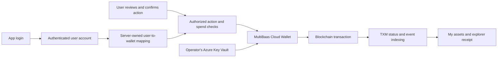

# Account UX and Curvegrid Cloud Wallet options

Status: 2026-09-27. Optional Privy + MetaMask connection code is implemented; Privy local activation is pending. Azure Cloud Wallet is configured on Curvegrid Testnet and Sepolia, with live signature verification passed on both. The live app still uses user-signed browser wallets. See [setup instructions and exact activation status](WALLET_SETUP.md).

## Current implementation / 現在

- Platform navigation: Explore, Dashboard, Markets, ENS Index, Activity. These show the shared city and market.
- My workspace: My assets and Compose. Holdings and transactions use the connected address; My assets explains how to connect when signed out. Viewing a basket definition does not require owning it.
- A browser wallet connection is not a server-authenticated login session. Demo role switching exists only in the explicit simulation.
- `src/server/operator.ts` has a Cloud Wallet adapter for bounded operator actions (verification, activation and revenue deposits) and TXM status. It is not a per-user account service. Cloud Wallet signing has been verified live; the bounded operator transaction paths and TXM remain unverified.

全体の市場を見るメニューと、自分の保有・組成を扱うメニューを分離した。現在の実取引は利用者のウォレット署名。メール／Googleログインの接続コードは実装済みで、Privyの有効化・実ログイン確認が残る。Cloud Walletは運営用として設定済み。

## Can the product work without MetaMask?

Yes. MultiBaas Cloud Wallet integrates an externally owned account with Microsoft Azure Key Vault and can sign and submit contract calls. The application's cloud account controls the keys; Curvegrid does not take custody. If this application controls end-user signing keys, the application operator has custody relative to those users. Cloud Wallet is not itself an email/Google/passkey authentication system.

Proposed flow:

Before implementation: choose the key ownership model, configure the cloud provider, build authenticated sessions and per-user wallet mapping, restrict backend signing by account/method/amount, prevent duplicate requests, and specify recovery and gas funding. An API key must not be shipped to the browser with signing permissions. Keep explicit transaction confirmation even if a browser extension is unnecessary.

MetaMaskを必須にしない構成は可能。通常のログイン→利用者専用アドレス→購入内容の確認→MultiBaasで署名／送信→保有一覧と取引履歴、という体験にできる。ただし自社の鍵保管基盤で利用者の鍵を管理する場合、運営者が鍵を管理する方式になる。自己管理を維持したい場合は、別途組込みウォレットを比較し、MultiBaasは取引作成・索引取得に利用する。現時点では鍵の管理方式を切り替えていない。

Official references: [Cloud Wallet setup](https://docs.curvegrid.com/multibaas/cloud-wallets/), [Curvegrid platform and custody model](https://www.curvegrid.com/blockchain-platform), [API key permissions](https://docs.curvegrid.com/multibaas/api-keys/).
