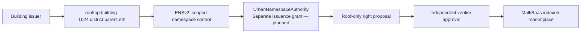

# ENSv2 pitch material — current evidence and target demonstration

この資料は2026-09-26時点の実装に合わせた説明素材。ENSv2がliveであるとはまだ言わない。

## 1枚にまとめる内容

**From physical space to a controlled onchain namespace.**

表示するstatus: **Local adapter tested · Sepolia deployment pending**。

- 現在: 親名を明示した名前生成、実registry ABIによるread、期限/親子関係/roleのチェック、unsigned grant/revoke descriptor。
- 次段階: Sepolia登録、実権限委譲、delegated mint入口、Universal Resolver、MultiBaas event証跡。
- 限界: ENS名の支配は物件所有権の証明ではなく、名前の編集権限は権利発行やVerifier権限ではない。

## 25秒の読み上げ

> A building contains several independent spaces. ENSv2 gives each space a namespace and scoped control. Our local adapter checks name state, expiry and canonical registry links. The next step is an explicit issuance adapter on Sepolia, allowing an operator to propose a rooftop right without control over the interior. Verification remains separate. ENS deployment is still pending.

## 実装完了後のデモ（現在はまだ実行不可）

1. Ownerが建物のrooftop namespaceだけOperatorへ委譲。
2. OperatorがSolar用途・許可期間内の権利を提案。独立Verifier承認後に出品。
3. 同じOperatorによるinteriorの権利提案は拒否。
4. Ownerが委譲を取消。次の提案は拒否、以前に購入された権利と過去収益は維持。
5. 名前解決、委譲/取消、提案のreceiptをSepolia ExplorerとMultiBaasで提示。

この5つの証跡が揃ってから資料のstatusをLiveへ変更する。既存スライドの将来形コピーをそのまま実装実績として読み上げない。
