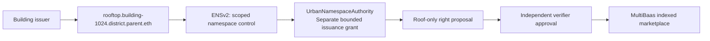

# ENSv2 pitch material — current evidence and target demonstration

この資料は2026-09-26時点の実装に合わせた説明素材。公開Sepoliaの登録・委譲発行は実証済み。公開サイトへの接続はまだ完了していないため、両者を区別して説明する。

## 1枚にまとめる内容

**From physical space to a controlled onchain namespace.**

表示するstatus: **Official-contract integration tested · public Sepolia / MultiBaas cutover in progress**。

- 現在: 公式ENSv2 registry、resolver、registrarの連携、UrbanNamespaceAuthority、限定発行・取消、ERC-1155発行後の審査待ち、ENS Indexの実ウォレット操作を実装。15コントラクトテスト、ローカルfork、公開Sepoliaで登録・限定発行・取消後拒否を検証。
- 次段階: 作成済みSepolia MultiBaasへのAPI設定・link / query、公開ブラウザでのウォレット署名。最新の実績はENSV2_DESIGN.mdと公開manifestを確認。
- 限界: ENS名の支配は物件所有権の証明ではなく、名前の編集権限は権利発行やVerifier権限ではない。

## 25秒の読み上げ

> A building contains several independent spaces. ENSv2 gives each space a namespace and scoped control. Our on-chain authority checks name state, expiry and canonical registry links. Our explicit issuance adapter allows an operator to propose a rooftop right without control over the interior; both official-contract tests and public Sepolia simulations reject issuance after revocation. Verification remains separate. The hosted app cutover is pending its Sepolia MultiBaas connection.

## 公開ブラウザ接続後のデモ（コントラクト経路はローカルで実証済み）

1. Ownerが建物のrooftop namespaceだけOperatorへ委譲。
2. OperatorがSolar用途・許可期間内の権利を提案。独立Verifier承認後に出品。
3. 同じOperatorによるinteriorの権利提案は拒否。
4. Ownerが委譲を取消。次の提案は拒否、以前に購入された権利と過去収益は維持。
5. 名前解決、委譲/取消、提案のreceiptをSepolia ExplorerとMultiBaasで提示。

この5つの証跡が揃ってから資料のstatusをLiveへ変更する。既存スライドの将来形コピーをそのまま実装実績として読み上げない。
